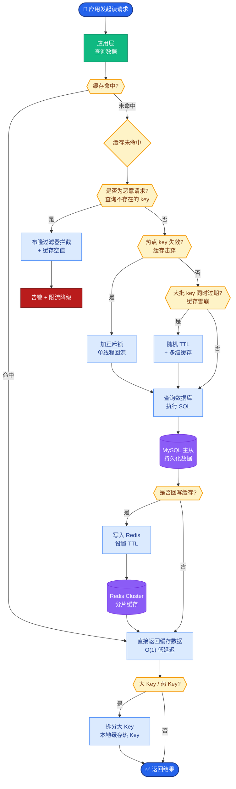
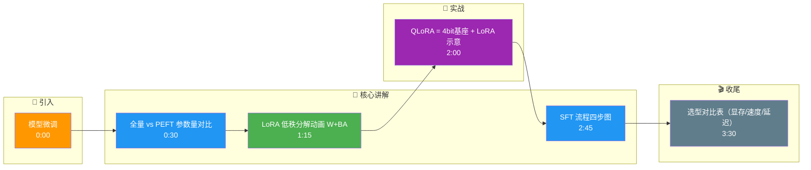

# 模型微调

### 概念解释
微调在预训练模型上用下游数据继续训练，使模型适配任务或领域。全量微调更新全部参数；**参数高效微调（PEFT）**只训练少量附加参数或低秩增量，降低显存与存储。

### 原理详解
#### 1. 全量微调
更新全部参数 $(\theta)$。效果最好潜力大，但需要大显存、易过拟合小数据，部署时每任务一份完整权重。

#### 2. LoRA (Low-Rank Adaptation)
对某线性层 $W \in \mathbb{R}^{d \times k}$，冻结 $W$，训练低秩分解：
$$W' = W + BA,\quad B \in \mathbb{R}^{d \times r},\ A \in \mathbb{R}^{r \times k},\ r \ll \min(d,k)$$
**直觉**：大矩阵更新往往低秩即可近似任务有效子空间。训练只存 $(A,B)$，推理可合并 $W' = W + BA$ 或保持分开。

#### 3. QLoRA
在 4-bit 量化的基座权重（如 NF4）上叠加 LoRA，用 paged optimizer 等技巧减少显存峰值。使单卡微调大模型成为可能。

#### 4. 其他 PEFT 方法
- **Adapter Tuning**：在 Transformer 层中插入小瓶颈层（down-project → 激活 → up-project），只训练 adapter 参数。
- **Prefix Tuning**：在输入前添加可学习的前缀向量（虚拟 token），不改变原词表 embedding。
- **P-Tuning v2**：将 prompt tokens 扩展到每一层的可学习前缀，提升小模型表现。

#### 5. SFT (Supervised Fine-Tuning) 流程
1. **数据**：高质量指令–回答对（可含思维链、拒答、工具格式）。
2. **格式**：Chat 模板与 tokenizer 对齐。
3. **训练**：交叉熵损失，通常只监督 assistant 段 token。
4. **评估**：验证集 loss、人工/模型裁判、任务基准。

### LoRA 结构示意图
```text
输入 x ──▶ [ 冻结权重 W ] ──┐
         (原始主路)         │
                           ├ (+) ─▶ 输出 h
输入 x ──▶ [ A ] ─▶ [ B ] ─┘
         (降维 d→r) (升维 r→k)
         (训练参数 A, B)
```

### 实战案例
在做垂直领域（如医疗问答）LoRA 微调时，曾遇到模型只在特定指令格式下表现好，换一种提问方式就失效。通过混合多格式指令数据和调整 LoRA 的 `alpha`（缩放因子）解决了泛化性问题，避免了重新全量训练。

### 关键代码示例 (Python/PyTorch)
```python
# 使用 PEFT 库配置 LoRA
from peft import LoraConfig, get_peft_model

config = LoraConfig(
    r=16,              # 秩
    lora_alpha=32,     # 缩放因子 (通常设为 2*r)
    target_modules=["q_proj", "v_proj"], # 只微调 Attention 的 Q/V
    lora_dropout=0.05,
    bias="none",
    task_type="CAUSAL_LM"
)
model = get_peft_model(base_model, config)
model.print_trainable_parameters() # 打印可训练参数占比
```

### 微调方法选型对比
| 维度 | 全量微调 | LoRA | QLoRA | Adapter | Prefix Tuning |
| :--- | :--- | :--- | :--- | :--- | :--- |
| **显存占用** | 极高 | 低 (原模型 + 增量) | 极低 (4-bit 基座) | 中 (插入层) | 低 (只存前缀) |
| **训练速度** | 慢 | 快 | 稍慢 (反量化开销) | 中 | 快 |
| **推理延迟** | 无额外开销 | 无 (合并权重后) | 无 (合并权重后) | 有 (额外层计算) | 有 (序列变长) |
| **部署灵活性** | 差 (需存全量权重) | 优 (只需挂载小 Adapter) | 优 | 差 (改动模型结构) | 中 |

### 追问应对
**Q：KV Cache 显存如何估算？**
A：与层数、头数、每头维度、batch、序列长度、精度（FP16/BF16/INT8）成正比；可答「每层每 token 存 K、V 两份向量，总显存随长度线性增」。

## 常见考点
1.  **LoRA 的秩**：$r$ 的选择对效果和参数量的影响，通常设置为 8, 16, 64 等。
2.  **LoRA 的放置位置**：通常放置在 Attention 模块中的 $W_q, W_v$，也可以放在所有 Linear 层。
3.  **QLoRA 的关键组件**：NormalFloat4 (NF4) 量化、双重量化、Paged Optimizer（利用 CPU 内存缓解 OOM）。

## 核心流程图



## 记忆要点

- 全量微调更新所有参数显存大；PEFT（如LoRA）只训练少量参数，省显存且易部署。
- LoRA核心公式W' = W + BA，冻结原权重，训练低秩矩阵A、B，推理时可合并无延迟。
- QLoRA在4-bit量化基座上做LoRA，配合NF4和Paged Optimizer，单卡微调大模型。
- SFT流程：高质量指令数据、对齐Chat模板、只计算Assistant段Loss、多维度评估。
- 选型对比：全量效果最好但贵；LoRA性价比高；QLoRA显存最低；推理延迟LoRA/QLoRA合并后无影响。

## 结构化回答

**30 秒电梯演讲：** 微调就是在预训练模型上用下游数据继续练。全量微调效果最好但显存爆炸；PEFT 只训少量参数，最典型的 LoRA 把权重更新拆成两个低秩矩阵，推理时还能合并回去零延迟。QLoRA 再叠加 4-bit 量化，单卡就能微调大模型。

**展开框架：**
1. **全量 vs PEFT** — 全量更新所有参数，效果上限高但显存大、每任务一份权重；PEFT 只训增量，省显存易部署。
2. **LoRA 核心** — W' = W + BA，冻结原权重，训练低秩矩阵 A、B，推理可合并无额外延迟。
3. **QLoRA 与 SFT** — QLoRA 在 4-bit NF4 量化基座上做 LoRA，配 Paged Optimizer 单卡可训；SFT 流程要抓好指令数据质量、Chat 模板对齐、只算 Assistant 段 Loss。

**收尾：** 选型其实是道选择题——要效果、要成本还是要显存，我可以帮您按具体场景算笔账。

## 视频脚本

> 预计时长：4 分钟 | 由浅入深

| 时间 | 画面/字幕 | 口播台词 | 讲解要点 |
|------|----------|----------|----------|
| 0:00 | 标题卡：模型微调 | "微调就是拿预训练模型，用你的数据接着练，让它懂你的活儿。" | 微调定义 |
| 0:30 | 全量 vs PEFT 参数量对比 | "全量微调更新所有参数，效果最好但显存吃不消；PEFT 只训一小撮。" | 全量与PEFT |
| 1:15 | LoRA 低秩分解动画 W+BA | "LoRA 的精髓：冻结原权重，只训两个低秩矩阵 A 和 B，推理还能合并回去。" | LoRA公式 |
| 2:00 | QLoRA = 4bit基座 + LoRA 示意 | "QLoRA 更狠，基座量化到 4-bit，单卡就能微调几十 B 的模型。" | QLoRA省显存 |
| 2:45 | SFT 流程四步图 | "SFT 的关键是数据质量、模板对齐、只算 Assistant 那段 Loss。" | SFT流程 |
| 3:30 | 选型对比表（显存/速度/延迟） | "全量最贵，LoRA 性价比高，QLoRA 显存最低，合并后推理都没延迟。" | 选型权衡 |

### 视频流程图




