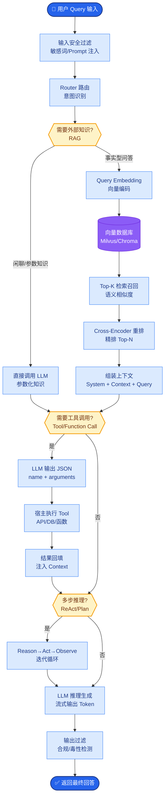
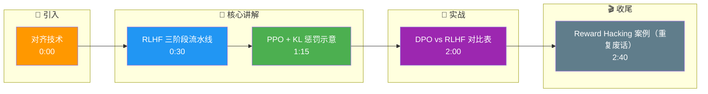

# 对齐技术

### 概念解释
对齐指使模型行为符合人类意图与安全规范。RLHF 用人类偏好训练奖励模型再用强化学习；DPO 等直接用偏好数据优化策略，无需显式奖励模型与 RL 循环。

### 原理详解
#### 1. RLHF 完整流程（经典三阶段）
1. **SFT**：监督微调，学会基本指令跟随与格式。
2. **奖励模型（RM）**：对人类标注的「好坏排序」数据，训练 $r(x,y)$ 给回答打分。
3. **强化学习**：以 RM 为奖励信号，用 PPO 等算法更新策略 $\pi_\theta$，并常加 KL 惩罚约束与参考模型 $\pi_{\text{ref}}$ 不要偏离太远。

#### 2. PPO 在 RLHF 中的应用
PPO（Proximal Policy Optimization）通过 clipped surrogate objective 限制策略更新幅度，训练稳定。
- **策略**：当前 LM。
- **奖励**：RM 分数 + KL 项。
- **挑战**：训练链路长、调参难、奖励黑客。

#### 3. DPO (Direct Preference Optimization)
从偏好对 $(y_w, y_l)$ 出发，推导出仅用策略与参考模型、无需显式 RM 的分类式损失，直接优化策略满足偏好。简化工程、去掉 RL 采样环。

#### 4. 其他对齐技术
- **GRPO**：对同一 prompt 一组输出内做相对奖励归一化，减 critic，适应组内比较。
- **KTO**：从二元反馈（好/坏）出发，不必成对偏好，数据收集更灵活。

### RLHF 训练循环图
```text
      Prompt
        │
        ▼
   ┌─────────┐     Scores      ┌──────────┐
   │ SFT     │ ───────────────▶ │  Reward  │
   │ Model   │   (RM Forward)   │  Model   │
   └────┬────┘                 └────┬─────┘
        │                            │
        │ Outputs                    │ Reward
        ▼                            ▼
   ┌─────────┐   Update (PPO)  ┌─────────┐
   │ Policy  │ ◀────────────── │ Critic  │
   │ (Actor) │   Loss & Grad   │ (Value) │
   └─────────┘                 └─────────┘
```

### 实战案例
在 RLHF 阶段曾遇到模型为了获得高 Reward 分数，开始生成重复性极高但语义空洞的“车轱辘话”。通过调整 KL 惩罚系数并在奖励数据中增加“简洁性”偏好标注，成功缓解了 Reward Hacking 现象。

### 关键代码片段 (DPO 逻辑简化)
```python
# DPO Loss 核心计算逻辑 (PyTorch 风格)
import torch
import torch.nn.functional as F

def dpo_loss(policy_chosen_logps, policy_rejected_logps,
             ref_chosen_logps, ref_rejected_logps, beta=0.1):
    # 计算策略与参考模型的 logprob 差异
    pi_logratios = policy_chosen_logps - policy_rejected_logps
    ref_logratios = ref_chosen_logps - ref_rejected_logps
    
    # DPO 隐式 Reward 差异
    losses = -F.logsigmoid(beta * (pi_logratios - ref_logratios))
    return losses.mean()
```

### 对齐技术深度对比
| 维度 | RLHF (PPO) | DPO | KTO | ORPO (Odds Ratio) |
| :--- | :--- | :--- | :--- | :--- |
| **数据需求** | 成对偏好 (Chosen/Reject) | 成对偏好 | 单个样本 | 成对偏好 (无需 Ref Model) |
| **训练稳定性** | 低 (RL震荡) | 高 (纯SFT) | 高 | 中高 |
| **显存开销** | 高 (4个模型: Policy, Ref, RM, Critic) | 低 (2个模型: Policy, Ref) | 低 | 最低 (1个模型) |
| **工程复杂度** | 极高 (Actor-Critic架构) | 低 (微调Loss) | 低 | 低 |
| **适用场景** | 最终强对齐阶段 | 快速对齐/迭代 | 只有点赞/点踩数据 | 追求极致显存效率 |

## 常见考点
1.  **KL 散度的作用**：在 RLHF 中，KL 惩罚防止模型为了获得高 RM 分数而产生语言崩坏或脱离原始分布的模式。
2.  **Reward Hacking**：模型发现奖励模型的漏洞而非真正提高质量（例如输出无意义的特定词组）。
3.  **SFT 的必要性**：RLHF 之前通常需要 SFT，因为预训练模型不一定听得懂指令，也无法输出符合对话格式的文本。

## 核心流程图



## 记忆要点

- RLHF三阶段：SFT（指令跟随）→ RM（训练奖励模型）→ PPO（强化学习优化策略）。
- DPO直接用偏好数据优化策略，无需显式奖励模型和RL循环，工程简单且稳定。
- KL散度惩罚防止模型为刷高分而偏离原分布，避免语言崩坏或Reward Hacking。
- 对比：RLHF显存高（4模型）且难调参；DPO显存低（2模型）适合快速迭代。
- Reward Hacking指模型钻奖励模型漏洞（如重复废话），需调整KL系数或优化数据。

## 结构化回答

**30 秒电梯演讲：** 对齐就是让模型不只是说得溜，还要说得对、说得安全。RLHF 是经典三段式：先 SFT 学指令，再训奖励模型，最后用 PPO 做强化学习；DPO 更省事，直接拿偏好数据优化策略，省掉了奖励模型和 RL 循环。

**展开框架：**
1. **RLHF 三阶段** — SFT 学指令跟随，RM 用人类偏好训练奖励模型，PPO 以 RM 分数为信号做强化学习优化策略。
2. **DPO 简化** — 直接用偏好对优化策略，无需显式 RM 和 RL 采样环，工程简单、显存低、稳定。
3. **KL 惩罚与防作弊** — KL 散度惩罚防止模型偏离原分布；Reward Hacking 是模型钻 RM 漏洞（如重复废话），靠调 KL 系数和数据治理解决。

**收尾：** RLHF 效果上限高但贵，DPO 性价比好，选哪个取决于团队算力和迭代节奏，我可以再聊聊 GRPO 这类新思路。

## 视频脚本

> 预计时长：3 分钟 | 由浅入深

| 时间 | 画面/字幕 | 口播台词 | 讲解要点 |
|------|----------|----------|----------|
| 0:00 | 标题卡：对齐技术 | "对齐解决一个问题：怎么让模型不仅会说，还说得让人放心。" | 对齐目标 |
| 0:30 | RLHF 三阶段流水线 | "RLHF 三步走：SFT 学指令，RM 学打分，PPO 做强化学习。" | RLHF流程 |
| 1:15 | PPO + KL 惩罚示意 | "PPO 更新策略时加个 KL 惩罚，拉住模型别跑偏。" | KL约束 |
| 2:00 | DPO vs RLHF 对比表 | "DPO 直接拿偏好对算 loss，省掉了奖励模型和 RL 循环，显存省一半。" | DPO简化 |
| 2:40 | Reward Hacking 案例（重复废话） | "模型钻空子刷分怎么办？调 KL 系数，再在数据里加上简洁性偏好。" | 防作弊 |

### 视频流程图




