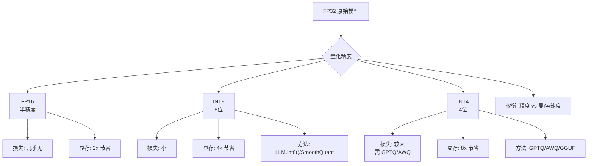

# 模型量化

### 概念解释
量化把浮点权重/激活用低比特整数近似，减少显存与带宽，加速推理。训练后量化（PTQ）常见；QAT（量化感知训练）精度更好但成本高。

### 原理详解
#### 1. 精度级别
- **INT8**：每权重 8 bit，常配合 per-tensor 或 per-channel scale/zero-point。
- **INT4**：4 bit，容量减半，精度风险更高，常与 group-wise 缩放配合。

#### 2. 常见算法
- **GPTQ**：逐列（或块）量化权重，用 Hessian 相关信息最小化量化误差，适合 GPU 上 PTQ。
- **AWQ**：强调保留对激活幅度大的「显著」权重通道，按激活统计决定保护权重。

#### 3. 格式与生态
- **GGUF / GGML**：文件格式与生态（llama.cpp 等），便于 CPU/多端部署。

### 量化映射示意图
```text
FP16 范围: [-6.0, 6.0]
     |
     |  映射
     ▼
INT8 范围: [-128, 127]
公式: Q = clamp(round(F / Scale) + Zero_point)
反量化: F = (Q - Zero_point) * Scale
```

### 实战案例
在尝试将 7B 模型量化至 INT4 部署到手机端时，发现模型的代码生成能力大幅下降（Perplexity 虽只微升）。采用 AWQ 算法，保留了对激活值贡献最大的 1% 权重为 FP16，恢复了约 95% 的代码生成准确率。

### 关键代码示例 (PyTorch 动态量化)
```python
import torch

# 动态量化：权重静态量化，激活动态量化
# 适用于 LSTM/Linear，推理时根据输入范围计算 Scale
quantized_model = torch.quantization.quantize_dynamic(
    model,
    {torch.nn.Linear},  # 指定要量化的层
    dtype=torch.qint8   # 目标数据类型
)
print(quantized_model) # 查看量化后的模块结构
```

### 量化方法与场景对比
| 维度 | PTQ (GPTQ/AWQ) | QAT (Quant Aware Training) | 动态量化 | GGUF (llama.cpp) |
| :--- | :--- | :--- | :--- | :--- |
| **数据需求** | 少量校准集 (~128条) | 全量训练数据 | 无需数据 | 需原始权重转换 |
| **精度损失** | 中 (INT4需调优) | 低 (模型学会适应量化) | 高 (LLM很少用) | 取决于量化等级 (Q4/Q5/Q8) |
| **训练成本** | 无 (仅需几分钟推理) | 高 (需重训/微调) | 无 | 无 |
| **部署硬件** | GPU / Server | GPU / Server | CPU / Mobile | CPU / Mac / Mobile / Edge |
| **适用场景** | 快速验证大模型部署 | 对精度要求极高的任务 | 传统 NLP 模型 | 个人电脑 / 本地化部署 |

### 量化对性能的影响
- **正面**：显存降、吞吐升、边缘部署可行。
- **负面**：perplexity 上升、复杂推理/代码任务可能掉点；KV Cache 量化需小心误差累积。

## 常见考点
1.  **Per-Tensor vs Per-Channel**：Per-channel 对每个输出通道单独量化，精度通常优于 Per-tensor（全张量共用一个缩放因子），特别是针对卷积层或某些 Linear 层。
2.  **Activation Outliers**：激活值中存在异常大的数值（如 >6），这会导致普通 INT8 量化精度严重下降，SmoothQuant 等方法旨在解决此问题。
3.  **KV Cache 量化**：推理时 KV Cache 占用大量显存，量化 KV Cache（如 INT8）可大幅增加并发，但需关注长序列下的误差累积。


## 核心流程图




## 记忆要点

- 量化用低比特整数近似浮点数，减少显存和带宽，加速推理但可能损失精度。
- PTQ（训练后量化）如GPTQ/AWQ，用少量校准集；QAT（量化感知训练）精度高但成本大。
- GPTQ利用Hessian信息最小化误差；AWQ保留激活幅度大的显著权重，精度更好。
- Per-channel量化（每通道独立缩放）精度优于Per-tensor（全张量统一缩放）。
- 部署生态：GGUF适合CPU/端侧；PTQ适合GPU服务端；INT4需关注异常激活值。

## 结构化回答

**30 秒电梯演讲：** 量化就是把模型里的浮点数换成低比特整数，比如 FP16 压成 INT4，显存直接砍掉四分之三，推理也更快。代价是可能掉精度，所以工程上用 GPTQ、AWQ 这些算法来减小误差，必要时再上 QAT。

**展开框架：**
1. **核心收益与代价** — 用低比特整数近似浮点数，省显存、省带宽、加速推理；代价是 perplexity 上升，复杂任务可能掉点。
2. **PTQ vs QAT** — 训练后量化（GPTQ/AWQ）只需少量校准集、几分钟搞定；量化感知训练精度高但要重训、成本大。
3. **算法与部署** — GPTQ 用 Hessian 信息最小化误差，AWQ 保护激活幅度大的显著权重；GGUF 走 CPU/端侧，PTQ 走 GPU 服务端。

**收尾：** 量化不是无脑压到 INT4 就完事——激活异常值、KV Cache 误差累积都是坑，我可以讲讲 SmoothQuant 怎么处理。

## 视频脚本

> 预计时长：3 分钟 | 由浅入深

| 时间 | 画面/字幕 | 口播台词 | 讲解要点 |
|------|----------|----------|----------|
| 0:00 | 标题卡：模型量化 | "量化就是把高清图压成标清，省流量，细节略损。" | 量化本质 |
| 0:30 | FP16 → INT8 → INT4 显存递减柱状图 | "FP16 压到 INT4，显存直接砍掉四分之三。" | 收益直观 |
| 1:10 | PTQ vs QAT 对比 | "PTQ 几分钟搞定，QAT 精度更好但要重训。" | 两条路线 |
| 1:50 | GPTQ/AWQ 算法示意 | "GPTQ 用二阶信息算误差，AWQ 保护那些激活大的关键权重。" | 主流算法 |
| 2:30 | 部署生态地图（GGUF/PTQ） | "GGUF 跑端侧，PTQ 跑服务端，各走各的路。" | 部署选型 |

