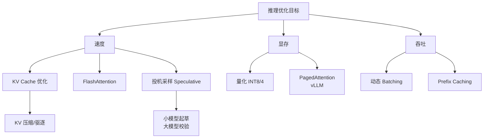
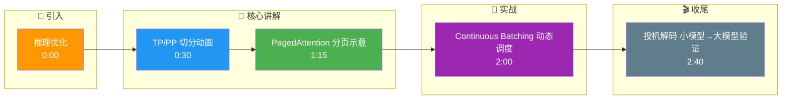

# 推理优化

### 概念解释
大模型推理瓶颈来自算力、显存带宽、KV Cache、批调度等。工程上从模型分片、内核、缓存管理、批处理、投机解码等多方面优化。

### 原理详解
#### 1. 模型并行
- **张量并行（TP）**：单层内矩阵分块到多 GPU（列切分 $A$、行切分 $B$），需 all-reduce 通信。
- **流水线并行（PP）**：不同层放在不同 GPU，micro-batch 流水，减少气泡。

#### 2. 显存与调度优化
- **PagedAttention (vLLM)**：将 KV Cache 存成非连续块（类似 OS 分页），按请求动态分配，减少 padding 浪费。
- **Continuous Batching**：在迭代中动态增删请求，提高 GPU 利用率。

#### 3. 算法与架构优化
- **Speculative Decoding**：用小模型多步预测，大模型并行验证；接受则一次前进多 token，降低延迟。
- **MoE (Mixture of Experts)**：每层含多个专家，门控只对少数专家计算，提高容量与效率比；挑战是负载均衡与通信。

### Speculative Decoding 流程
```text
Step 1: 小模型 预测 N 个 token
        [t1, t2, t3, t4, t5]
             │
Step 2: 大模型 并行验证这 N 个 token
        (并行处理树结构 Attention)
             │
Step 3: 比较结果
        - 若 t1, t2 匹配 -> 保留
        - 若 t3 不匹配 -> 丢弃 t3 及后续
             │
Step 4: 接受 t1, t2，从 t3 位置重新开始循环
```

### 实战案例
在高并发在线服务中，使用 vLLM 的 PagedAttention 替换原本的 HuggingFace Transformers 推理，将显存碎片导致的 OOM（内存溢出）频率降为零，同时由于 Continuous Batching 机制，同一批 GPU 卡的实际吞吐量（QPS）提升了 3 倍。

### 关键代码示例 (vLLM 离线推理)
```python
from vllm import LLM, SamplingParams

# 初始化 LLM 引擎 (自动启用 PagedAttention 和 Continuous Batching)
llm = LLM(model="meta-llama/Llama-2-7b-hf", tensor_parallel_size=2)

# 配置采样参数
sampling_params = SamplingParams(temperature=0.7, top_p=0.95, max_tokens=100)

# 批量生成
prompts = ["Hello, my name is", "The future of AI is"]
outputs = llm.generate(prompts, sampling_params)
```

### 推理优化技术对比
| 优化维度 | 张量并行 (TP) | 流水线并行 (PP) | FlashAttention (计算优化) | 投机解码 |
| :--- | :--- | :--- | :--- | :--- |
| **核心瓶颈** | 显存单卡放不下 | 显存单卡放不下 | 显存带宽/计算访存比 | 生成延迟 / Token Latency |
| **主要成本** | 通信带宽 | 填充气泡 | GPU 架构依赖 (需 Ampere+) | 小模型推理成本 + 验证计算 |
| **适用场景** | 单次请求大模型 | 极深层模型或 batch 大 | 几乎所有 LLM 训练/推理 | 对延迟敏感的在线对话 |
| **加速效果** | 线性加速 (但受通信限制) | 接近线性 (受 Pipeline 调度影响) | 2x-3x (Attention Kernel) | 1.5x-2.5x (取决于 Draft 准确率) |

### 追问应对
**Q：MoE 为什么「参数多算力少」？**
A：每 token 只激活部分专家，计算量随激活专家数增长，而总参数量包含所有专家。

## 常见考点
1.  **All-Reduce 通信开销**：在 TP 中，每个 Transformer Block 结束后需要同步所有 GPU 的部分结果，带宽需求高，不适合跨机部署。
2.  **投机解码的收益**：取决于小模型的猜测准确率。如果准确率低（验证失败多），大模型计算浪费多，收益下降甚至为负。
3.  **vLLM 的内存碎片**：通过 PagedAttention 解决了显存因请求序列长度不一导致的内部碎片问题，极大提升了 Batch Size 的上限。

## 核心流程图



## 记忆要点

- 张量并行（TP）切分矩阵层内通信，适合单机多卡；流水线并行（PP）切分层，减少气泡。
- PagedAttention将KV Cache分页存储，动态分配，解决显存碎片和OOM。
- Continuous Batching动态增删请求，替换掉完成的，提升GPU利用率。
- 投机解码用小模型猜N个token，大模型并行验证，加速生成降低延迟。
- MoE每层只激活部分专家，参数多计算少，需解决负载均衡和通信开销。

## 结构化回答

**30 秒电梯演讲：** 推理优化就是围着三个瓶颈打转：算力、显存、带宽。张量并行和流水线并行解决单卡放不下；PagedAttention 和 Continuous Batching 解决显存碎片和 GPU 空转；投机解码用小模型猜、大模型验，降低生成延迟。

**展开框架：**
1. **模型并行** — TP 切分矩阵层内通信适合单机多卡，PP 切分层间流水减少气泡。
2. **显存与调度** — PagedAttention 把 KV Cache 分页存储动态分配，解决碎片和 OOM；Continuous Batching 动态增删请求，提升 GPU 利用率。
3. **算法优化** — 投机解码用小模型猜 N 个 token、大模型并行验证；MoE 每层只激活部分专家，参数多但计算少。

**收尾：** 这些优化手段是可组合的——比如 vLLM 就同时用了 PagedAttention 和 Continuous Batching，我可以讲讲它们怎么配合。

## 视频脚本

> 预计时长：3 分钟 | 由浅入深

| 时间 | 画面/字幕 | 口播台词 | 讲解要点 |
|------|----------|----------|----------|
| 0:00 | 标题卡：推理优化 | "推理优化就是围着三个瓶颈打：算力、显存、带宽。" | 三大瓶颈 |
| 0:30 | TP/PP 切分动画 | "张量并行切矩阵，流水线并行切层，都是为了单卡放不下的问题。" | 模型并行 |
| 1:15 | PagedAttention 分页示意 | "PagedAttention 把 KV Cache 像操作系统分页一样管理，告别碎片。" | 显存管理 |
| 2:00 | Continuous Batching 动态调度 | "请求完成的就踢出去，新的塞进来，GPU 不闲着。" | 批调度 |
| 2:40 | 投机解码 小模型→大模型验证 | "小模型先猜几个 token，大模型一次性验证，命中就赚了。" | 投机解码 |

### 视频流程图




