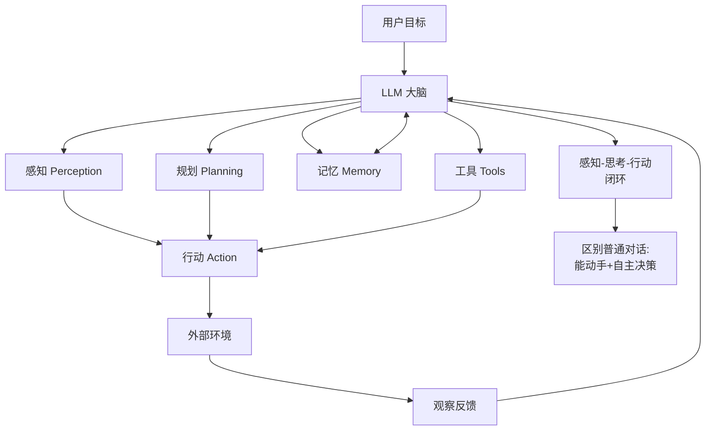

# 什么是AI Agent?它和普通LLM对话有什么本质区别

- **AI Agent = LLM + 感知 + 规划 + 行动 + 记忆**

- **核心区别:**

| 维度 | 普通LLM | AI Agent |
|------|---------|----------|
| 交互 | 单轮问答 | **多轮自主** |
| 行动 | 只输出文本 | **调用工具/API** |
| 状态 | 无状态 | **有记忆** |
| 控制 | 用户驱动 | **Agent自主决策** |
| 终止 | 用户决定 | **Agent判断完成** |

- **Agent核心循环:**
```
while not done:
1. 感知 - 接收输入/环境状态
2. 规划 - 决定下一步做什么
3. 行动 - 调用工具/API
4. 观察 - 获取行动结果
5. 更新记忆 - 存储中间结果
```

- **典型Agent:** AutoGPT / Devin / Claude Code / Codex / Manus

- **实战案例**：在电商客服场景中，普通LLM只能根据知识库回答“退款政策”，而Agent可以自主识别用户意图，调用订单查询API验证状态，并操作退款接口完成闭环，无需人工介入。

- **代码示例**：
```python
from langchain.agents import initialize_agent, Tool
from langchain.llms import OpenAI

# 定义工具：模拟实际业务API
def refund_order(order_id: str) -> str:
    return f"Order {order_id} refunded successfully."

tools = [
    Tool(name="Refund", func=refund_order, description="Use to refund an order")
]

# 初始化 Agent (ReAct 模式)
agent = initialize_agent(tools, OpenAI(temperature=0), agent="zero-shot-react-description")
agent.run("请帮我退款，订单号是 12345")
```

- **边界情况**：
  - **工具调用失败**：当API返回错误（如网络超时、权限不足）时，Agent需要具备重试或降级处理的逻辑，而非直接报错崩溃。
  - **记忆溢出**：长对话中，如果记忆未做窗口限制或摘要压缩，会导致Token超出上下文限制，需设计“遗忘机制”或“重要度打分”。
  - **循环终止**：Agent可能陷入无法达成目标的死循环（如反复查询不存在的订单），必须有最大步数或时间预算限制。

- ## 面试追问
  1. **在多轮对话中，如何解决LLM上下文窗口有限的问题？你会选择滑动窗口还是语义摘要，各有什么优劣？**
  2. **如果Agent调用的工具是幂等的（重复调用无害）和非幂等的（如转账），在架构设计上有什么不同？**
  3. **如何评估一个Agent的“自主性”是否达标？除了准确率，你会关注哪些指标？**

- ## 易错点
  - **混淆“自主”与“自动”**：Agent强调的是基于感知的决策能力，而不仅仅是自动化脚本。它需要处理不确定性和模糊指令。
  - **忽视副作用**：认为Agent只是“查询”数据。实际上Agent的“行动”会改变环境状态（如修改数据库、发邮件），必须引入“回滚”或“审批”机制。


## 核心流程图




## 记忆要点

- 定义：Agent = LLM + 感知 + 规划 + 行动 + 记忆。
- 核心区别：普通LLM只输出文本；Agent能调用工具、有记忆、自主决策并改变环境。
- 循环：感知→规划→行动→观察→更新记忆，直到任务完成。
- 实战：客服场景中Agent能调API查订单并退款，实现闭环，而非仅回答政策。
- 边界：工具调用需重试机制；长对话需记忆摘要；必须设最大步数防死循环。

## 结构化回答

**30 秒电梯演讲：** AI Agent 就是给大模型装上了手和脑子——普通 LLM 只会输出文本，Agent 能调用工具、有记忆、能自主决策并改变环境。核心循环就是感知、规划、行动、观察、更新记忆，直到任务完成。

**展开框架：**
1. **本质定义** — Agent = LLM + 感知 + 规划 + 行动 + 记忆，从"只会说"升级为"会干活"。
2. **核心循环** — 感知→规划→行动→观察→更新记忆，自主判断任务是否完成。
3. **生产边界** — 工具调用要有重试，长对话要做记忆摘要，必须设最大步数防死循环。

**收尾：** 理解 Agent 的关键不是套公式，而是想清楚自主性和可控性的平衡——我可以接着聊聊 Agent 和 Workflow 的本质区别。

## 视频脚本

> 预计时长：2 分钟 | 由浅入深

| 时间 | 画面/字幕 | 口播台词 | 讲解要点 |
|------|----------|----------|----------|
| 0:00 | 标题卡：什么是 AI Agent | "普通 LLM 像只会背书的百科全书，Agent 是会动手干活的大学生。" | 类比开场 |
| 0:30 | 普通 LLM vs Agent 对比表 | "普通 LLM 只输出文本，Agent 能调工具、有记忆、自主决策。" | 核心区别 |
| 1:10 | 五步循环动画 | "核心循环就是：感知、规划、行动、观察、更新记忆。" | 核心循环 |
| 1:40 | 客服退款闭环示意 | "比如客服场景，Agent 能查订单、调退款接口，真正闭环。" | 实战价值 |

---

## 延伸：什么是 AI Agent

> 合并自 `agt-001`（相似度 68%）

AI Agent 是以大模型为认知核心，结合规划、记忆与工具调用，能在多步交互中根据环境反馈持续决策并完成任务的系统。

### 核心组成
- **Planning (规划)**：把模糊目标拆成可执行步骤，并在执行中动态调整。
- **Memory (记忆)**：短期上下文 + 长期知识，避免「说完就忘」或重复劳动。
- **Tools (工具)**：手脚，如搜索、数据库、代码执行、API 调用等。

### 原理详解
1. **与「普通 LLM 单次调用」的区别**
   - **普通调用**：输入 Prompt → 模型输出文本，没有与外部环境闭环。
   - **Agent**：输出往往是「下一步动作」（例如：调用某工具、更新记忆、结束），环境返回 Observation（观察结果），再进入下一轮推理，形成多轮控制循环。

2. **自主决策能力体现**
   - 在动作空间中选下一步（选哪个工具、传什么参数、是否结束）。
   - 在信息不完整时决定先澄清还是先假设再验证。
   - 在失败时重试、换策略或请求人工介入（视系统设计而定）。

3. **核心循环（ReAct / Tool-use 范式）**
   抽象为：Thought（推理）→ Action（行动）→ Observation（观察）→ … → Final Answer。
   实现上常由「编排层」驱动：解析模型输出、执行工具、把结果写回上下文，直到满足停止条件。

### 边界情况与极端场景
1. **死循环与无限发散**：当工具返回结果不满足模型预期，或模型陷入逻辑悖论时，可能导致无限循环。必须设置全局最大步数或 Token 预算熔断机制。
2. **工具执行失败与不可逆操作**：涉及“删除”、“转账”等破坏性操作时，若模型解析参数错误或产生幻觉，后果严重。需引入“人机确认”或关键操作的二次鉴权流程。
3. **上下文窗口溢出**：在长任务链中，历史 Observation 会撑爆上下文。必须具备动态摘要或滑动窗口记忆机制，保留关键信息，丢弃冗余细节。
4. **并发与状态一致性**：在多 Agent 或高并发场景下，外部环境状态可能在 Agent 规划与执行期间发生变化（如库存被抢购），导致执行失败。需引入乐观锁或状态重试机制。

### 实战案例
- **API 语义映射**：某电商 Agent 曾错误地将“取消订单”意图映射到退款接口，导致状态机死锁。解决方案是在 System Prompt 中加入“动作前先检查订单状态”的强制规则，并引入鉴权中间件。
- **循环陷阱**：在搜索类 Agent 中，常因检索结果不满足而陷入“搜索→总结→再搜索”的死循环，工程上必须设置最大步数或步级奖励模型来及时止损。

### 代码示例：ReAct 循环实现
```python
def agent_loop(query, tools, llm):
    prompt = f"Task: {query}\nAvailable tools: {[t.name for t in tools]}"
    for step in range(5):  # 限制最大步数防止死循环
        response = llm.generate(prompt)
        if "Final Answer:" in response:
            return response.split("Final Answer:")[-1].strip()
        tool_call = parse_action(response)  # 解析出工具名和参数
        result = tools[tool_call.name].run(tool_call.args)
        prompt += f"\nObservation: {result}"  # 反馈给模型
    return "Agent failed to reach conclusion."
```

## 面试追问
1. 如果 Agent 调用工具返回了 502 网络错误，应该在 ReAct 循环的哪个层面处理？是让 LLM 自行重试，还是在代码层做指数退避？
2. 当工具返回的 Observation 非常长（例如一篇长文），直接拼接到 Prompt 会导致 Token 消耗过大，你有什么优化策略？
3. 如何评估一个 Agent 的任务完成成功率？单纯看“是否结束”够吗？

## 易错点
1. **混淆自主性与自动化**：认为写死 `if-else` 调用 API 也是 Agent。Agent 的核心在于“基于环境反馈的动态决策”，而非预定义的脚本执行。
2. **忽略工具调用的幂等性**：在重试逻辑中未考虑工具是否幂等，可能导致重复扣款或数据重复写入。

## 记忆要点

- 定义：以 LLM 为核心，具备规划、记忆、工具能力，能多步交互决策的系统。
- 核心循环：Thought (推理) -> Action (行动) -> Observation (观察) -> Final Answer。
- 与 LLM 区别：LLM 是单次文本生成，Agent 是与环境闭环的动态决策。
- 核心组成：Planning (拆解)、Memory (短期/长期)、Tools (手脚)。
- 风险控制：必须设置最大步数熔断，防止死循环或无限发散。

## 结构化回答

**30 秒电梯演讲：** AI Agent 是以大模型为认知核心，结合规划、记忆、工具调用，能在多步交互中根据环境反馈持续决策并完成任务的系统。它和普通 LLM 单次调用的本质区别是与环境闭环——输出往往是"下一步动作"，环境返回 Observation 再进入下一轮推理。核心循环是 Thought→Action→Observation→Final Answer，必须设最大步数熔断防死循环。

**展开框架：**
1. **核心组成** — Planning 把模糊目标拆成可执行步骤；Memory 短期上下文 + 长期知识避免说完就忘；Tools 是手脚（搜索、数据库、代码执行、API 调用）。
2. **核心循环** — Thought 推理 → Action 行动 → Observation 观察 → Final Answer；由编排层驱动解析模型输出、执行工具、写回上下文直到停止条件。
3. **边界与风险** — 死循环设最大步数或 Token 预算熔断；破坏性操作（删除、转账）需人机确认二次鉴权；上下文溢出用动态摘要滑动窗口。

**收尾：** 做电商 Agent 时踩过坑——"取消订单"意图错误映射到退款接口导致状态机死锁，在 System Prompt 加"动作前先检查订单状态"强制规则并引入鉴权中间件后解决。您想聊哪块，ReAct 循环实现还是工具调用幂等性？

## 视频脚本

> 预计时长：3 分钟 | 由浅入深

| 时间 | 画面/字幕 | 口播台词 | 讲解要点 |
|------|----------|----------|----------|
| 0:00 | 标题卡：什么是 AI Agent | "像一个能手脚并用、自己查资料、还会根据结果改方案的数字员工。" | 类比开场 |
| 0:20 | 核心组成三件套 | "Planning 规划、Memory 记忆、Tools 工具，缺一不可。" | 核心组成 |
| 0:50 | 与 LLM 区别对比 | "LLM 单次文本生成无闭环，Agent 与环境闭环动态决策。" | 本质区别 |
| 1:20 | ReAct 核心循环图 | "Thought 推理→Action 行动→Observation 观察→Final Answer。" | 核心循环 |
| 1:55 | 死循环警示 | "坑：工具返回不满足预期会死循环，必须设最大步数熔断。" | 风险控制 |
| 2:25 | 取消订单案例 | "实战：意图误映射退款接口死锁，加状态检查规则解决。" | 实战教训 |
| 2:50 | 总结卡 | "记住：规划+记忆+工具+闭环，必须熔断。下期讲 vs Chain。" | 收尾 |
