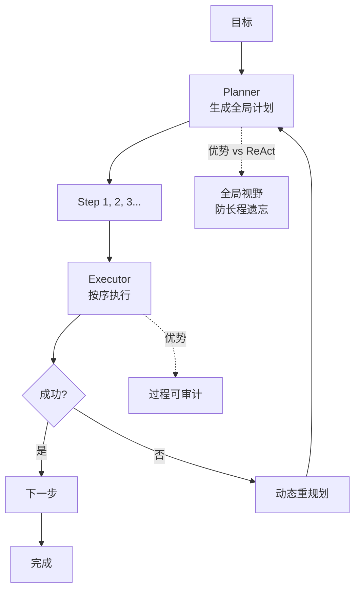

# Plan-and-Execute Agent架构是什么?相比ReAct有什么优势

- **Plan-and-Execute:** 先全局规划,再逐步执行.

- **架构:**
```
用户任务 → Planner(全局规划) → 任务列表
↓
Executor(逐步执行) ← 逐个任务
↓
Replanner(重新规划) ← 执行结果
```

- **vs ReAct:**

| | ReAct | Plan-and-Execute |
|--|-------|-----------------|
| 规划 | 每步即时决策 | **先全局规划** |
| 上下文 | 完整历史 | **只需当前任务** |
| Token消耗 | 高(线性增长) | **低(分段)** |
| 适用 | 简单/探索性 | **复杂/多步骤** |
| 错误恢复 | 重新推理 | **重新规划** |

- **LangChain实现:**
```python
planner = ChatOpenAI().with_structured_output(Plan)
executor = AgentExecutor(agent=tool_agent)
replanner = ChatOpenAI().with_structured_output(Response)
```

- **优势:**
1. 减少Token消耗(每步只需子任务上下文)
2. 更适合复杂任务
3. 可以并行执行独立子任务

- **细节补充：**
  - **Planner 输出结构**：通常要求输出 JSON 或 DAG（有向无环图）来定义任务依赖。
  - **状态共享**：Executor 处理完的任务结果需存入共享内存，供后续步骤使用。
  - **动态规划**：Replanner 根据执行结果（如失败、新信息）动态修改剩余 Plan。

- **实战案例**：在编写数据分析报告时，ReAct往往会“走一步看一步”，导致重复读取同一个大文件。Plan-and-Execute会先规划好“读取数据->清洗->分析->绘图”四个步骤，Executor只需关注单步执行，不仅效率高，而且中途清洗失败时，Replanner只需重试清洗步骤，无需从头开始。

- **代码示例**：
```python
# LangChain Plan-and-Execute 模式核心逻辑
plan = planner.invoke({"input": "分析Q1销售数据并生成图表"})
# plan.steps = ["读取Q1.csv", "计算增长率", "生成趋势图"]

for step in plan.steps:
    result = executor.invoke({"input": step, "previous_steps": completed_steps})
    completed_steps.append(result)
    if result.status == "error":
        plan = replanner.invoke({"plan": plan, "error": result.error})
```

- **边界情况**：
  - **规划不可行**：Planner生成了包含不存在工具的Plan，Executor无法执行。需要引入“工具能力校验”步骤。
  - **任务依赖缺失**：Planner未识别出步骤间的依赖（如先B后A），导致A失败。需使用Replanner进行动态调整。
  - **初始信息不足**：Planner在缺少关键信息（如具体文件名）时强行规划，导致后续步骤不断报错。

- ## 面试追问
  1. **Plan-and-Execute中，如果Planner生成的第一步就错了，后续步骤全部白费，如何提高初始规划的准确率？**
  2. **如何权衡Planner的推理成本（使用GPT-4）和Executor的执行成本（使用GPT-3.5）？是否可以混用？**
  3. **在DAG（有向无环图）规划中，如何检测并处理循环依赖？**

- ## 易错点
  - **忽视Replanner的重要性**：认为Plan一旦生成就不可变。实际上，没有Replanner的Plan-and-Execute非常脆弱，一步错步步错。
  - **过度规划**：试图把所有细节都在第一阶段规划出来，导致Planner阶段Token爆炸。应采用“滚动规划”策略。


## 核心流程图




## 记忆要点

- 架构：先Planner全局规划任务列表，再Executor逐步执行，Replanner动态调整。
- 对比ReAct：先规划后执行，Token消耗低（分段），适合复杂多步骤任务。
- 优势：子任务可并行，出错只需重规划而非从头推理，上下文更聚焦。
- 实战：数据分析报告先规划“读-洗-析-画”，再执行，避免重复读文件。
- 关键：Planner输出结构化（JSON/DAG），Replanner处理失败和依赖变更。

## 结构化回答

**30 秒电梯演讲：** Plan-and-Execute 就是先画图纸再施工——Planner 全局规划出任务列表，Executor 逐步执行，Replanner 根据结果动态调整。相比 ReAct 的"走一步看一步"，它 Token 消耗低、适合复杂多步骤任务，出错也只需局部重规划。

**展开框架：**
1. **三段式架构** — Planner 全局规划任务列表，Executor 逐步执行，Replanner 动态调整，分工明确。
2. **对比 ReAct 的优势** — 先规划后执行，Token 消耗低（分段）；子任务可并行；出错只需重规划而非从头推理。
3. **工程关键** — Planner 输出结构化（JSON/DAG）定义依赖，Replanner 处理失败和依赖变更，避免过度规划。

**收尾：** 这个架构的命门是 Planner 的初始规划质量——我可以聊聊怎么用"滚动规划"避免一次性规划爆炸。

## 视频脚本

> 预计时长：3 分钟 | 由浅入深

| 时间 | 画面/字幕 | 口播台词 | 讲解要点 |
|------|----------|----------|----------|
| 0:00 | 标题卡：Plan-and-Execute | "装修房子：ReAct 是走一步看一步，Plan-and-Execute 是先画图纸再施工。" | 类比开场 |
| 0:30 | Planner→Executor→Replanner 架构图 | "三段式：Planner 规划，Executor 执行，Replanner 兜底调整。" | 架构总览 |
| 1:15 | vs ReAct 对比表（Token/并行/恢复） | "相比 ReAct，Token 省了，能并行，出错只需局部重规划。" | 对比优势 |
| 2:00 | 数据分析报告实战案例 | "数据分析先规划读-洗-析-画四步，避免重复读文件。" | 实战价值 |
| 2:40 | Replanner 动态调整动画 | "关键在 Replanner：某步失败就重规划，而不是从头再来。" | 动态调整 |

