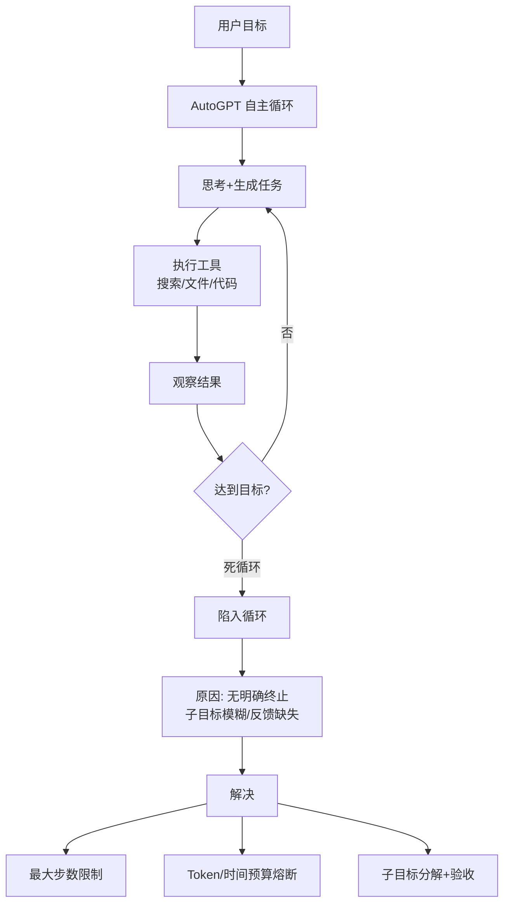
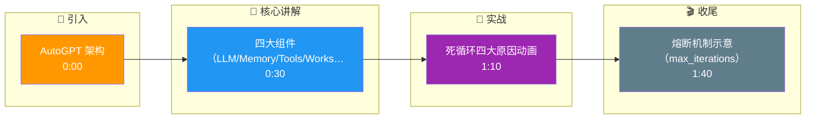

# AutoGPT的核心架构是什么?它为什么经常陷入死循环?如何解决

- **AutoGPT架构:**

```
目标输入 → Agent循环 {
Thought → Reasoning → Plan → Action → Observation
} → 目标完成
```

- **核心组件:**
1. **AI(LLM)** - 大脑,做推理和决策
2. **Memory** - 向量数据库存储历史
3. **Tools** - 搜索、文件、代码执行等
4. **Workspace** - 持久化文件/状态

- **死循环原因:**
1. **目标模糊** - Agent不知道何时算完成
2. **工具失败** - 工具返回错误,Agent反复重试
3. **上下文遗忘** - 长对话后忘记原始目标
4. **决策僵化** - 每次推理路径太相似

- **解决方案:**
1. **最大迭代数限制** - 硬性终止
2. **完成检测器** - 专门的判断是否完成的机制
3. **反思机制** - 每N步反思进度
4. **温度调节** - 提高采样多样性避免重复
5. **状态压缩** - 定期总结中间结果

- **补充细节：**
  - **内存管理**：采用长短时记忆结合，向量检索相关历史减少输入。
  - **自我反思**：引入“Critic”角色，对执行结果打分，决定是继续还是结束。

- **实战案例**：让AutoGPT开发一个网页爬虫时，它曾陷入“测试代码->发现报错->修复代码->测试代码”的死循环，因为环境配置始终不对。解决方案是引入`max_iterations=10`并在内存中加入“若3次尝试失败则切换技术栈”的指令。

- **代码示例**：
```python
# 防止死循环的简单熔断机制
MAX_ITERATIONS = 10

def run_agent(goal):
    for i in range(MAX_ITERATIONS):
        thought, action = agent.decide(goal, memory)
        if action.type == "FINISH": 
            return action.result
        
        result = execute(action)
        memory.add(result)
        
        # 简单的重复检测
        if is_repeating_pattern(memory, last_n=3):
            raise Exception("Agent detected in a loop, aborting.")
```

- **边界情况**：
  - **资源耗尽**：Agent在循环中不断写入文件或创建对象，导致服务器磁盘或内存爆满，需限制资源配额。
  - **工具副作用积累**：反复调用创建API（如创建数据库表）导致“表已存在”错误，需幂等性设计。
  - **幻觉加剧**：在长期运行中，错误的Observation被存入记忆并被后续检索引用，导致错误像病毒一样扩散。

- ## 面试追问
  1. **除了限制步数，有什么更智能的方法来判断Agent是否陷入了无效循环？**
  2. **AutoGPT这种单体架构在处理非常复杂的任务时往往效率低下，你会如何将其拆解为多Agent协作系统？**
  3. **如何设计Memory的索引机制，才能既保证召回率，又避免将早期的错误经验检索出来干扰当前决策？**

- ## 易错点
  - **过度信任Agent**：认为Agent可以完全自主完成闭环保镖任务。实际上，生产环境中必须保留人工干预接口。
  - **混淆Thought与Plan**：AutoGPT往往只有即时的Thought，缺乏长远的Plan。这是它容易陷入局部最优循环的根本原因。

## 核心流程图



## 记忆要点

- 架构：自主循环（Thought→Plan→Action→Observation），配合向量库Memory和工具集。
- 死循环原因：目标模糊不知何时停、工具反复失败、上下文遗忘、决策路径僵化。
- 解决：硬性限制最大迭代数、设计完成检测器、定期反思进度、调节温度增加随机性。
- 实战：开发爬虫时陷入“测-错-改”死循环，需设步数限制并加入“失败换栈”指令。
- 核心：AutoGPT缺乏长远规划，依赖即时Thought，容易陷入局部最优循环。

## 结构化回答

**30 秒电梯演讲：** AutoGPT 的核心是一个自主循环：Thought、Plan、Action、Observation，配合向量记忆和工具集。它最大的毛病是容易陷入死循环——目标太模糊、工具反复失败、上下文遗忘。解法就是硬性限制步数、加完成检测器、定期反思。

**展开框架：**
1. **自主循环架构** — Thought→Plan→Action→Observation 循环，配合向量库 Memory 和工具集自主运行。
2. **死循环四大原因** — 目标模糊不知何时停、工具反复失败、上下文遗忘、决策路径僵化。
3. **工程兜底** — 硬性限制最大迭代数、设计完成检测器、定期反思进度、调节温度增加随机性。

**收尾：** AutoGPT 的根本短板是缺乏长远规划，只靠即时 Thought 容易陷局部最优——这也是后来 Plan-and-Execute 兴起的原因。

## 视频脚本

> 预计时长：2 分钟 | 由浅入深

| 时间 | 画面/字幕 | 口播台词 | 讲解要点 |
|------|----------|----------|----------|
| 0:00 | 标题卡：AutoGPT 架构 | "给个目标，它就自己 Thought、Plan、Action、Observation 循环下去。" | 自主循环 |
| 0:30 | 四大组件（LLM/Memory/Tools/Workspace） | "大脑、记忆、工具、工作区，四件套配齐。" | 核心组件 |
| 1:10 | 死循环四大原因动画 | "为什么会死循环？目标模糊、工具失败、上下文遗忘、决策僵化。" | 死循环原因 |
| 1:40 | 熔断机制示意（max_iterations） | "解法很朴素：限步数、加完成检测器、定期反思、调温度。" | 解决方案 |

### 视频流程图




