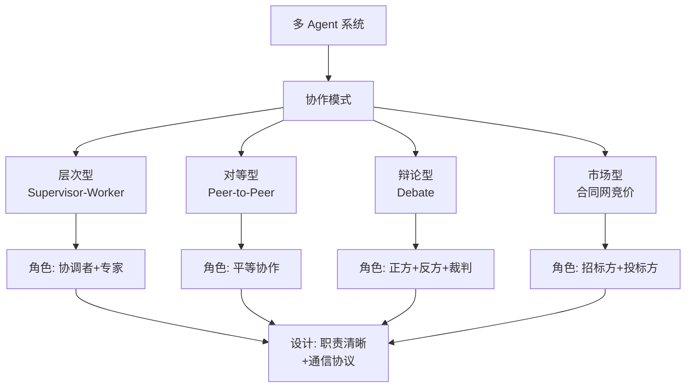

# 多Agent系统(MAS)的常见协作模式有哪些?如何设计角色分工

- **协作模式:**

1. **层级式:** Manager -> Workers
   - Manager 负责任务拆解和分配，Worker 执行具体子任务。
   - 优势：控制力强，适合明确流程。

2. **对话式:** 无中心化节点，Agent间直接沟通
   - 例如：辩论、相互质疑。
   - 优势：能激发创新，适合头脑风暴。

3. **顺序式:** 像流水线一样，Agent A 输出给 Agent B
   - 例如：Writer -> Editor -> Publisher
   - 优势：专业化分工，质量高。

- **角色分工设计原则:**
   - **单一职责**: 每个Agent专注于特定领域或能力（如专门的代码审查员、专门的搜索员）。
   - **能力互补**: 避免同质化，例如一个Agent负责发散思维，另一个负责收敛总结。
   - **明确接口**: 定义好Agent间通信的消息格式（Protocol）。

- **实战案例:** 在搭建自动化内容生产平台时，我们设计了“资深编辑”、“研究员”、“SEO专家”三个Agent。研究员负责搜集素材，编辑负责撰稿，SEO负责优化关键词。它们通过共享的黑板机制交互，最终产出一篇高质量文章。

- **代码示例:**
```python
# 模拟层级式 Manager-Agent 调度
manager_prompt = "你是项目主管，负责将任务分发给下属：Coder, Tester。"

def manager_task(goal):
    # Manager 决策谁来做
    decision = llm.predict(f"{manager_prompt} 任务: {goal}")
    if "Coder" in decision:
        result = coder_agent.run(decision)
    elif "Tester" in decision:
        result = tester_agent.run(decision)
    return result
```

- **边界情况**：
  - **通信风暴**：对话模式下，Agent间陷入无休止的争论，导致系统挂起。需设置轮次限制或投票机制。
  - **死锁**：顺序模式中，Agent B 等待 A 的结果，而 A 正在等待 B 的确认，需设计超时重发。
  - **消息噪声**：层级模式中，Manager 下发的指令模糊，导致 Worker 返回错误结果，Manager 又重新下发，形成震荡。

- ## 面试追问
  1. **在多Agent系统中，如何保证Agent之间传递信息的保真度？防止信息在传递链条中失真？**
  2. **如果发现两个Agent的角色定义有重叠，导致它们互相推诿任务，架构上如何解决？**
  3. **多Agent系统通常成本很高（多个LLM实例），如何在不降低效果的前提下优化成本？**

- ## 易错点
  - **为了多Agent而多Agent**：简单任务用一个Agent能搞定，拆分成多个反而增加了通信延迟和协调成本。
  - **忽视人类角色**：在设计中完全自动化，没有预留“人类Agent”的位置，导致出现伦理或逻辑错误时无法人工介入。


## 核心流程图




## 记忆要点

- 协作模式：层级式（Manager派单）、对话式（去中心化辩论）、顺序式（流水线）。
- 设计原则：单一职责（专人专事）、能力互补（发散vs收敛）、明确接口（通信协议）。
- 实战：内容生产设“研究员-编辑-SEO”角色，通过共享黑板协作产出文章。
- 边界：对话式需设轮次限防争论；顺序式需防死锁；层级式需指令清晰防震荡。
- 误区：简单任务别拆多Agent（增成本）；必须预留人类介入接口防失控。

## 结构化回答

**30 秒电梯演讲：** 多 Agent 系统就是模拟人类社会分工——层级式有 Manager 派单，对话式让 Agent 互相辩论，顺序式像流水线一棒接一棒。设计原则记住八个字：单一职责、能力互补、明确接口。

**展开框架：**
1. **三种协作模式** — 层级式（Manager 派单）控制力强、对话式（去中心化辩论）激发创新、顺序式（流水线）专业化分工质量高。
2. **角色设计三原则** — 单一职责（专人专事）、能力互补（发散 vs 收敛）、明确接口（通信协议）。
3. **生产边界** — 对话式要设轮次限防争论，顺序式要防死锁，层级式指令要清晰防震荡；简单任务别拆多 Agent。

**收尾：** 多 Agent 不是万能药——成本和协调开销很现实，我可以聊聊什么场景下坚决不该拆。

## 视频脚本

> 预计时长：2 分钟 | 由浅入深

| 时间 | 画面/字幕 | 口播台词 | 讲解要点 |
|------|----------|----------|----------|
| 0:00 | 标题卡：多 Agent 协作 | "多 Agent 就是模拟公司分工：有管理的、有干活的、有挑刺的。" | 分工本质 |
| 0:30 | 三种协作模式对比图 | "层级式派单、对话式辩论、顺序式流水线，各有各的好。" | 协作模式 |
| 1:10 | 角色设计三原则 | "设计记住八个字：单一职责、能力互补、明确接口。" | 设计原则 |
| 1:40 | 内容生产实战案例 | "研究员搜素材、编辑撰稿、SEO 优化，共享黑板协作。" | 实战落地 |

