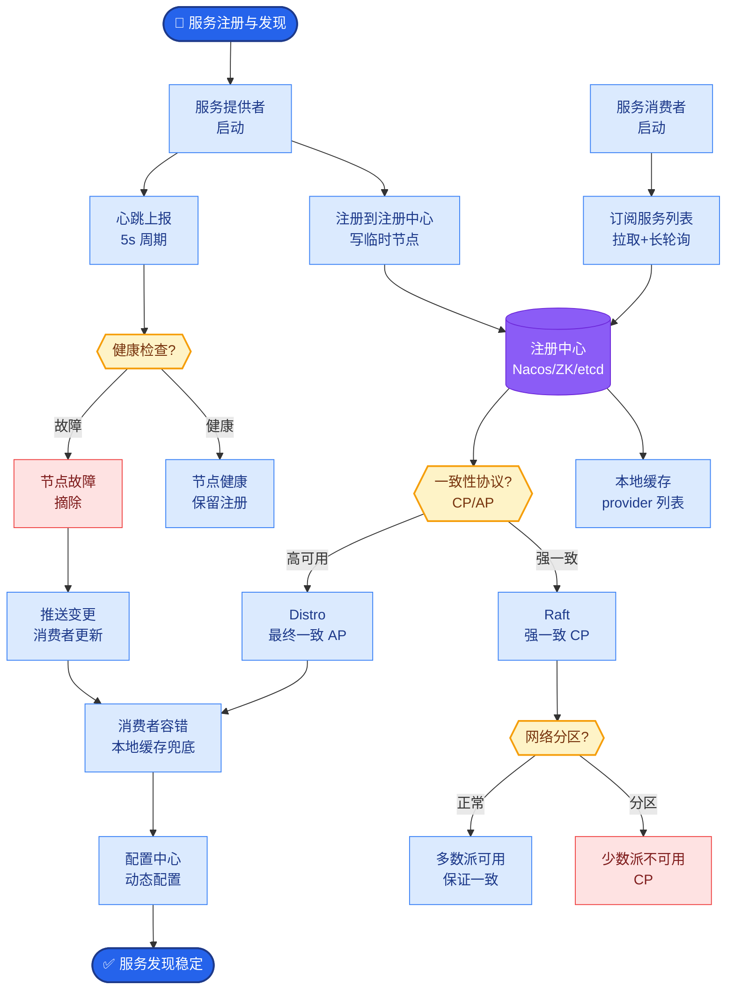

# Claude Computer Use和Browser Use的核心技术挑战是什么

- **常见协作模式:**

1. **层级式**
- Manager → Workers(经理分配任务给工人)
- 例:CrewAI的Crew结构

2. **对话式**
- Agent之间自由对话,达成共识
- 例:AutoGen的GroupChat

3. **流水线式**
- A → B → C,每个Agent处理特定步骤
- 例:写作Agent(初稿) → 编辑Agent(润色) → 事实核查Agent

4. **竞争式**
- 多个Agent提出不同方案,投票选出最优
- 提高准确率,但成本高

5. **Swarm(群体智能)**
- 去中心化协调,Agent根据规则自主协作
- OpenAI Swarm框架

- **角色设计原则:**
- **单一职责** - 每个Agent只擅长一件事
- **互补** - 角色之间技能互补
- **明确边界** - 每个Agent的输入输出清晰
- **协调机制** - 谁做决策、谁执行、谁验证

- **补充细节：**
  - **通信开销**：多Agent系统通信占用的Token成本极高，需设计高效的消息传递协议。
  - **共识机制**：对话式协作中，如何避免陷入无休止的争论？（设置发言人或协调者）。

- **实战案例**：
在电商自动客服场景中，使用流水线模式时，曾因“意图识别Agent”将退款请求误判为咨询，导致后续“售后Agent”没有权限操作，最终通过增加一个“路由Agent”进行二次判断解决。

- **边界情况：**
  - **死循环处理**：在对话式或竞争式协作中，如果Agent无法达成共识（如两个Agent坚持不同观点），系统必须有最大轮数限制或强制仲裁机制，否则会导致无限Loop和成本失控。
  - **上下文窗口溢出**：长时间协作会导致历史消息累积超出Context Window，必须实现自动总结或Sliding Window机制，防止早前的关键决策信息丢失。
  - **单点故障**：在层级式中，如果Manager Agent输出错误指令，所有下游Worker都会执行错误任务。需要引入Worker的反馈纠错机制。

- **代码示例** (Python/CrewAI):
```python
# 定义流水线模式：Draft -> Review -> Publish
from crewai import Agent, Task, Crew

writer = Agent(role="Writer", goal="Write blog posts")
editor = Agent(role="Editor", goal="Critique posts")

task1 = Task(description="Write about AI", agent=writer)
task2 = Task(description="Review the output", agent=editor, context=[task1])

crew = Crew(agents=[writer, editor], tasks=[task1, task2], process="sequential")
```

---

### 架构图：多Agent协作模式对比
```text
【层级式 Hierarchy】        【流水线 Pipeline】
      Manager                    Input
        │                         │
    ┌───┴───┐                     ▼
    │       │                  Agent A
  Worker1 Worker2               │
    │       │                   ▼
    └───┬───┘                Agent B
        │                      │
        ▼                      ▼
     Output                 Agent C
                              │
                              ▼
                           Output

【竞争式 Competition】       【Swarm (图网络)】
    Input                     Agent A ◀──── Agent B
      │                         │  ▲    ▲   │
      ▼                         │  │    │   │
   ┌─────┐     Vote            └──┴────┴───┘
   │Ag 1 │ ────▶ Result
   └─────┘
   │Ag 2 │ ────▶
   └─────┘
```

### ## 常见考点
1. **SOP（标准作业程序）与Agent**：将业务流程转化为多Agent协作的设计思路。
2. **通信协议**：Agent间传递的是自然语言还是结构化数据？（推荐结构化+自然语言混合）。

## 面试追问
1. 如果多Agent系统中有某个Agent产生了幻觉，导致错误信息在Agent间传递并放大（“以讹传讹”），架构上如何设计熔断或纠错机制？
2. 在资源受限（如低延迟要求、低Token预算）的情况下，如何优化多Agent的通信协议？（提示：Bit-token、语义压缩、状态共享而非历史消息共享）
3. 如何评估多Agent系统的效果？单纯看最终任务得分够不够？是否需要引入“协作效率”作为评估指标？

## 易错点
1. **过度设计**：将简单的线性任务强行拆解为多Agent协作，导致成本增加且调试困难。原则是能用单Agent解决的绝不拆分。
2. **缺乏全局视野**：在去中心化协作中，每个Agent只关注局部目标，可能导致整体任务目标偏离。必须引入全局评估者或定期对齐机制。


## 核心流程图



## 记忆要点

- Computer Use基于视觉（截图+坐标），通用性强但精度低；Browser Use基于DOM，精度高但仅限网页。
- 核心挑战是像素级定位难，解决方案是放大局部区域；动态界面需等待元素出现。
- 长任务易累积错误，需设置检查点与回滚机制；高危操作必须引入人工确认。
- 高分屏DPI适配和模态框遮挡是常见边界情况，需坐标换算和推理关闭遮挡物。

## 结构化回答

**30 秒电梯演讲：** Computer Use 让 AI 像人一样看屏幕、动鼠标，靠 VLM 把截图转成点击坐标。通用性强但精度是个坎——像素级点击常常偏。Browser Use 走 DOM 更准但只能管网页。长任务还要防错误累积，高危操作必须有人工确认。

**展开框架：**
1. **两条技术路线** — Computer Use 基于视觉（截图+坐标）通用性强但精度低；Browser Use 基于 DOM 精度高但仅限网页。
2. **核心挑战** — 像素级定位难（靠放大局部区域解决）、动态界面变化（等待元素出现）、长任务错误累积（检查点+回滚）。
3. **安全与边界** — 高危操作必须引入人工确认；高分屏 DPI 适配和模态框遮挡是常见坑，需坐标换算和推理关闭遮挡物。

**收尾：** Computer Use 的天花板在 VLM 的视觉理解能力——我可以聊聊怎么用 Accessibility Tree 给它开外挂。

## 视频脚本

> 预计时长：2 分钟 | 由浅入深

| 时间 | 画面/字幕 | 口播台词 | 讲解要点 |
|------|----------|----------|----------|
| 0:00 | 标题卡：Computer Use | "让 AI 像盲人远程操作电脑，只能看截图、动鼠标键盘。" | 核心思路 |
| 0:30 | Computer Use vs Browser Use 对比 | "Computer Use 看截图通用但精度低，Browser Use 操作 DOM 精度高但只管网页。" | 路线对比 |
| 1:10 | 像素定位挑战动画 | "像素级点击常偏，解法是放大局部区域再识别。" | 精度挑战 |
| 1:40 | 检查点+人工确认示意 | "长任务要设检查点防错误累积，高危操作必须人工确认。" | 安全兜底 |

