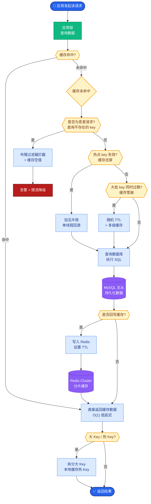

# 什么是Agent OS / Agent Runtime?它解决了什么基础设施问题

- **Computer Use:** Agent控制鼠标键盘操作真实电脑界面.

- **核心技术栈:**
1. **屏幕截图** - 截屏 → VLM理解界面
2. **坐标定位** - VLM输出点击坐标
3. **动作执行** - 鼠标点击/键盘输入/滚动
4. **反馈循环** - 执行后重新截屏验证

- **技术挑战:**

| 挑战 | 描述 | 当前方案 |
|------|------|---------|
| 精确定位 | 像素级点击精度不够 | **放大/裁剪局部区域** |
| 动态界面 | 网页内容动态变化 | **等待元素出现** |
| 长任务 | 步骤多,错误累积 | **检查点+回滚** |
| 多窗口 | 切换窗口/标签页 | **窗口管理策略** |
| 安全 | 危险操作(删除/支付) | **人工确认机制** |

- **Browser Use vs Computer Use:**
- Browser Use:直接操作DOM/Accessibility Tree,更精确
- Computer Use:通过截图+鼠标,更通用但精度低

- **代表产品:** Claude Computer Use / Anthropic / OpenAI Operator / Browser-use

- **补充细节：**
  - **SAM (Segment Anything Model)**：辅助VLM进行更精细的UI元素分割。
  - **操作抽象**：将点击坐标抽象为语义标签（如“搜索按钮”），增强鲁棒性。

- **边界情况：**
  - **高分屏适配**：在不同DPI（如Retina屏）和分辨率下，像素坐标与逻辑坐标的换算容易出错，导致点击偏移。
  - **模态框与遮挡**：当弹窗、Toast通知或下拉菜单遮挡目标元素时，单纯视觉判断可能会误判状态，需要具备“关闭遮挡物”的推理能力。
  - **时间敏感操作**：如填写验证码或倒计时按钮，若截屏-推理-执行的耗时超过有效期，会导致操作失败。需要引入快照缓存或极速模式。

- **实战案例：**
在自动化测试SaaS后台时，遇到阴影DOM元素导致常规DOM定位失效，转而使用Computer Use（视觉定位）成功绕过了前端框架的封装限制，但付出了更高的Token成本。

- **代码示例：**
```python
# 简单的Computer Use循环逻辑模拟
import pyautogui
from PIL import ImageGrab

def agent_loop(prompt, model):
    while True:
        # 1. 获取屏幕状态
        screenshot = ImageGrab.grab()
        
        # 2. VLM决策 (伪代码)
        action = model.vision_decide(prompt, screenshot)
        if action.type == 'DONE': break
        
        # 3. 执行动作
        if action.type == 'CLICK':
            pyautogui.click(action.x, action.y)
        elif action.type == 'TYPE':
            pyautogui.write(action.text)
```

---

### 架构图：Computer Use 工作流
```text
┌──────────────┐
│   User Goal  │ (如：“帮我订票”)
└──────┬───────┘
       ▼
┌───────────────────────────────┐
│   VLM (Vision Model)          │
│ 1. 分析当前截图                │
│ 2. 决策：移动鼠标到(x,y)并点击 │
└──────┬────────────────────────┘
       │ Action (Coordinate)
       ▼
┌───────────────────────────────┐
│   OS / Browser Interface      │
│   (PyAutoGUI / Puppeteer)     │
└──────┬────────────────────────┘
       │ Execution
       ▼
┌───────────────────────────────┐
│   New Screenshot              │◀────── 循环
└───────────────────────────────┘
```

### ## 常见考点
1. **DOM vs. Pixel**：为什么 Claude Computer Use 放弃 DOM 直接看屏幕？（通用性 vs. 精确度）。
2. **多模态模型的上下文限制**：高频截屏如何挤占Token预算？（需压缩历史截图或只关注ROI区域）。

## 面试追问
1. Computer Use 在处理暗黑模式、颜色对比度低或无障碍标签缺失的界面时，识别率会显著下降，有什么技术手段可以缓解？（提示：预处理增强、Accessibility Tree注入辅助）
2. 如果 Agent 误操作导致了不可逆的破坏（如删除数据库），系统层面应该设计什么样的“安全沙箱”或“熔断机制”？
3. 相比于 Browser Use 直接操作 DOM，Computer Use 的视觉方式在处理长页面滚动时的性能瓶颈是什么？如何优化？

## 易错点
1. **忽略页面加载延迟**：Agent 指令执行过快，在页面元素渲染完成前就进行点击，导致报错。必须引入显式等待机制，而非简单的 `time.sleep`。
2. **坐标系混乱**：混淆绝对屏幕坐标、相对窗口坐标和相对元素坐标，导致多显示器环境下定位失效。


## 核心流程图



## 记忆要点

- Agent OS是Agent运行的基础设施，负责环境交互、状态管理和工具调度。
- 核心解决环境隔离问题，防止Agent误操作破坏宿主机；提供持久化记忆存储。
- 统一工具接入标准，避免重复开发适配器；支持多Agent并发调度与资源竞争管理。
- 典型代表如LangGraph Runtime，支持循环、中断恢复和人机协作。

## 结构化回答

**30 秒电梯演讲：** Agent OS 就是给 Agent 提供的运行基础设施——沙箱隔离防止误操作搞坏宿主机，统一管理工具注册、状态持久化和生命周期，还要管 Token、CPU、内存这些资源配额。典型代表就是 LangGraph Runtime。

**展开框架：**
1. **基础设施定位** — 负责 Agent 的环境交互、状态管理和工具调度，是 Agent 运行的"操作系统"。
2. **核心解决问题** — 环境隔离防误操作破坏宿主机，持久化记忆存储，统一工具接入标准避免重复造适配器。
3. **生产能力** — 支持多 Agent 并发调度与资源竞争管理，细粒度控制 Token/CPU/内存配额，支持多租户隔离与计费。

**收尾：** Agent OS 的价值就是把"怎么安全跑起来"这件事标准化——我可以聊聊微 VM 和 Docker 容器在隔离上的区别。

## 视频脚本

> 预计时长：2 分钟 | 由浅入深

| 时间 | 画面/字幕 | 口播台词 | 讲解要点 |
|------|----------|----------|----------|
| 0:00 | 标题卡：Agent OS | "Agent OS 就像给 AI 租了间带工具箱和监控的独立工作室。" | 类比开场 |
| 0:30 | 沙箱隔离示意 | "核心是隔离：防止 Agent 乱拆房东（主机）的东西。" | 环境隔离 |
| 1:10 | 工具注册表+状态持久化 | "统一工具接入标准，不用每个项目重写适配器。" | 工具管理 |
| 1:40 | 资源配额仪表盘 | "Token、CPU、内存都要配额，还要支持多租户计费。" | 资源管理 |

