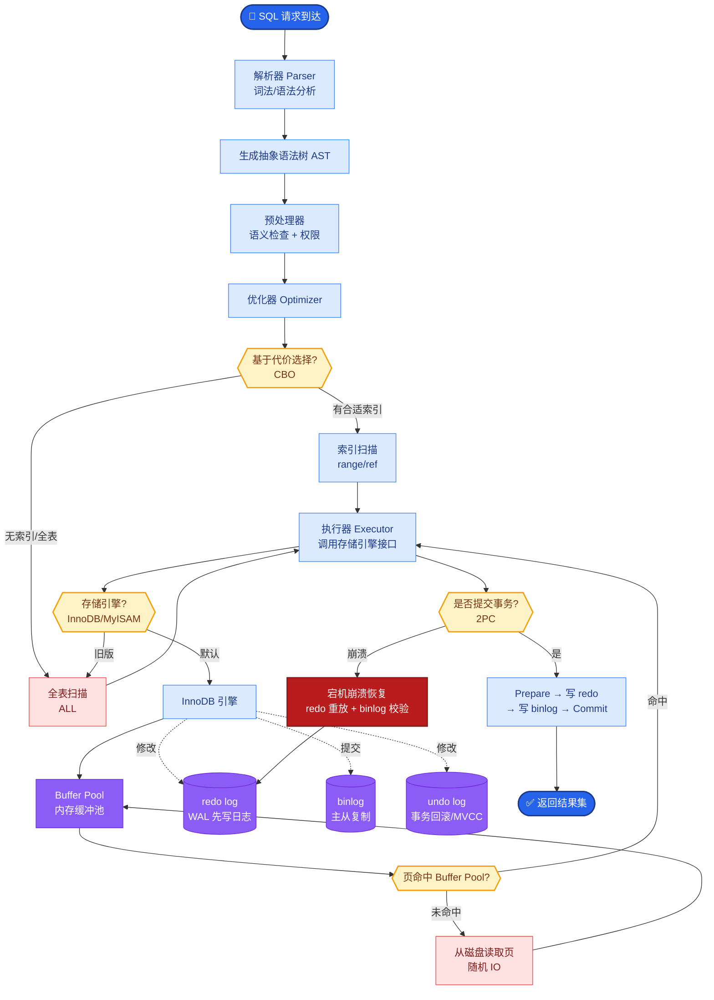

# Agent和Workflow(工作流)的本质区别是什么?什么时候用Agent,什么时候用Workflow

- **核心区别:控制流的确定性**

| | Workflow | Agent |
|--|---------|-------|
| 控制流 | **预定义路径** | **LLM动态决策** |
| 确定性 | 高 | 低 |
| 可预测性 | 高 | 低 |
| 灵活性 | 低 | **高** |
| 成本 | 低(只调必要的LLM) | **高(每步都调LLM)** |
| 调试 | 容易 | 困难 |

- **选择决策树:**
```
任务步骤是否固定?
├─ 是 → 能用规则/代码解决吗?
│       ├─ 是 → Workflow
│       └─ 否 → Workflow + 局部Agent
└─ 否 → 步骤间需要推理判断吗?
        ├─ 否 → 简单链式调用
        └─ 是 → Agent
```

- **最佳实践(Anthropic建议):**
1. **先用Workflow** - 80%的场景Workflow足够
2. **只在必要时用Agent** - 任务高度不可预测时
3. **混合使用** - Workflow编排,关键节点用Agent
4. **LLM做路由** - 用LLM选择走哪条Workflow分支

- **架构对比图:**
```
Workflow (静态图):
[Start] → [Step A] → [Step B] → [End]
           ↓           ↓
       (Fixed)    (Fixed Logic)

Agent (动态图):
[Start] → [LLM决策] ──→ (可选: Tool A)
   ↑         ↓                       ↓
   └──── [观察环境] ←─────────────────┘
         ↓
    [LLM决策] ──→ (可选: Tool B) → [End]
```

- **边界情况：**
  - **黑盒不可控**：Agent 在面对没有见过的新颖 Corner Case 时，可能会陷入“胡乱尝试”的死循环，而 Workflow 会直接报错或走兜底逻辑，更符合线上系统稳定性要求。
  - **并发冲突**：多个 Agent 并发执行时，如果共享状态（如同一个数据库记录），容易出现竞态条件，而 Workflow 通常是串行或基于 DAG 的并发，更容易处理事务一致性。

- **实战案例：**
在构建客户投诉处理系统时，最初的Agent设计经常“幻想”出不存在的退款政策。后来改为确定性Workflow（提取意图 -> 查库 -> 回复），仅在“情感安抚”环节保留Agent，稳定性提升40%，成本降低60%。

- **代码示例：** (伪代码对比)
```python
# Workflow (确定性)
def process_ticket(text):
    category = classify(text) # 分类模型
    if category == 'refund':
        return check_policy(text) # 硬编码逻辑
    else:
        return standard_reply(text)

# Agent (动态性)
def process_agent(text):
    tools = [check_policy, transfer_human, standard_reply]
    prompt = f"用户投诉: {text}. 请选择工具处理。"
    return llm_agent_with_tools.run(prompt) # 每次动态推理
```

- **## 常见考点**
1. **混合架构设计**：如何在固定的 Workflow 中嵌入 Agent 节点来处理特定的不确定性（例如：在审核节点使用 Agent 判断内容合规性）。
2. **成本权衡**：在什么情况下 Agent 带来的灵活性成本（Token消耗、延迟）是不可接受的？
3. **可观测性**：为什么 Workflow 比 Agent 更容易调试和监控？如何为 Agent 增加 Trace ID 来弥补这一短板？

## 面试追问
1. 你提到了混合使用，当 Agent 节点在 Workflow 中返回不确定的结果（例如无法解析），Workflow 应该如何设计回退策略？（Retry、回滚还是转人工？）
2. 如何量化评估一个任务应该用 Workflow 还是 Agent？有没有具体的指标（如输入输出的方差、分支复杂度）？
3. Agent 的“记忆”在 Workflow 中如何管理？如果 Workflow 中间调用了 Agent，Agent 的短期记忆是否需要传递给 Workflow 的后续步骤？

## 易错点
1. **将简单的脚本包装成 Agent**：例如定时抓取固定网页，明明用 Python 脚本或简单 Workflow 即可，却用 Agent 每次去“思考”怎么抓取，这是典型的过度工程。
2. **忽视非功能性需求**：在需要强一致性（如金融交易扣款）的场景下使用 Agent，由于 LLM 的概率特性，可能导致重复操作或逻辑漏洞，此类场景必须锁死流程。


## 核心流程图



## 记忆要点

- 核心区别：Workflow是预定义路径（确定性），Agent是LLM动态决策（灵活性）。
- 选择口诀：步骤固定用Workflow，步骤未知需推理用Agent，80%场景优先Workflow。
- Workflow成本低易调试，适合生产环境；Agent成本高不可控，适合复杂探索。
- 最佳实践是混合架构，用Workflow编排，仅在关键节点插入Agent处理不确定性。

## 结构化回答

**30 秒电梯演讲：** 本质区别就是控制流的确定性——Workflow 是预定义路径像地铁按轨道跑，Agent 是 LLM 动态决策像出租车随时改道。选择口诀：步骤固定用 Workflow，步骤未知需推理才用 Agent，80% 的场景 Workflow 就够了。

**展开框架：**
1. **本质区别** — Workflow 是预定义路径（确定性高），Agent 是 LLM 动态决策（灵活性高），控制流的确定性是分水岭。
2. **选择决策** — 步骤固定用 Workflow，步骤未知需推理用 Agent；Workflow 成本低易调试适合生产，Agent 成本高不可控适合复杂探索。
3. **混合最佳实践** — 用 Workflow 做编排，仅在关键节点插入 Agent 处理不确定性，兼顾稳定与灵活。

**收尾：** 别为了用 Agent 而 Agent——简单脚本包装成 Agent 是典型的过度工程，我可以聊聊怎么量化评估该用哪个。

## 视频脚本

> 预计时长：2 分钟 | 由浅入深

| 时间 | 画面/字幕 | 口播台词 | 讲解要点 |
|------|----------|----------|----------|
| 0:00 | 标题卡：Agent vs Workflow | "Workflow 像地铁按轨道跑，Agent 像出租车随时改道。" | 类比开场 |
| 0:30 | 控制流确定性对比表 | "Workflow 预定义路径确定性高，Agent LLM 动态决策灵活性高。" | 核心区别 |
| 1:10 | 选择决策树动画 | "口诀：步骤固定用 Workflow，步骤未知需推理才上 Agent。" | 选择口诀 |
| 1:40 | 混合架构示意 | "最佳实践：Workflow 编排，关键节点插 Agent 处理不确定性。" | 混合实践 |

