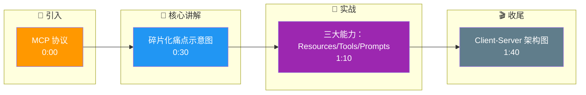

# MCP (Model Context Protocol)是什么?它解决了什么问题

- **MCP(Anthropic提出):** AI应用与外部工具/数据源之间的标准化协议.

- **类比:** MCP之于AI Agent = USB之于电脑硬件

- **解决的问题:**
- **碎片化** - 每个AI应用都要单独适配每个工具
- **重复开发** - 同一工具对不同LLM要做多次适配
- **发现困难** - Agent难以动态发现新工具

- **MCP架构:**
```
AI应用(MCP Client) ← stdio/SSE → MCP Server ← 工具/数据源
```

- **三大能力:**
1. **Resources** - 暴露数据(文件/数据库/API)
2. **Tools** - 暴露函数(可执行的操作)
3. **Prompts** - 暴露预设Prompt模板

- **优势:**
1. **标准化** - 一次开发,所有支持MCP的AI应用都能用
2. **动态发现** - Agent运行时自动发现可用工具
3. **安全** - 工具运行在独立进程中

- **生态:** Claude Desktop、Cursor、Zed、Hermes等都支持MCP

- **边界情况：**
  - **长连接稳定性**：使用 stdio 传输时，如果 Server 进程崩溃，Client 需要具备自动重启和重连机制，否则会导致工具链永久不可用。
  - **权限隔离**：MCP Server 运行在本地，往往拥有较高权限（读写文件、执行命令）。如果 AI 被越狱或诱导调用危险 MCP Server，可能造成本地系统风险。需要在 Server 层面做参数校验和沙箱限制。
  - **数据传输带宽**：MCP 通常基于 JSON-RPC，在传输大文件（如通过 Resource 传输高清图片或大模型）时，序列化和传输效率可能成为瓶颈，需结合 Blob 引用或流式传输优化。

- **详细通信流程图:**
```
+-------------------+          Transport          +-------------------+
|   MCP Host (App)  | ◄─────────────────────────► |  MCP Server       |
|                   |   (stdio / Local SSE)       |                   |
| 1. initialize     │                             | 2. Server Info    |
|    (handshake)    │                             |    (capabilities) |
|                   │                             |                   |
| 3. list_resources │◄────────────────────────────┤ 4. list_tools     |
|    (discovery)    │                             |    (discovery)    |
|                   │                             |                   |
| 5. call_tool      │────────────────────────────►│ 6. Execute Tool   |
|    (json-rpc)     │                             |    (local ops)    |
|                   │◄────────────────────────────┤ 7. Return Result  |
+-------------------+                             +-------------------+
```

- **实战案例：**
在内部知识库检索场景中，以前需要为Claude Desktop和VS Code插件分别开发数据连接器。接入MCP后，只需编写一个SQLite MCP Server，两个IDE内的AI助手即可直接查询本地文档，开发量减少50%。

- **代码示例：** (MCP Server Tool Definition - Python/SDK伪代码)
```python
from mcp.server import Server
from mcp.types import Tool, TextContent

app = Server("my-sql-server")

@app.list_tools()
async def list_tools() -> list[Tool]:
    return [Tool(
        name="execute_query",
        description="Run read-only SQL on local DB",
        inputSchema={
            "type": "object",
            "properties": {
                "sql": {"type": "string"}
            },
            "required": ["sql"]
        }
    )]

@app.call_tool()
async def call_tool(name: str, arguments: dict) -> list[TextContent]:
    if name == "execute_query":
        # 执行SQL并返回结果
        result = db.run(arguments["sql"])
        return [TextContent(type="text", text=result)]
```

## 面试追问
1. MCP 协议主要支持本地或近场通信（stdio/SSE），如果要支持远程调用（例如云端 MCP Server），在安全性认证和延迟控制上需要做哪些改造？（提示：JWT Auth、HTTPS、WebSocket）
2. 如果多个不同的 MCP Server 提供了同名但功能不同的 Tool（例如两个 Server 都有 `search`），Client 端应该如何处理命名冲突或路由策略？
3. MCP Server 的热加载机制是如何实现的？在不重启 Host 应用的情况下，如何让新安装的 Server 立即生效？

## 易错点
1. **混淆 MCP 与 Function Calling**：MCP 是传输层的协议标准，而 Function Calling 是 LLM 的推理触发机制。MCP 不仅仅是 Function Calling 的封装，还包含了资源管理和 Prompt 模板管理。
2. **忽视 Server 的生命周期管理**：认为 stdio 连接是持久的。实际上如果 Server 是无状态的，每次重启后 Host 需要重新 `initialize` 和 `list_tools`，若缓存未更新，可能导致调用失效。

## 核心流程图

```mermaid
flowchart TD
    Start([🚀 SpringBoot 启动<br/>main 方法]):::start
    SpringApplication[SpringApplication.run<br/>启动入口]:::process
    PrepareEnv[准备 Environment<br/>加载 application.yml]:::process
    ContextQ{{应用上下文?<br/>Servlet/Reactive}}:::decision
    ServletCtx[AnnotationConfigCtx<br/>传统 MVC]:::process
    ReactiveCtx[ReactiveWebCtx<br/>WebFlux]:::process
    Refresh[refresh 刷新容器<br/>核心入口]:::process
    BeanFactory[BeanFactory<br/>IoC 容器]:::store
    BeanDef[BeanDefinition<br/>扫描 @Component/@Bean]:::process
    ScanQ{{配置方式?<br/>注解/XML}}:::decision
    AnnoScan[ComponentScan<br/>ClassPathBeanDefinitionScanner]:::process
    XmlScan[XmlBeanDefinitionReader<br/>解析 XML]:::process
    Instantiate[实例化 Bean<br/>反射 newInstance]:::process
    Populate[属性填充<br/>依赖注入 @Autowired]:::process
    AwareQ{{实现 Aware 接口?}}:::decision
    Aware[BeanNameAware / ContextAware<br/>回调注入]:::process
    InitQ{{自定义初始化?}}:::decision
    PostConstruct[@PostConstruct<br/>初始化方法]:::process
    AOPQ{{需要 AOP 增强?<br/>切面 @Aspect}}:::decision
    Proxy[创建动态代理<br/>JDK/CGLIB]:::process
    ProxyChain[代理链<br/>MethodInvocation]:::process
    Final([✅ Bean 就绪 可用]):::start

    Start --> SpringApplication --> PrepareEnv --> ContextQ
    ContextQ -->|传统| ServletCtx --> Refresh
    ContextQ -->|响应式| ReactiveCtx --> Refresh
    Refresh --> BeanFactory --> BeanDef --> ScanQ
    ScanQ -->|注解| AnnoScan --> Instantiate
    ScanQ -->|XML| XmlScan --> Instantiate
    Instantiate --> Populate --> AwareQ
    AwareQ -->|是| Aware --> InitQ
    AwareQ -->|否| InitQ
    InitQ -->|是| PostConstruct --> AOPQ
    InitQ -->|否| AOPQ
    AOPQ -->|是| Proxy --> ProxyChain --> Final
    AOPQ -->|否| Final

    classDef start fill:#2563eb,stroke:#1e3a8a,color:#fff,stroke-width:2px;
    classDef process fill:#dbeafe,stroke:#3b82f6,color:#1e3a8a;
    classDef decision fill:#fef3c7,stroke:#f59e0b,color:#78350f,stroke-width:2px;
    classDef store fill:#8b5cf6,stroke:#6d28d9,color:#fff;

```

## 记忆要点

- MCP是AI应用与数据源的标准化协议，类比USB接口，一次开发处处使用。
- 解决工具碎片化问题，支持动态发现和统一接入。
- 三大能力：Resources（数据）、Tools（函数）、Prompts（模板）。
- 架构基于Client-Server模式，通过stdio/SSE通信，Server需独立进程保障安全。

## 结构化回答

**30 秒电梯演讲：** MCP 是 Anthropic 提出的标准化协议，就像 AI 世界的 USB 接口——一次开发，所有支持 MCP 的应用都能用。它统一了 Resources（数据）、Tools（函数）、Prompts（模板）三大能力的暴露标准，解决了工具碎片化和重复适配的痛点。

**展开框架：**
1. **定位与价值** — AI 应用与数据源的标准化协议，类比 USB 接口，一次开发处处使用，解决工具碎片化。
2. **三大能力** — Resources（暴露数据）、Tools（暴露函数）、Prompts（暴露模板），统一接入标准。
3. **架构与安全** — Client-Server 模式，通过 stdio/SSE 通信，Server 运行在独立进程保障安全，支持动态发现。

**收尾：** MCP 不只是 Function Calling 的封装——它还管资源和模板，我可以聊聊两者在传输层和推理层的本质区别。

## 视频脚本

> 预计时长：2 分钟 | 由浅入深

| 时间 | 画面/字幕 | 口播台词 | 讲解要点 |
|------|----------|----------|----------|
| 0:00 | 标题卡：MCP 协议 | "MCP 之于 AI Agent，就像 USB 之于电脑硬件，插上就能用。" | 类比开场 |
| 0:30 | 碎片化痛点示意图 | "以前每个 AI 应用都要单独适配每个工具，MCP 把这事标准化了。" | 解决痛点 |
| 1:10 | 三大能力：Resources/Tools/Prompts | "三大能力：数据、函数、模板，统一暴露标准。" | 核心能力 |
| 1:40 | Client-Server 架构图 | "Server 跑在独立进程里，既能动态发现工具，又保障安全。" | 架构与安全 |

### 视频流程图




---

## 延伸：MCP 协议（Model Context Protocol）

> 合并自 `agt-029`（相似度 81%）

### MCP 协议

**定义**：由 Anthropic 推动的开放标准，用于 AI 应用与外部数据源/工具之间的统一通信协议。可理解为“AI 界的 USB”。

**核心组件**：
1.  **MCP Server**：暴露工具/资源的独立进程（如连接 GitHub）。可以是本地进程，也可以是远程服务。
2.  **MCP Client**：运行在 Host 内，负责协议转换与连接管理。它向 Server 请求可用工具列表，并将工具调用转发给 Server。
3.  **Transport**：传输层，支持 stdio（本地子进程，通过标准输入输出通信，适合本地开发工具）或 HTTP/SSE（远程，适合云端部署）。

**架构图**：
```text
┌───────────────┐      1. LLM Request      ┌───────────────────────┐
│   AI App/IDE  │ ─────────────────────> │   MCP Client (Host)   │
│  (Claude etc) │                         └───────────┬───────────┘
└───────────────┘                                     │
                                                        │ 2. Transport Layer
                                                        │ (stdio / SSE)
┌───────────────┐                                     │
│  MCP Server   │ <───────────────────────────────────┘
│  (e.g., Git)  │      3. Tool Execution Result
│               │ <───────────────────────────────────┐
└───────┬───────┘                                     │
        │     4. Access Actual Resources              │
        ▼                                             │
┌───────────────┐                                     │
│   GitHub API  │ ────────────────────────────────────┘
└───────────────┘
```

**MCP vs Function Calling**：
*   **FC (Function Calling)**：解决模型“如何表达”调用意图（API 层面，OpenAI/Claude API 的原生能力）。
*   **MCP**：解决工具“如何暴露”与“如何连接”（系统层面，基础设施协议）。
*   **关系**：互补。MCP Client 将 MCP Server 暴露的工具转换为 FC 格式发给模型，收到调用后再通过 MCP 协议请求 Server。

**企业价值**：
*   **复用**：一个 Server 供多个 Agent（IDE、桌面、Web）使用，一次编写，处处运行。
*   **治理**：集中管理权限、审计与版本。
*   **安全**：工具独立进程，崩溃不拖垮主应用，且可限制网络访问。

**实战案例**：
某企业内部有 50+ 数据源。以前每接入一个 Claude Agent 或 ChatGPT 插件都要重写一遍 SDK。采用 MCP 后，数据团队只需维护一套 MCP Server，无论是 Claude Desktop 还是自研 Web Agent，只需配置连接即可直接调用所有内部工具，接入效率提升 10 倍。

**代码示例（MCP Client 伪代码逻辑）**：
```python
# 伪代码：Host 端如何通过 MCP 获取工具列表
import mcp_client

async def init_tools():
    # 连接到本地运行的 Git MCP Server
    client = mcp_client.Client(stdio_path="git-mcp-server")
    
    # 1. 初始化握手
    await client.initialize()
    
    # 2. 获取 Server 提供的工具列表
    tools_list = await client.list_tools()
    
    # 3. 转换为 LLM 需要的 Function Calling 格式
    llm_tools = [
        {"name": t.name, "description": t.description, "inputSchema": t.inputSchema}
        for t in tools_list.tools
    ]
    return llm_tools
```

**面试金句**：
*   **Q：为什么企业愿意接 MCP？**
*   **A**：降低重复建设（不用为每个 App 写一遍 SDK），统一安全与观测，便于平台组与业务组分工。

## 常见考点
1.  **Stdio vs SSE**：本地工具（如读取本地文件系统）为什么更适合用 `stdio`？（零配置、利用本地进程权限、防火墙友好）。
2.  **资源与提示**：MCP 协议中 `Resource` 和 `Prompt` 的区别是什么？（Resource 是数据如文件内容，Prompt 是预定义的提示词模板）。
3.  **采样控制**：如何在 MCP Server 端控制采样率或返回数据量？（Server 实现层处理，不属于 MCP 协议标准）。

**对比表格：MCP vs OpenAPI / Swagger**

| 维度 | MCP (Model Context Protocol) | OpenAPI / Swagger |
| :--- | :--- | :--- |
| **目标对象** | LLM / AI Agent | 开发者 / Web Server |
| **交互模式** | 双向流式 (LLM 指令 <-> 工具执行) | 单向请求-响应 (HTTP) |
| **数据传输** | JSON-RPC (stdio 或 SSE) | REST / JSON over HTTP |
| **上下文感知** | 原生支持 LLM 对话历史注入 | 无状态，需自行处理 Session |
| **本地集成** | 优秀 (通过 stdio 接入本地进程) | 弱 (需启动 Web 服务) |

## 记忆要点

- 定义：AI界USB，统一AI应用与数据源/工具的通信标准，解决集成碎片化。
- 核心组件：MCP Server（暴露资源）、Client（协议转换）、Transport（stdio/SSE）。
- 与FC关系：MCP解决”如何连接”，FC解决”如何表达”；Client将MCP工具转为FC格式。
- 企业价值：一次编写处处运行，统一权限审计，工具独立进程提升安全性。
- 传输层：本地工具用stdio（零配置），云端部署用SSE（远程通信）。

## 结构化回答

**30 秒电梯演讲：** MCP 是 Anthropic 推的”AI 界 USB 标准”——统一了 AI 应用和数据源/工具的通信协议，解决集成碎片化。它和 Function Calling 不冲突：MCP 管”如何连接工具”，FC 管”模型如何表达调用意图”，Client 把 MCP 工具转成 FC 格式发给模型。

**展开框架：**
1. **三大组件** — MCP Server（暴露工具/资源的独立进程）、Client（协议转换+连接管理）、Transport（stdio 本地零配置 / SSE 云端远程）。
2. **与 FC 互补** — FC 是模型层面的原生能力（表达意图），MCP 是系统层面的基础设施协议（连接工具）；Client 做两者转换。
3. **企业三大价值** — 一次编写处处运行（多 Agent 复用）、统一权限审计、工具独立进程崩溃不拖垮主应用。
4. **传输层选型** — 本地工具用 stdio（零配置、防火墙友好），云端部署用 SSE（远程通信）。

**收尾：** 我见过企业 50+ 数据源，以前每接一个 Agent 都要重写 SDK，上 MCP 后一套 Server 全搞定，接入效率提了 10 倍。您想深入聊协议细节、Server 开发还是企业落地？

## 视频脚本

> 预计时长：4 分钟 | 由浅入深

| 时间 | 画面/字幕 | 口播台词 | 讲解要点 |
|------|----------|----------|----------|
| 0:00 | 标题卡：MCP 协议 | “AI 工具集成太碎片？MCP 就是 AI 界的 USB，插上就能用。” | 开场钩子 |
| 0:25 | USB 即插即用类比 | “像 USB 一样，鼠标（工具）插上就能被电脑（Agent）直接用，不用每个工具写一遍 SDK。” | 本质类比 |
| 1:00 | Server-Client-Transport 三组件图 | “三大组件：Server 暴露工具，Client 做协议转换，Transport 是 stdio 本地或 SSE 云端。” | 核心组件 |
| 1:40 | MCP vs FC 互补关系 | “MCP 管'如何连接'，FC 管'如何表达'。Client 把 MCP 工具转成 FC 格式发给模型，不冲突。” | 与 FC 关系 |
| 2:20 | 企业三大价值清单 | “企业价值：一次编写处处运行、统一权限审计、工具独立进程崩溃不拖垮主应用。” | 企业价值 |
| 3:00 | 50+ 数据源接入效率提 10 倍案例 | “实战：企业 50+ 数据源，以前每接一个 Agent 重写 SDK，上 MCP 后一套 Server 全搞定，效率提 10 倍。” | 实战案例 |
| 3:45 | 总结卡 | “记住：AI 界 USB、三组件、与 FC 互补。下期讲工具路由。” | 收尾 |
