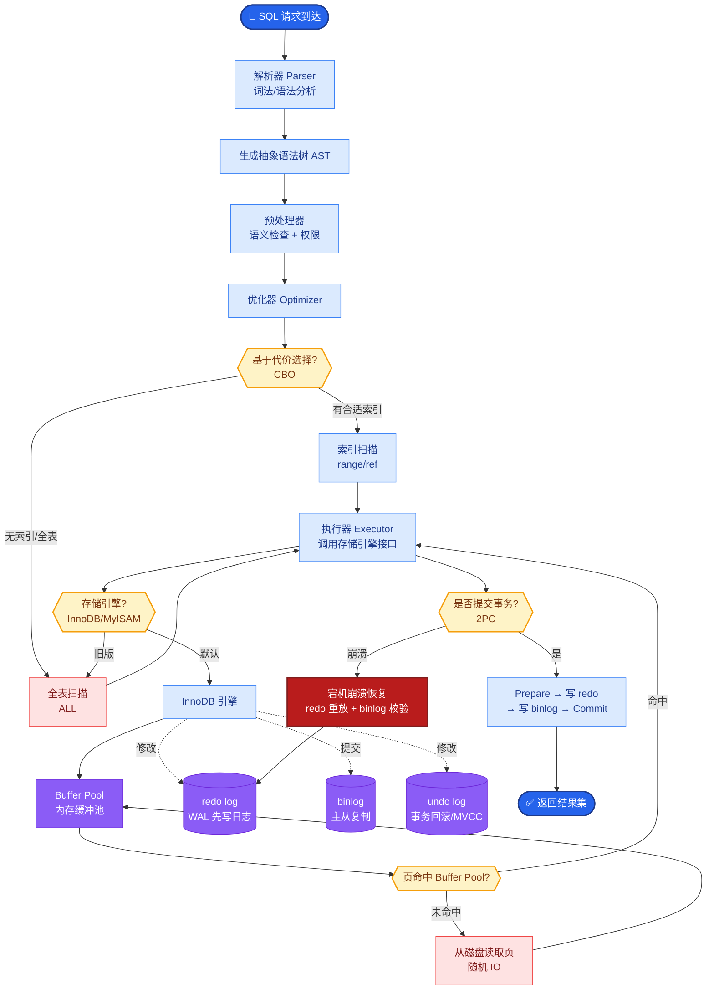

# 当Agent有几十上百个工具时,如何高效选择正确的工具

- **工具过载问题:** LLM上下文有限,工具太多导致选择困难和幻觉.

- **解决方案(分层策略):**

1. **工具检索**
- 将工具描述做embedding
- 根据用户意图检索Top-K相关工具
- 只将相关工具传给LLM

2. **工具分类路由**
- 先用LLM/分类器选择工具类别
- 再在类别内选择具体工具

3. **层级工具**
- 粗粒度工具作为入口
- 调用后动态暴露细粒度工具

4. **工具使用历史**
- 记录哪些工具组合在什么场景下被使用
- 用历史数据辅助选择

5. **MCP动态发现**
- MCP Server按需暴露工具
- Agent先列出可用工具,再选择

- **实战案例:**
在某企业级SaaS助手中，我们曾一次性挂载了80+个CRM和ERP接口，导致Agent在处理简单订单查询时也出现严重的"幻觉"，甚至调用不存在的"delete_user"工具。后改用两阶段路由（先判意图模块：销售/客服/HR，再加载对应模块的5-8个工具），响应准确率从60%提升至94%。

- **代码示例 (Python):**
```python
# Tool RAG 实现
from sklearn.metrics.pairwise import cosine_similarity
import numpy as np

def retrieve_tools(query, tool_index, top_k=5):
    query_vec = embedding_model.encode(query)
    # tool_index: 预先计算好的所有工具描述的embedding矩阵
    scores = cosine_similarity([query_vec], tool_index)[0]
    top_indices = np.argsort(scores)[-top_k:][::-1]
    return [all_tools[i] for i in top_indices]

# 使用
candidate_tools = retrieve_tools("预定周五去纽约机票", tool_vector_db)
# 仅将 candidate_tools 注入到 LLM Prompt 中
```

- **工具选型对比:**

| 策略 | 适用工具数量 | 实现复杂度 | 延迟增加 | 准确率上限 |
| :--- | :--- | :--- | :--- | :--- |
| **Direct Prompt** | < 15 | 低 | 无 | 高 (上下文充足) |
| **Tool RAG** | 15 - 100 | 中 | 低 (检索耗时) | 中 (依赖检索相关性) |
| **Classifier/Routing** | 50 - 500 | 高 | 中 (多跳推理) | 高 (分类隔离干扰) |
| **Hierarchy** | > 100 | 很高 | 高 (多轮交互) | 中 (用户体验折损) |

- **实践建议:**
- <15个工具:直接放系统prompt
- 15-50个工具:Tool RAG
- 50+个工具:分类路由 + Tool RAG

- **Tool RAG 架构图:**
```
User Input: "帮我预定周五去纽约的机票"
    │
    ▼
[Embedding Model]
    │
    ▼ (Vector Similarity Search)
+-----------------------+
|  Tool Vector Index    |
|  (Name + Description) |
+-----------+-----------+
            │
            ▼ Top-5 Retrieved Tools
+-----------------------+
| 1. book_flight (0.92) |
| 2. check_weather (0.85)|
| 3. search_hotel (0.80)|
| 4. cancel_trip (0.75) |
| 5. get_news (0.60)    |
+-----------+-----------+
            │
            ▼ Inject into Prompt
    ┌───────────────┐
    │  LLM Decision │
    └───────────────┘
```

- **## 常见考点**
1. **Embedding 策略**：做 Tool RAG 时，是对工具的 `name`、`description` 分别 Embedding 还是拼接后 Embedding？如何处理参数描述中的语义信息？
2. **Router 模型**：在分类路由阶段，使用小模型（如 GPT-3.5/4o-mini）还是微调过的 BERT 分类器效果更好？各自的优缺点是什么？
3. **Cold Start 问题**：当一个全新的工具加入，且未被 Embedding 索引收录时，系统如何兜底处理？

## 核心流程图



## 记忆要点

- 工具过载会导致选择困难，解决方案是检索（RAG）、分类路由和层级设计。
- Tool RAG：对工具描述做Embedding，检索Top-K相关工具注入Prompt。
- 分类路由：先判意图类别，再加载该类别的少量工具，减少干扰。
- 实战建议：<15个直接传，15-50个用RAG，50+个用路由+RAG。

## 结构化回答

**30 秒电梯演讲：** 工具一多，LLM 就选择困难还乱幻觉。解法是分层策略：Tool RAG 对工具描述做 Embedding 检索 Top-K，分类路由先定大类再选具体。口诀是：少于 15 个直接传，15-50 个用 RAG，50 个以上路由加 RAG。

**展开框架：**
1. **问题本质** — 工具过载导致上下文溢出和选择困难，LLM 甚至会调用不存在的工具。
2. **三大方案** — Tool RAG 检索 Top-K 相关工具注入 Prompt；分类路由先判意图再加载少量工具；层级设计粗粒度入口动态暴露细粒度。
3. **实战分层建议** — <15 个直接传 Prompt，15-50 个用 Tool RAG，50+ 个用分类路由 + RAG 组合。

**收尾：** 选型其实是延迟和准确率的权衡——我可以聊聊不同工具数量下怎么评估选型。

## 视频脚本

> 预计时长：2 分钟 | 由浅入深

| 时间 | 画面/字幕 | 口播台词 | 讲解要点 |
|------|----------|----------|----------|
| 0:00 | 标题卡：工具选择 | "工具一多，LLM 就选择困难，甚至会调不存在的工具。" | 过载问题 |
| 0:30 | Tool RAG 检索流程 | "Tool RAG：对工具描述做 Embedding，检索 Top-K 注入 Prompt。" | 检索方案 |
| 1:10 | 分类路由两阶段示意 | "分类路由先判意图大类，再加载该类别的少量工具。" | 路由方案 |
| 1:40 | 分层选型建议表 | "口诀：少于 15 直接传，15-50 用 RAG，50 以上路由加 RAG。" | 实战口诀 |

### 视频流程图


