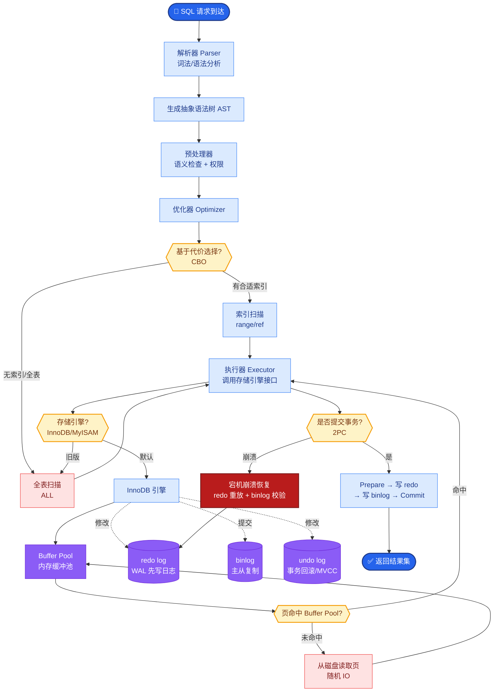
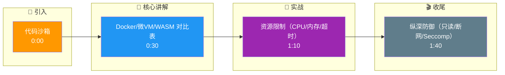

# Agent执行代码的安全沙箱如何设计?有哪些隔离方案

- **代码执行沙箱方案:**

| 方案 | 隔离级别 | 性能 | 适用 |
|------|---------|------|------|
| Docker容器 | 进程级 | 中 | 通用 |
| 微VM(Firecracker) | 内核级 | **高** | 高安全 |
| WASM运行时 | 进程内 | 高 | 轻量 |
| gVisor | 系统调用级 | 中 | Google |
| E2B沙箱 | 云端VM | 高 | SaaS |

- **实战案例:**
在一次数据分析Demo中，LLM生成的代码包含 `while True: pass` 死循环，由于未设置CPU超时配额，直接导致宿主机单核卡死。后续引入Docker Cgroup限制 `--cpus=1` 和 `--timeout=10s`，并在Seccomp中禁用了 `fork` 炸弹相关的系统调用，彻底解决了资源耗尽风险。

- **代码示例 (Python/Docker):**
```python
import docker

client = docker.from_env()

# 运行沙箱容器
container = client.containers.run(
    image="python-sandbox:latest",
    command=f"python -c '{user_code}'",
    mem_limit="50m",      # 内存限制
    cpu_period=100000,
    cpu_quota=50000,       # 0.5核CPU限制
    network_disabled=True, # 禁用网络
    read_only=True,        # 只读文件系统
    runtime="runsc",      # 使用 gVisor 增强隔离
    remove=True
)
```

- **安全策略:**

1. **资源限制**
- CPU/内存配额
- 执行超时(如30秒)
- 网络访问白名单

2. **文件系统隔离**
- 只读根文件系统
- 临时目录可写
- 禁止访问宿主文件

3. **网络策略**
- 默认禁止网络
- 白名单域名
- 禁止内网访问

4. **能力限制**
- 禁止系统调用
- 禁止root权限
- seccomp/AppArmor profile

- **Agent最佳实践:** 代码执行结果截断(防止大量输出撑爆上下文)

- **Docker 安全沙箱架构图:**
```
+--------------------------+          +--------------------------+
|      Host OS             |          |   Docker Container       |
|                          |          |   (Sandboxed Env)        |
|  +------------------+    │          |  +--------------------+  |
|  |  Agent App       │    │          |  | Python Interpreter |  |
|  |  (Code Gen)      │    │          |  | exec(code)         |  |
|  +--------+---------+    │          |  +---------+----------+  |
|           │             │          |            ^             |
|           │ REST/gRPC   │          |            │ Stdout/Stderr|
|           ▼             │          |            │             |
|  +--------+---------+    │          +------------|-------------+
|  |  Docker Daemon   │◄─────────────────────────┘
|  |  (API Endpoint)  │    |
|  +--------+---------+    |
|           │             |
|   [Network/FS Controls]  │
|           │             |
|  [Seccomp/Profile Filter]│
+--------------------------+
```

- **## 常见考点**
1. **Seccomp 作用**：Seccomp (Secure Computing Mode) 是如何过滤系统调用的？为什么限制 `clone` 或 `unshare` 调用可以防止容器逃逸？
2. **网络隔离**：如果代码执行需要访问外部 API（如抓取网页），如何在沙箱中安全地开启出站网络？如何防止访问内网 IP（如 169.254.169.254 元数据服务）？
3. **WASM vs Docker**：WebAssembly (WASM) 沙箱的优势在于启动速度快和内存占用低，但它目前的主要限制是什么（如缺乏成熟的 OS 级库支持）？

## 核心流程图



## 记忆要点

- 沙箱方案对比：Docker（通用）、微VM（高安全）、WASM（轻量高性能）。
- 资源限制是关键：必须限制CPU、内存和执行超时，防止死循环耗尽宿主机。
- 文件系统设为只读，网络默认禁止，仅开启白名单。
- 使用Seccomp过滤危险系统调用（如fork），防止容器逃逸。

## 结构化回答

**30 秒电梯演讲：** 代码沙箱就是在隔离环境里跑不可信代码，炸了也只脏箱子不伤人。方案从 Docker（通用）到微 VM（高安全）到 WASM（轻量）。关键四件事：限资源、只读文件系统、断网加白名单、用 Seccomp 过滤危险系统调用。

**展开框架：**
1. **方案选型** — Docker 通用、微 VM（Firecracker）内核级高安全、WASM 轻量高性能，按隔离级别和性能权衡。
2. **资源限制是关键** — 必须限制 CPU、内存和执行超时，防止死循环耗尽宿主机。
3. **纵深防御** — 文件系统只读、网络默认禁止仅开白名单、Seccomp 过滤危险系统调用（如 fork）防容器逃逸。

**收尾：** 沙箱设计的本质是纵深防御——我可以聊聊 Firecracker 微 VM 为什么比 Docker 更安全。

## 视频脚本

> 预计时长：2 分钟 | 由浅入深

| 时间 | 画面/字幕 | 口播台词 | 讲解要点 |
|------|----------|----------|----------|
| 0:00 | 标题卡：代码沙箱 | "像在透明真空箱里做化学实验，炸了也只脏箱子不伤人。" | 类比开场 |
| 0:30 | Docker/微VM/WASM 对比表 | "Docker 通用，微 VM 高安全，WASM 轻量高性能。" | 方案选型 |
| 1:10 | 资源限制（CPU/内存/超时） | "关键四件事之一：限 CPU、内存、超时，防死循环。" | 资源限制 |
| 1:40 | 纵深防御（只读/断网/Seccomp） | "文件只读、网络白名单、Seccomp 过滤危险调用，纵深防御。" | 纵深防御 |

### 视频流程图




