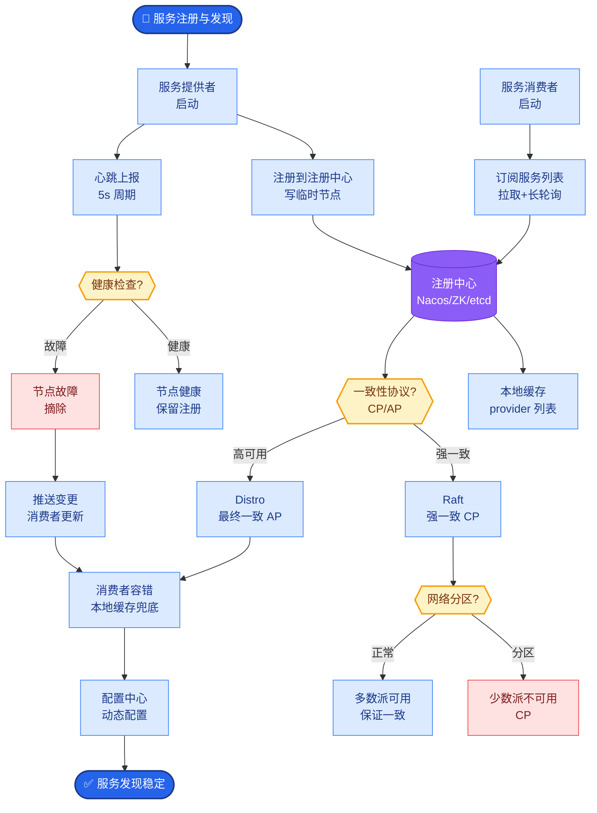
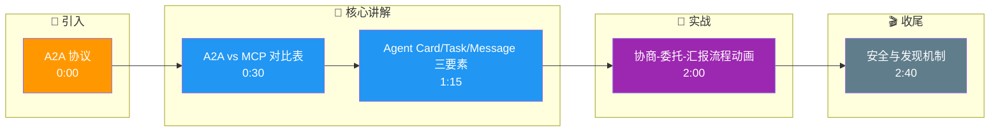

# A2A (Agent-to-Agent) 通信协议的核心设计是什么?和MCP有什么区别

- **A2A vs MCP:**

| | MCP | A2A |
|--|-----|-----|
| 通信方向 | Agent ↔ 工具 | **Agent ↔ Agent** |
| 解决问题 | Agent如何使用外部工具 | Agent如何与其他Agent协作 |
| 数据流 | 请求-响应 | **协商-委托-汇报** |
| 发现 | 工具发现 | **Agent发现** |
| 耦合度 | 低（单向调用） | 高（双向协作/状态同步） |

- **A2A核心概念:**

1. **Agent Card** - Agent的自我描述(能力/接口/认证)
```json
{
  "name": "Research Agent",
  "capabilities": ["web_search", "summarize"],
  "endpoint": "https://agent-x.com/a2a",
  "auth": "bearer_token"
}
```

2. **Task** - Agent间委托的任务单元
- 任务有生命周期:pending→running→completed→failed

3. **Message** - Agent间的通信消息
- 支持文本/结构化数据/文件

4. **Artifact** - Agent产出物

- **A2A 通信流程架构:**

```text
┌─────────────┐            Negotiate/Discover           ┌─────────────┐
│  Agent A    │ ────────────────────────────────────> │  Agent B    │
│ (Manager)   │ <─── (Returns Agent Card/Capabilities)│ (Worker)    │
└──────┬──────┘                                        └──────┬──────┘
       │                                                      │
       │ 1. Delegate Task (Task Protocol JSON)               │
       │ ──────────────────────────────────────────────────> │
       │                                                      │
       │                     [Processing...]                  │
       │                                                      │
       │ 2. Report Status (Running/Failed/Partial)           │
       │ <────────────────────────────────────────────────── │
       │                                                      │
       │ 3. Final Result + Artifact(s)                        │
       │ <────────────────────────────────────────────────── │
```

- **应用场景:**
- 编排Agent委托子任务给专业Agent
- Agent市场(发现并雇佣其他Agent)
- 跨组织Agent协作

- **关键设计细节:**
- **幂等性**: 任务消息应包含唯一ID，防止网络重放导致重复执行。
- **异步流式通信**: 除了简单的Request-Response，A2A通常支持WebSocket或SSE流式传输中间思考过程，增强协作透明度。

- **实战案例:**：某多Agent金融分析系统曾因Worker Agent无序并发写入同一“分析报告”文件导致数据覆盖。修复方案引入了A2A协议中的 `artifact_lock` 机制，在Task协商阶段明确声明了资源独占性，解决了协作冲突。

- **代码示例 (Python - 伪代码):**
```python
# Agent A 发起任务委托
task_payload = {
    "task_id": uuid4(),
    "type": "data_analysis",
    "payload": {"dataset": "sales_2024.csv"},
    "callback_url": "https://agent-a/api/callback"
}
response = requests.post(
    "https://agent-b/a2a/execute", 
    json=task_payload, 
    headers={"Authorization": "Bearer <shared_token>"}
)
```

## 常见考点
1. **如何保证安全性？**
   - 问点：跨组织调用时如何鉴权？
   - 答案：使用OAuth2.0/JWT，Agent Card中声明scopes，调用方需申请授权。
2. **Agent 如何发现其他 Agent？**
   - 问点：有没有类似服务注册中心的机制？
   - 答案：通常通过Agent Registry（服务发现）或DID（Decentralized Identifier）去中心化网络发现。
3. **A2A与传统的RPC调用有何本质区别？**
   - 问点：直接用gRPC不行吗？
   - 答案：RPC是确定性的函数调用，A2A包含目标规划、非确定性执行和人类可读的协商过程，更适合解决模糊任务。

## 核心流程图



## 记忆要点

- A2A是Agent间协作，MCP是Agent调用工具，前者高耦合双向，后者低耦合单向。
- 核心三要素：Agent Card(能力描述)、Task(任务委托)、Message(协商汇报)。
- 流程是协商-委托-汇报，支持异步流式传输，需保证任务幂等性。
- 安全用OAuth2.0鉴权，发现机制依赖Agent Registry或DID去中心化标识。

## 结构化回答

**30 秒电梯演讲：** A2A 是 Agent 之间协作的协议，区别于 MCP 的 Agent 调工具——A2A 是双向高耦合，MCP 是单向低耦合。核心三要素：Agent Card（能力描述）、Task（任务委托）、Message（协商汇报），流程是协商、委托、汇报。

**展开框架：**
1. **与 MCP 的本质区别** — A2A 是 Agent 间协作（双向高耦合），MCP 是 Agent 调工具（单向低耦合），解决问题不同。
2. **核心三要素** — Agent Card 描述能力、Task 定义带生命周期的委托单元、Message 支持协商与汇报。
3. **工程关键** — 流程是协商-委托-汇报，支持异步流式传输，需保证任务幂等性；安全用 OAuth2.0，发现靠 Agent Registry 或 DID。

**收尾：** A2A 比 RPC 复杂在它包含目标规划和非确定性执行——我可以聊聊跨组织 Agent 协作怎么建立信任。

## 视频脚本

> 预计时长：3 分钟 | 由浅入深

| 时间 | 画面/字幕 | 口播台词 | 讲解要点 |
|------|----------|----------|----------|
| 0:00 | 标题卡：A2A 协议 | "A2A 像人才市场：有工人、有职位描述（Agent Card）、有合同（Task）。" | 类比开场 |
| 0:30 | A2A vs MCP 对比表 | "A2A 是 Agent 间双向协作，MCP 是 Agent 调工具单向调用。" | 本质区别 |
| 1:15 | Agent Card/Task/Message 三要素 | "三要素：Agent Card 描述能力，Task 委托任务，Message 协商汇报。" | 核心概念 |
| 2:00 | 协商-委托-汇报流程动画 | "流程是协商、委托、汇报，支持异步流式传输。" | 通信流程 |
| 2:40 | 安全与发现机制 | "安全用 OAuth2.0，发现靠 Agent Registry 或 DID 去中心化标识。" | 安全与发现 |

### 视频流程图




