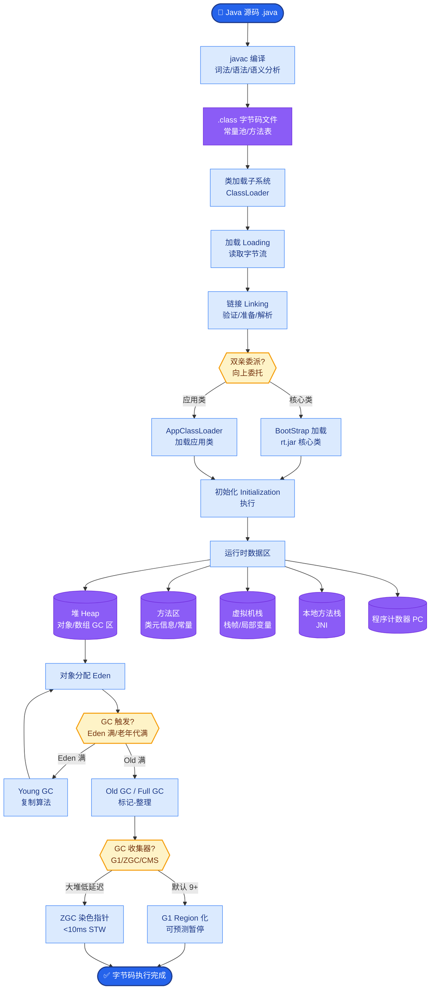
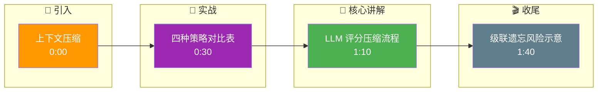

# 上下文压缩(Context Compaction)有哪些策略?如何在不丢失关键信息的情况下减少Token

- **上下文压缩策略:**

1. **对话摘要**
- 旧对话→LLM生成摘要→替换原文
- 压缩比:10:1~50:1
- 风险:摘要可能丢失细节

2. **选择性保留**
- 保留:用户指令、关键决策、错误教训
- 丢弃:寒暄、重复信息、工具详细输出
- 用LLM做重要性评分

3. **工具输出截断**
- 工具返回的大量数据截取关键部分
- 如API返回100条,只取Top-5
- 附加「还有95条结果,需要时请查询」

4. **结构化存储**
- 将中间结果存为JSON而非自然语言
- Token效率提升3-5倍

5. **分层摘要**
- 最近5轮:完整
- 5-20轮:每轮摘要
- 20+轮:整体摘要

- **实际效果:**
- 原始上下文:50K tokens
- 压缩后:8-12K tokens(保持95%+信息量)

- **Codex/Hermes等Agent框架都内置了上下文压缩**

- **LLM驱动的压缩流程:**
```text
[Original Long Context]
        │
        ▼
┌───────────────────────┐
│  LLM Classifier/Eval  │
│  (Score Importance)   │
└───────┬───────┬───────┘
        │       │
   High │       │ Low
   Score│       │ Score
        ▼       ▼
   [Keep]      [Compress/Discard]
        │       │
        ▼       ▼
┌───────────────────────┐
│   Compact Context     │
│ (Key Facts + Summary) │
└───────────────────────┘
```

- **实战案例:**：日志分析Agent在处理长达50K的报错日志时，如果不压缩直接输入会导致模型专注于中间的重复循环日志，忽略最开始的根因异常。实施了“长文本摘要 + 关键报错行引用”的混合策略：先用廉价模型（如GPT-3.5）提取异常栈，再仅将关键代码段注入主模型，将Token消耗降低了70%且定位准确率提升。

- **代码示例 (Python - LLM辅助压缩):**
```python
prompt = ChatPromptTemplate.from_messages([
    ("system", "你是一个信息压缩专家。请保留关键实体和决策，丢弃寒暄和重复内容。"),
    ("user", "压缩以下对话历史，输出JSON: {\"keep\": \"关键信息\", \"summary\": \"其他内容摘要\"}
\n---\n{history}")
])

def compress_context(history_text: str):
    chain = prompt | llm | JsonOutputParser()
    result = chain.invoke({"history": history_text})
    return f"关键保留: {result['keep']}\n历史摘要: {result['summary']}"
```

- **策略对比:**

| 策略 | 压缩比 | 语义保留度 | 计算成本 | 适用场景 |
| :--- | :--- | :--- | :--- | :--- |
| 对话摘要 | 高 (10:1-50:1) | 低 (细节丢失严重) | 高 (需LLM推理) | 长期历史归档 |
| 选择性保留 | 中 (2:1-5:1) | 高 (原始文本) | 中 (需LLM打分) | 任务关键路径信息 |
| 工具输出截断 | 极高 (100:1) | 中 (依赖截断逻辑) | 低 (规则切片) | 大数据量检索/列表 |
| 结构化存储 | 中 (3:1-5:1) | 高 (信息无损) | 低 (字符串替换) | 中间变量、状态传递 |

## 常见考点
1. **压缩导致的级联遗忘问题？**
   - 问点：多次摘要后信息是否严重失真？
   - 答案：是的，这就是"递归摘要"的问题。解决方案是保留原始关键句子的引用，或者使用Graph结构连接摘要而非简单的线性替换。
2. **如何量化信息丢失率？**
   - 问点：怎么知道压缩后还剩多少信息？
   - 答案：可以使用"问答测试集"，在压缩前和压缩后让LLM回答一组预设问题，对比准确率。
3. **LLM本身的压缩能力极限？**
   - 问点：能一直压缩下去吗？
   - 答案：不能，存在信息熵极限。通常建议压缩比不超过 20:1，否则逻辑链路会断裂。

## 核心流程图



## 记忆要点

- 压缩策略：对话摘要、选择性保留、工具输出截断、结构化存储。
- 摘要压缩比高(10:1)但易失真，工具截断适合大数据，结构化存储效率高。
- LLM驱动压缩：先评分重要性，高分保留，低分压缩或丢弃。
- 风险：递归摘要导致级联遗忘，建议保留关键句子引用，压缩比不超过20:1。

## 结构化回答

**30 秒电梯演讲：** 上下文压缩就是丢弃噪音保留核心语义。四种策略：对话摘要压缩比高但易失真，选择性保留高价值信息，工具输出截断适合大数据，结构化存储比自然语言紧凑 3-5 倍。LLM 驱动压缩会先评分重要性再决定保留还是丢弃。

**展开框架：**
1. **四种策略** — 对话摘要（压缩比 10:1 但易失真）、选择性保留（评分留高价值）、工具输出截断（适合大数据）、结构化存储（无损且紧凑）。
2. **LLM 驱动压缩** — 先评分重要性，高分保留原文，低分压缩或丢弃，实现智能筛选。
3. **风险与边界** — 递归摘要导致级联遗忘，建议保留关键句子引用，压缩比不超过 20:1 否则逻辑链断裂。

**收尾：** 压缩不是越狠越好——信息熵有极限，我可以聊聊怎么用问答测试集量化信息丢失率。

## 视频脚本

> 预计时长：2 分钟 | 由浅入深

| 时间 | 画面/字幕 | 口播台词 | 讲解要点 |
|------|----------|----------|----------|
| 0:00 | 标题卡：上下文压缩 | "把长篇小说压缩成精编版和人物小传，剧情连贯字数大减。" | 类比开场 |
| 0:30 | 四种策略对比表 | "摘要、选择性保留、工具截断、结构化存储，各有各的适用场景。" | 策略对比 |
| 1:10 | LLM 评分压缩流程 | "LLM 先评分重要性，高分保留，低分压缩或丢弃。" | 智能压缩 |
| 1:40 | 级联遗忘风险示意 | "递归摘要会级联遗忘，压缩比别超 20:1，保留关键句引用。" | 风险边界 |

### 视频流程图




