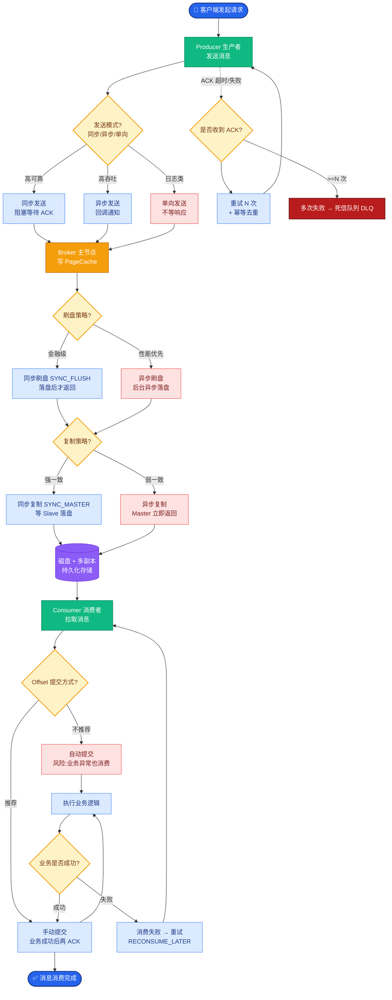

# Tree of Thoughts (ToT) 和 ReAct 的区别是什么?ToT适合什么场景

- **ToT vs ReAct:**

| | ReAct | ToT |
|--|-------|-----|
| 推理路径 | 单条链 | **多条并行树** |
| 回溯 | 无 | **支持回溯** |
| 搜索 | 无 | **BFS/DFS搜索** |
| 适用 | 线性推理 | **需要探索/试错** |
| Token消耗 | 低 | **高** |

- **ToT流程:**
1. **分解** - 将问题拆为多个思维步骤
2. **生成** - 每步生成多个候选想法
3. **评估** - 评估每个想法的前景(value函数)
4. **搜索** - BFS/DFS搜索最优路径
5. **回溯** - 死路时回溯到上一节点

- **ToT 搜索过程示意图:**
```text
Start (Initial State)
  │
  ├── Thought 1.1 ──> Thought 2.1 ──> Thought 3.1 (Failed) ──┐
  │                                                (Backtrack) │
  ├── Thought 1.2 ──> Thought 2.2 (Dead End) ─────────────────┘
  │
  └── Thought 1.3 ──> Thought 2.3 ──> Thought 3.3 (Success!)
```

- **适用场景:**
- 数学竞赛题(24点游戏)
- 创意写作(需要探索多种可能)
- 密码推理/逻辑谜题
- 需要全局规划的问题

- **不适合:** 简单问答、线性任务(用ReAct即可)

- **实战案例**: 在解决LeetCode困难级算法题时，ReAct往往因第一个思路陷入死胡同而放弃，而ToT会尝试3种不同算法思路（如DP、贪心、回溯），并在回溯发现DP超时后，自动剪枝切换至贪心算法，最终通过测试。

- **代码示例 (Python - 伪代码):**
```python
def tot_solver(problem, max_depth=3, breadth=3):
    root = State(problem)
    queue = [root]
    
    for _ in range(max_depth):
        next_level_states = []
        for state in queue:
            candidates = llm_generate_thoughts(state, n=breadth) # 生成
            for cand in candidates:
                value = llm_evaluate(state, cand) # 评估
                if value > threshold: 
                    next_level_states.append(cand)
        queue = beam_search(next_level_states) # 搜索/剪枝
    return best_solution(queue)
```

## 常见考点
1. **Value Function 如何设计？**
   - 问点：如何判断一个 Thought 是好是坏？
   - 答案：可以单独设计一个 Prompt 让 LLM 给出 1-10 的打分，或者通过简单的规则判断（如代码能否运行、数学答案是否正确）。
2. **BFS 和 DFS 在 ToT 中的选择？**
   - 问点：什么时候用广度优先？
   - 答案：BFS 适用于寻找最短路径或需要全面探索的情况（如数学证明）；DFS 适用于深度推理或路径较明显的情况。
3. **ToT 的成本控制？**
   - 问点：搜索指数级膨胀怎么办？
   - 答案：限制每一层的分支数量和最大搜索深度，或者使用 Beam Search（集束搜索）只保留 top-k 个最优节点。

## 易错点
1. **ToT 并非万能**：认为 ToT 可以提升所有任务效果。实际上对于简单任务（如事实性问答），ToT 会引入极高的 Token 成本且效果提升不明显，甚至因为生成过多候选词导致幻觉概率累积增加。
2. **回溯的幻觉风险**：在代码或数学任务中，如果 LLM 自身的“评估器”不够准确，可能会错误地回溯掉正确的路径，或者死守错误的路径进行无效搜索。

## 面试追问
1. 在实际工业场景中，ToT 的高延迟和高成本往往是不可接受的，你会如何设计“动态剪枝”策略来平衡效果与成本？
2. 如果 LLM 生成的候选思想非常发散，导致 Value Function 很难标准化打分，你会怎么改进评估机制？（提示：引入外部验证器如代码解释器或搜索引擎）
3. ToT 和 Graph of Thoughts (GoT) 的核心区别是什么？在什么场景下你会选择 GoT 而不是 ToT？


## 核心流程图



## 记忆要点

- ToT vs ReAct：ToT是多树并行支持回溯，ReAct是单链式无回溯。
- ToT流程：分解→生成候选→评估→搜索(BFS/DFS)→回溯。
- 适用场景：数学竞赛、创意写作、逻辑谜题等需探索试错的复杂任务。
- 成本控制：限制分支数和深度，用Beam Search剪枝，不适合简单线性任务。

## 结构化回答

**30 秒电梯演讲：** Tree of Thoughts 把推理从单链升级成多分支树——像下棋推演整棵棋局树，走错还能悔棋。流程是分解、生成候选、评估、BFS/DFS 搜索、回溯。适合数学竞赛、创意写作这类需要探索试错的复杂任务，但 Token 消耗高。

**展开框架：**
1. **与 ReAct 的区别** — ToT 是多条并行树支持回溯，ReAct 是单链式无回溯；ToT 适合探索试错，ReAct 适合线性推理。
2. **五步流程** — 分解问题→生成候选想法→评估前景（value 函数）→BFS/DFS 搜索→死路时回溯。
3. **成本控制** — 限制分支数和深度，用 Beam Search 剪枝；简单线性任务别用 ToT，否则烧 Token 还可能累积幻觉。

**收尾：** ToT 不是万能药——简单问答用它纯属浪费，我可以聊聊怎么设计 Value Function 给分支打分。

## 视频脚本

> 预计时长：2 分钟 | 由浅入深

| 时间 | 画面/字幕 | 口播台词 | 讲解要点 |
|------|----------|----------|----------|
| 0:00 | 标题卡：Tree of Thoughts | "像下棋不只看一步，推演整棵棋局树，走错还能悔棋。" | 类比开场 |
| 0:30 | ToT vs ReAct 对比 | "ToT 多树并行能回溯，ReAct 单链式无回溯。" | 核心区别 |
| 1:10 | 五步流程动画 | "分解、生成候选、评估、搜索、回溯，五步走。" | 流程拆解 |
| 1:40 | 适用 vs 不适用场景 | "适合数学竞赛、创意写作；简单线性任务别用，烧 Token。" | 场景边界 |

