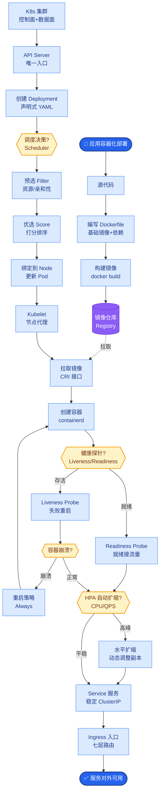

# OpenAI Swarm的核心设计理念是什么?Handoff机制如何工作

- **Swarm核心:极简的多Agent编排**

- **设计哲学:**
- **无状态** - Agent本身无内部状态,状态完全存储在`context_variables`中
- **轻量级** - 没有复杂的图结构,本质是函数调用链+context传递
- **Handoff** - Agent间通过显式函数「交接」控制权,类似goto但结构化

- **核心概念:**

1. **Agent** - `instructions` (System Prompt) + `functions` (Tools)
2. **Handoff Function** - 返回另一个Agent对象的特殊函数
3. **Context Variables** - 字典形式的数据,在Agent间流转,保持会话记忆

```text
      Swarm Handoff 控制流转移

   [User Input]
        |
        v
+-------------------+
| Triage Agent      | 
| (意图识别)        | ---transfer_to_billing()---> [Billing Agent]
+-------------------+                                      |
        |                                              |
        | <-----------------transfer_back()------------+
        |
        v
   [Final Response]
   (Context始终伴随)
```

- **Handoff示例:**
```python
def transfer_to_billing():
    """交接给账单专员"""
    return billing_agent  # 返回目标Agent实例

def transfer_back_to_triage():
    """交接回分诊台"""
    return triage_agent

triage_agent = Agent(
name="客服分诊",
instructions="根据用户问题分诊，如果涉及钱转给billing，否则转给tech",
functions=[transfer_to_billing, transfer_to_tech]
)

# 用户问账单问题 → triage调用transfer_to_billing
# 控制权自动转给billing_agent (上下文Context保持不变)
# billing_agent处理完后，可直接调用transfer_back返回
```

- **实战案例**: 在构建客服系统时，遇到用户身份验证需跨多个Agent（如Sales->Tech->Billing）。我们在Handoff函数中更新`context_variables`（例如`{"user_verified": True}`），后续Agent无需再次询问密码，大幅提升了用户体验。

- **代码示例 (Handoff更新状态)**:
```python
def transfer_to_technical_support():
    """更新状态并交接给技术支持"""
    return Agent(
        name="Tech Support",
        instructions="帮助用户解决技术问题",
        functions=[escalate])

def verify_and_handoff(user_id):
    """验证身份后交接，并在Context中打标"""
    # 模拟验证逻辑
    is_valid = check_db(user_id)
    # 返回Agent并携带更新后的Context
    return tech_agent, {"is_verified": is_valid, "user_id": user_id}
```

- **vs AutoGen/CrewAI:**
- **更简单** - 去除了GroupChat/Crew/Process等复杂概念,聚焦于编排
- **更Pythonic** - 纯Python函数式编程,无需学习特定DSL
- **更灵活** - Handoff本质是返回Agent实例的函数,逻辑完全可控
- **适合:** 客服分诊、专业路由、多轮对话场景

- **注意:** Swarm是实验性框架,生产环境需自行增强（如日志、监控、持久化）

## 常见考点
1. **Context更新**：如何在Handoff过程中更新Context（例如记录用户已经验证过身份）？
2. **函数调用冲突**：如果Agent既有一个普通Tool叫`check_status`，又有一个Handoff函数，LLM如何区分？
3. **循环递归**：如果Agent A转给B，B又转回A，Swarm如何防止无限循环（通常由LLM指令控制或手动限制步数）？


## 核心流程图



## 记忆要点

- 设计哲学：无状态轻量级编排，状态存于Context Variables，本质是函数调用链。
- 核心机制：Handoff函数返回目标Agent实例，显式移交控制权，Context保持流转。
- 实战技巧：在Handoff中更新Context（如打标验证状态），避免后续Agent重复询问。
- 框架对比：比AutoGen/CrewAI更简单Pythonic，适合客服分诊与路由场景。

## 结构化回答

**30 秒电梯演讲：** OpenAI Swarm 是极简的多 Agent 编排框架——无状态、轻量级，本质是函数调用链加 context 传递。核心是 Handoff 机制：函数返回目标 Agent 实例就完成控制权移交。比 AutoGen/CrewAI 更 Pythonic，适合客服分诊和路由场景。

**展开框架：**
1. **设计哲学** — 无状态轻量级编排，状态存于 Context Variables，本质是函数调用链。
2. **Handoff 机制** — 函数返回目标 Agent 实例，显式移交控制权，Context 保持流转。
3. **实战与对比** — 在 Handoff 中更新 Context（如打标验证状态）避免重复询问；比 AutoGen/CrewAI 更简单 Pythonic。

**收尾：** Swarm 是实验性框架，生产用要自己加日志监控——我可以聊聊它和 LangGraph 的 Conditional Edge 有啥区别。

## 视频脚本

> 预计时长：3 分钟 | 由浅入深

| 时间 | 画面/字幕 | 口播台词 | 讲解要点 |
|------|----------|----------|----------|
| 0:00 | 标题卡：OpenAI Swarm | "像客服转接电话，不知道全貌但能无缝转给同事。" | 类比开场 |
| 0:30 | 无状态 + Context Variables | "设计哲学：Agent 无状态，状态全存在 Context Variables 里。" | 设计哲学 |
| 1:15 | Handoff 控制权转移动画 | "核心是 Handoff：函数返回目标 Agent 实例，控制权就移交了。" | 核心机制 |
| 2:00 | Handoff 中更新 Context 示意 | "实战：在 Handoff 里打标验证状态，后续 Agent 不用重复问。" | 实战技巧 |
| 2:40 | vs AutoGen/CrewAI | "比 AutoGen/CrewAI 更简单 Pythonic，适合客服分诊路由。" | 框架对比 |

