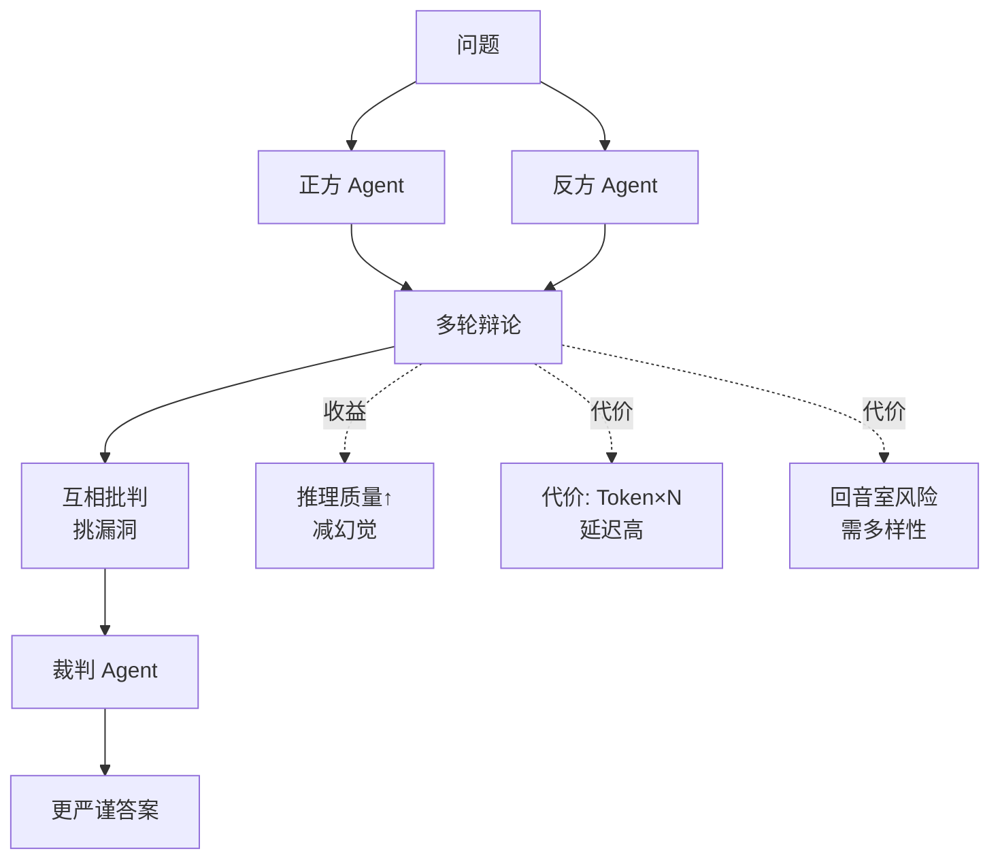

# 多Agent辩论(Debate)如何提升推理质量?有什么代价

- **Agent辩论机制:**

多个Agent针对同一问题独立给出答案,然后互相审视对方的推理过程,最终达成共识或聚合结果。

```text
       Agent Debate 流程示意图

   [原始问题]
      /   |   \
     v    v    v
 [Agent A] [Agent B] [Agent C]
 (观点1)  (观点2)  (观点3)
     |      |      |
     +------+------+      <--- 交叉辩论/相互Critique
            |
     [汇总观点 + 历史辩论记录]
            |
            v
       [最终答案]
     (投票/聚合)
```

- **流程:**
```
问题 → Agent A给出答案+推理
→ Agent B给出答案+推理
→ Agent A审视B的推理,修正自己的
→ Agent B审视A的推理,修正自己的
→ ... N轮 ...
→ 最终答案(投票/综合/LLM Judgement)
```

- **效果:**
- **质量提升**：数学推理准确率提升5-15% (如Debate on Math tasks)
- **纠错能力**：减少单个Agent的确认偏差，暴露逻辑漏洞
- **适用性**：特别适合有明确正确答案或可验证逻辑的任务

- **代价:**
- **Token消耗 = Agent数量 × 辩论轮数 × 平均推理长度**
- 3个Agent × 3轮 ≈ 9倍单Agent成本（甚至更高，因为辩论轮需要阅读他人观点）
- **延迟**：大幅增加，由于串行或并行的API调用累积

- **实践建议:**
1. 用2-3个Agent(不需要太多,3-5个是甜蜜点)
2. 2-3轮辩论足够(边际收益递减,容易陷入僵局)
3. **多样性设置**：不同Agent用不同temperature、不同System Prompt（如“你是批判者”vs“你是支持者”）
4. 最终用裁判Agent或加权投票决定答案

- **实战案例**: 在金融风险分析任务中，我们使用“狼人杀”模式辩论：一个Agent故意扮演“激进风控”，另一个扮演“保守风控”，第三个中立。这迫使模型从极端反例中寻找稳健的证据，最终输出的风控报告比单Agent减少了30%的逻辑漏洞。

- **代码示例 (多轮辩论逻辑)**:
```python
agents = [
    Agent(name="Proposer", role="提出方案"),
    Agent(name="Critic", role="寻找漏洞")
]

history = []
for round in range(2):
    for agent in agents:
        # 每个Agent都能看到之前的所有对话
        response = agent.run(history, context_variables={"phase": "debate"})
        history.append({"role": agent.name, "content": response})

# 最终由法官总结
final_answer = judge_agent.run(history)
```

- **注意:** 辩论可能导致「回音壁」(互相强化错误答案)或发散，需要引入随机性或强力Judge。

## 常见考点
1. **聚合策略**：当A、B、C三个Agent意见不统一时，是用少数服从多数，还是让一个更强的LLM做最终裁决？
2. **提示词设计**：如何设计Prompt让Agent既能攻击对方弱点，又不至于变成无意义的争吵？
3. **效率优化**：是否可以采用Tree-of-Thoughts结合辩论，只辩论分歧最大的分支？


## 核心流程图




## 记忆要点

- 核心机制：多Agent独立作答后互相Critique，修正推理，最终聚合或投票。
- 收益代价：推理质量提升5-15%，但Token消耗和延迟成倍增加（N倍成本）。
- 最佳实践：2-3个Agent辩论2-3轮即可，边际收益递减，需防回音壁效应。
- 多样性设置：不同Temperature或Prompt（如批判者vs支持者）以暴露逻辑漏洞。

## 结构化回答

**30 秒电梯演讲：** 多 Agent 辩论就像专家会诊——多个 Agent 独立作答，然后互相 Critique 修正推理，最后投票或聚合。推理质量能提升 5-15%，但 Token 消耗是 N 倍。实战建议 2-3 个 Agent 辩论 2-3 轮就够，多了边际收益递减。

**展开框架：**
1. **核心机制** — 多 Agent 独立作答后互相 Critique，修正推理链，最终聚合或投票得出答案。
2. **收益与代价** — 推理质量提升 5-15%，减少确认偏差；但 Token 消耗和延迟成倍增加（N 倍成本）。
3. **实战要点** — 2-3 个 Agent 辩论 2-3 轮即可；用不同 Temperature 或 Prompt（批判者 vs 支持者）制造多样性，防回音壁效应。

**收尾：** 辩论不是越多越好——边际收益递减还可能强化错误，我可以聊聊怎么用强力 Judge 防回音壁。

## 视频脚本

> 预计时长：2 分钟 | 由浅入深

| 时间 | 画面/字幕 | 口播台词 | 讲解要点 |
|------|----------|----------|----------|
| 0:00 | 标题卡：多 Agent 辩论 | "像专家会诊，不同医生互相挑错以确诊。" | 类比开场 |
| 0:30 | 辩论流程动画 | "多 Agent 独立作答，互相 Critique，最后投票聚合。" | 核心机制 |
| 1:10 | 收益 vs 代价对比 | "质量提升 5-15%，但 Token 消耗是 N 倍。" | 收益代价 |
| 1:40 | 多样性设置示意 | "用不同 Temperature 或 Prompt 制造多样性，防回音壁。" | 实战要点 |

