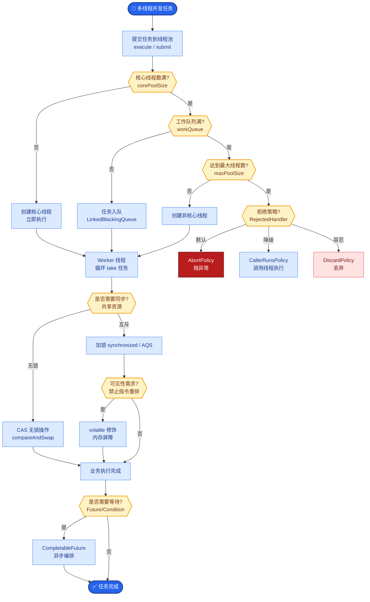
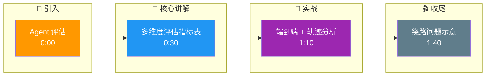

# 如何评估Agent系统的质量?除了任务成功率还有哪些指标

- **Agent评估维度:**

| 维度 | 指标 | 说明/计算方式 |
|------|------|----------|
| **效果** | 任务成功率 | 最终任务是否完成 (0/1 或 部分得分) |
| **效果** | 输出质量 | LLM-as-a-Judge 打分 (1-10) |
| **效率** | 平均步数 | 完成任务用了几步 (越少越好) |
| **效率** | Token消耗 | 总共花了多少Token (Input + Output) |
| **效率** | 工具调用次数 | 调了多少次工具 (无效调用次数) |
| **效率** | 延迟 | 端到端耗时 |
| **鲁棒性** | 错误恢复率 | 工具失败后能否自我修正并继续 |
| **鲁棒性** | 抗幻觉率 | 引用工具返回结果是否准确 |
| **成本** | 每任务成本 | API费用 ($) |
| **轨迹** | 步骤合理性 | 每步是否是最优选择 (Trajectory Analysis) |
| **安全** | 安全违规率 | 是否执行了危险操作 (如Drop Table) |

- **评估方法:**

1. **端到端测试**
- 准备测试集(输入+期望输出/Ground Truth)
- Agent自主完成任务,通过规则或LLM判断是否成功

2. **轨迹分析**
- 记录Agent每一步的Thought/Action/Observation
- 人工或LLM评估每步的合理性（避免“猜对了过程却错了”）

3. **基准测试**
- AgentBench / SWE-Bench (代码) / GAIA (综合) / WebArena (网页操作)
- 标准化的Agent能力评测，便于横向对比

4. **A/B测试**
- 不同Agent配置的线上A/B对比
- 关注真实用户反馈（点赞率、留存率）

```text
       Agent 评估 Pipeline

   [测试集] --> [Agent执行] --> [轨迹 + 结果]
                         |
             +-----------+-----------+
             |                       |
        [结果评估]             [轨迹评估]
        (Success/F1)          (Step Quality/LLM Judge)
             |                       |
             +-----------+-----------+
                         |
                   [综合评分报告]
```

- **实战案例**: 在评估客服Agent时，单纯的成功率掩盖了“绕路”问题。我们发现Agent虽最终解决了问题，但平均需要5步（包含3次无效查询）。引入“轨迹还原度”指标（与专家操作的编辑距离）后，优化Prompt将平均步数降至3步，Token成本降低40%。

- **代码示例 (计算轨迹指标)**:
```python
def calculate_trajectory_efficiency(golden_steps, actual_steps):
    """计算实际轨迹与黄金轨迹的重合度/编辑距离"""
    # 简单示例：计算多余步骤的比例
    extra_steps = len(actual_steps) - len(golden_steps)
    efficiency_score = max(0, 1 - (extra_steps / len(golden_steps)))
    return efficiency_score

# 评估调用
trajectory_score = calculate_trajectory_efficiency(
    golden_steps=["search", "read", "summarize"],
    actual_steps=["search", "search_fail", "read", "read_fail", "summarize"]
) # 结果会偏低，提示优化
```

## 常见考点
1. **LLM-as-a-Judge的局限性**：在评估Agent复杂推理时，裁判LLM是否会因为上下文过长或推理能力不足而误判？
2. **单一指标的陷阱**：如果只看Success Rate，Agent可能会通过无限尝试来“碰”对答案，如何平衡Success Rate和Token Cost？
3. **黄金数据集构建**：如何构建一个能覆盖Corner Case（如网络错误、API返回异常）的评测集？

## 核心流程图



## 记忆要点

- 评估维度：效果（成功率/质量）、效率（步数/Token/延迟）、鲁棒性（错误恢复率）。
- 核心方法：端到端测试看结果，轨迹分析看过程，LLM-as-a-Judge打分。
- 实战陷阱：只看Success率会掩盖“绕路”问题，需引入轨迹效率指标。
- 基准测试：AgentBench/SWE-Bench/GAIA等标准化数据集用于横向对比。

## 结构化回答

**30 秒电梯演讲：** 评估 Agent 不能只看任务成功率——还要看效率（步数、Token、延迟）、鲁棒性（错误恢复率）和安全（违规率）。核心方法是端到端测试看结果，轨迹分析看过程，再用 LLM-as-a-Judge 打分。只看成功率会掩盖"绕路"问题。

**展开框架：**
1. **多维度评估** — 效果（成功率/质量）、效率（步数/Token/延迟）、鲁棒性（错误恢复率）、安全（违规率），不能只看单一指标。
2. **核心方法** — 端到端测试看结果，轨迹分析看过程合理性，LLM-as-a-Judge 打分，A/B 测试看真实用户反馈。
3. **实战陷阱** — 只看 Success 率会掩盖"绕路"问题，需引入轨迹效率指标；基准测试用 AgentBench/SWE-Bench/GAIA 横向对比。

**收尾：** 评估的关键是多维度组合——我可以聊聊怎么用轨迹还原度指标揪出"绕路"问题。

## 视频脚本

> 预计时长：2 分钟 | 由浅入深

| 时间 | 画面/字幕 | 口播台词 | 讲解要点 |
|------|----------|----------|----------|
| 0:00 | 标题卡：Agent 评估 | "像考核员工，不仅看结果 KPI，也看过程和花费。" | 类比开场 |
| 0:30 | 多维度评估指标表 | "效果、效率、鲁棒性、安全，四个维度缺一不可。" | 评估维度 |
| 1:10 | 端到端 + 轨迹分析 | "端到端测试看结果，轨迹分析看过程，LLM 当裁判打分。" | 核心方法 |
| 1:40 | 绕路问题示意 | "只看成功率会掩盖绕路，要引入轨迹效率指标。" | 实战陷阱 |

### 视频流程图




