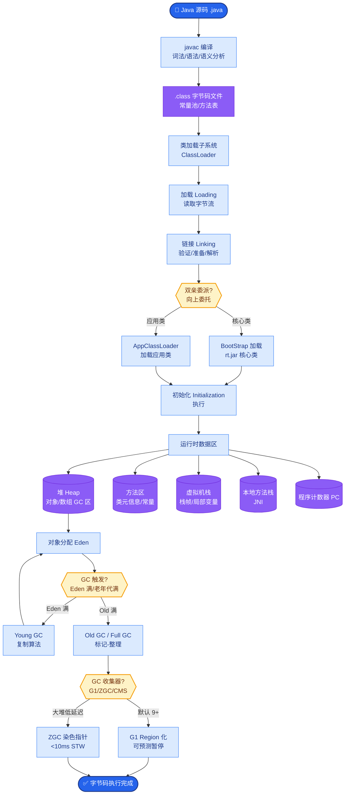

# SWE-Bench是什么?它如何评估代码Agent的能力

- **SWE-Bench:** 基于真实GitHub Issue的代码修复评测基准,是目前评估代码Agent能力的核心标准.

```text
      SWE-Bench 评测闭环

   [Issue] (用户报告Bug)
      |
      v
+--------------------------+
|  Agent (Coder)           |
|  1. 阅读 Issue & Repo    |
|  2. 定位 Bug 文件        |
|  3. 编写 Patch (diff)    |
+-----------+--------------+
            |
            v
   [应用 Patch 到代码库]
            |
            v
   [运行单元测试集]
            |
            v
   [测试通过率]
   (Pass % = Score)
```

- **评测流程:**
1. 给Agent一个GitHub Issue描述 (包含环境、复现步骤)
2. Agent在真实代码仓库中定位问题并修复
3. 运行该Issue对应的单元测试验证修复是否正确
4. **通过所有相关测试 = 成功** (而不是仅通过某一个)

- **难度分级:**
- **SWE-Bench Lite**: 300题 (从Full中采样而来,易于快速验证)
- **SWE-Bench Full**: 2294题 (完整版,计算量巨大)
- **SWE-Bench Verified**: 500题 (OpenAI/Princeton人工验证过Patch的可行性,最权威)

- **当前SOTA(2024-2025):**
- **Claude 3.5 Sonnet (w/ SWE-agent runbook)**: ~49%-72% (视具体Prompt策略和RAG检索强度而定)
- 未经辅助的人类开发者: ~67% 
- 普通GPT-4 (无框架): ~1-2% (直接写代码极难通过)

- **为什么SWE-Bench重要:**
1. **真实场景** - 来自真实开源项目,涉及真实Bug和复杂依赖
2. **可验证** - 单元测试自动评分,客观无主观判断
3. **端到端** - 考察理解需求、定位代码、修改代码、验证全流程

- **局限:**
- 主要侧重Python项目 (12个主流Python库)
- 复杂架构改动难以评测 (Unit Test可能覆盖不到)
- 单元测试覆盖率影响评分 (本身Test写烂了也不行)

- **实战案例:** 在Django项目修复中，Agent常因未读取`migrations`文件导致修改的Model字段与数据库结构不匹配，虽然单元测试Pass但实际运行报错，这暴露了SWE-Bench仅依赖UT的盲区。
- **代码示例 (Python):**
```python
# 模拟 SWE-Bench 评测器的 Patch 应用与验证逻辑
def evaluate_prediction(instance, repo_path, prediction_patch):
    # 1. 应用 Agent 生成的 Patch
    apply_patch(repo_path, prediction_patch)
    
    # 2. 构建隔离环境并安装依赖
    build_env(instance["repo"])
    
    # 3. 运行对应 Issue 的测试文件 (如 test_views.py::TestBug::test_123)
    test_result = run_tests(repo_path, instance["test_identifier"])
    
    # 4. 只有测试结果为 PASSED 才算得分
    return test_result.status == "PASSED"
```

- **对比表格:**

| 维度 | 传统代码生成 (如HumanEval) | SWE-Bench |
| :--- | :--- | :--- |
| **输入源** | 自然语言描述函数功能 | 真实 GitHub Issue (历史记录、报错堆栈) |
| **上下文** | 单个函数 (<100行) | 整个仓库 (数千文件，含跨文件依赖) |
| **验证方式** | 单元测试用例 (仅需写函数体) | 运行原有测试套件 (需读懂遗留代码逻辑) |
| **主要考察点** | 语法正确性、算法实现 | 需求理解、代码定位、调试能力、兼容性 |

## 常见考点
1. **环境构建**：评测时如何构建隔离的Python环境？如果Agent运行了`pip install`破坏了环境怎么办？
2. **上下文检索**：面对大仓库，如何设计RAG系统精准找到与Bug相关的文件？
3. **测试代价**：Full版本运行一次测试极慢，实际工程中如何优化评测速度？


## 核心流程图



## 记忆要点

- 定义：基于真实GitHub Issue的代码修复评测，考察端到端修复能力。
- 流程：Agent生成Patch -> 应用到代码库 -> 运行单元测试 -> 通过率即得分。
- 版本对比：Lite（300题快速验证）、Full（2294题）、Verified（500题人工校验）。
- 核心难点：需理解大仓库上下文与跨文件依赖，非单纯代码生成。

## 结构化回答

**30 秒电梯演讲：** SWE-Bench 是基于真实 GitHub Issue 的代码修复评测基准——给 Agent 一个 Bug 工单，它在真实代码库里定位、修复，然后跑单元测试看通过率。这是评估代码 Agent 端到端能力的黄金标准，核心难点是要理解大仓库上下文和跨文件依赖。

**展开框架：**
1. **评测闭环** — Agent 生成 Patch → 应用到代码库 → 运行单元测试 → 通过率即得分，全流程自动化客观评分。
2. **版本分级** — Lite（300 题快速验证）、Full（2294 题）、Verified（500 题人工校验最权威）。
3. **核心难点** — 需理解大仓库上下文与跨文件依赖，不是单纯代码生成；局限是主要侧重 Python 项目。

**收尾：** SWE-Bench 的盲区在只依赖单元测试——我可以聊聊 Django 项目里 UT 过了但实际报错的案例。

## 视频脚本

> 预计时长：2 分钟 | 由浅入深

| 时间 | 画面/字幕 | 口播台词 | 讲解要点 |
|------|----------|----------|----------|
| 0:00 | 标题卡：SWE-Bench | "给程序员真实的修 Bug 工单，看修完能不能跑通测试。" | 类比开场 |
| 0:30 | 评测闭环动画 | "Agent 生成 Patch，应用到代码库，跑单元测试，通过率即得分。" | 评测流程 |
| 1:10 | 版本分级对比 | "Lite 300 题快验，Full 2294 题，Verified 500 题人工校验最权威。" | 版本分级 |
| 1:40 | 核心难点示意 | "难点在理解大仓库上下文和跨文件依赖，不是单纯写代码。" | 核心难点 |

