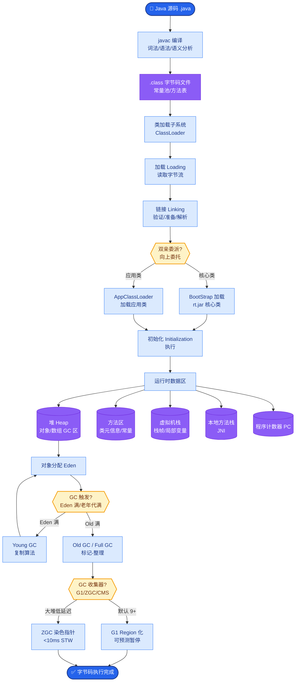
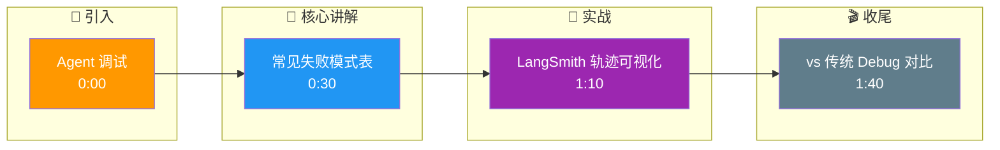

# 如何调试Agent的错误行为?常见的Agent失败模式有哪些

- **常见Agent失败模式:**

| 模式 | 症状 | 原因 | 解决 |
|------|------|------|------|
| **死循环** | 反复执行相同操作 | 状态不更新 | 检查点+强制跳出 |
| **工具幻觉** | 调用不存在的工具 | 工具描述不清晰 | 明确工具列表 |
| **参数错误** | 工具参数格式错 | Schema不明确 | Function Calling |
| **过早终止** | 任务未完成就停了 | 完成判断不准 | 明确完成标准 |
| **上下文遗忘** | 忘记早期指令 | 上下文溢出 | 记忆系统 |
| **级联错误** | 一个错误引发连锁 | 错误恢复弱 | 检查点+回滚 |
| **无限探索** | 不停搜索不行动 | 缺乏行动触发 | 最大步数限制 |

- **调试工具:**
1. **LangSmith** - 可视化Agent执行轨迹
2. **Phoenix(Arize)** - LLM可观测性
3. **自建Trace日志** - 记录每步的input/output/thought

- **调试方法论:**
1. 复现:记录导致失败的输入
2. 定位:沿轨迹找到第一个错误步骤
3. 分析:是该步骤的Thought/Action/参数哪个出错
4. 修复:调整prompt/工具描述/错误处理
5. 回归:重新跑全部测试确保不引入新问题

- **核心细节补充:**
  - **Self-Reflection（自反思）**: 在ReAct框架中加入「批评者」角色，对执行结果进行打分（0-10分），若分数低于阈值则强制修正，是解决级联错误的有效手段。
  - **执行树回溯**: 采用Tree of Thoughts（ToT）方法时，调试需关注节点剪枝逻辑，错误的剪枝会导致进入死胡同。
  - **Golden Trace**: 构建成功的标准执行路径，调试时将当前Trace与Golden Trace进行Diff，快速定位偏差点。

- **Agent Loop 架构图:**

```text
    用户输入
       │
       ▼
  ┌─────────────┐
  │   推理引擎   │ ◄──────┐ (观察/思考)
  │  (LLM Core)  │        │
  └──────┬──────┘        │
         │ Action        │
         ▼               │
  ┌─────────────┐        │
  │  工具执行器  │        │
  └──────┬──────┘        │
         │ Result        │
         ▼               │
  ┌─────────────┐        │
  │  观测更新    │ ───────┘
  └──────┬──────┘
         │
    (判断是否完成)
         │
    是 ──┴── 否 (继续循环)
         ▼
     最终输出
```

- **实战案例:** 在数据库查询Agent中，曾遇到Agent因SQL执行超时（30s）误判为语法错误，随即开始疯狂修改原本正确的SQL语句，最终导致死循环。解决方法是引入自定义Parser区分"超时"与"语法错误"。
- **代码示例:**
```python
# 简单的自纠正 Agent 循环结构
def run_agent_with_reflection(question, max_steps=5):
    history = []
    for step in range(max_steps):
        # 1. LLM 决策
        thought, action = llm_decide(question, history)
        
        # 2. 执行工具
        obs = tool_execute(action)
        
        # 3. 关键：自反思
        reflection = llm_reflect(thought, action, obs)
        if "CRITICAL_ERROR" in reflection:
            # 回滚到上一个稳定状态或终止
            break 
            
        history.append((thought, action, obs))
```

- **对比表格:**

| 维度 | 传统 Debug (如 pdb/GDB) | Agent 调试 |
| :--- | :--- | :--- |
| **不确定性** | 确定性执行 (输入同输出必同) | 非确定性 (LLM输出有随机性) |
| **故障点** | 代码逻辑错误 | Prompt偏差、工具Schema误解、幻觉 |
| **复现难度** | 极易 (只需断点) | 较难 (需控制Temperature/Seed) |
| **主要手段** | 查看变量堆栈 | 查看 Trace JSON、思维链 |

## 常见考点
1. **如何区分是Prompt问题还是工具问题？** 查看Trace中的Action字段，如果Action参数符合Schema但工具报错，通常是工具本身Bug；如果Action参数错误或调用了不存在工具，则是Prompt/工具描述问题。
2. **如何处理级联错误？** 追问是否熟悉「自纠正」机制，如ReAct+Reflection模式，以及如何设置错误重试次数和回滚策略。
3. **调试工具中LangSmith和OpenTelemetry的区别？** LangSmith专攻LLM应用，有原生Prompt版本管理；OpenTelemetry是通用标准，更适合融入现有微服务监控体系。

## 核心流程图



## 记忆要点

- 常见失败：死循环、工具幻觉、参数错误、过早终止、级联错误。
- 调试工具：LangSmith/Phoenix可视化轨迹，自建Trace日志记录每步。
- 调试方法：复现定位错误步骤，分析Thought/Action/参数，调整Prompt或工具描述。
- 核心差异：Agent调试关注非确定性Trace，传统Debug关注确定性堆栈。

## 结构化回答

**30 秒电梯演讲：** Agent 常见失败模式有死循环、工具幻觉、参数错误、过早终止、级联错误。调试靠 LangSmith 或 Phoenix 可视化轨迹，方法就是复现、定位错误步骤、分析 Thought/Action/参数、修 Prompt 或工具描述。和传统 Debug 的核心区别是 Agent 关注非确定性 Trace。

**展开框架：**
1. **常见失败模式** — 死循环（状态不更新）、工具幻觉（调不存在的工具）、参数错误（Schema 不明）、过早终止、级联错误。
2. **调试工具与方法** — LangSmith/Phoenix 可视化轨迹；复现→定位→分析 Thought/Action/参数→修 Prompt 或工具描述→回归测试。
3. **与传统 Debug 的差异** — Agent 调试关注非确定性 Trace，复现难需控制 Temperature/Seed；传统 Debug 关注确定性堆栈。

**收尾：** Agent 调试的命门是非确定性——我可以聊聊怎么用 Golden Trace 做 Diff 快速定位偏差。

## 视频脚本

> 预计时长：2 分钟 | 由浅入深

| 时间 | 画面/字幕 | 口播台词 | 讲解要点 |
|------|----------|----------|----------|
| 0:00 | 标题卡：Agent 调试 | "像调试复杂程序，靠 Trace 日志一步步查。" | 类比开场 |
| 0:30 | 常见失败模式表 | "死循环、工具幻觉、参数错误、过早终止、级联错误。" | 失败模式 |
| 1:10 | LangSmith 轨迹可视化 | "用 LangSmith 或 Phoenix 可视化每步轨迹，定位错误步骤。" | 调试工具 |
| 1:40 | vs 传统 Debug 对比 | "Agent 调试关注非确定性 Trace，传统 Debug 关注确定性堆栈。" | 核心差异 |

### 视频流程图




