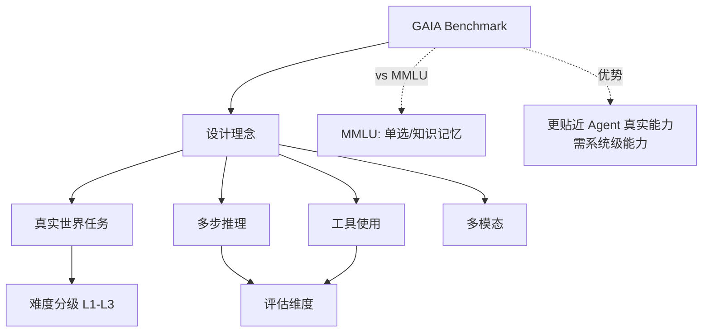

# GAIA Benchmark评估什么?为什么说它比MMLU更适合评估Agent

- **GAIA (General AI Assistants):** 评估真实世界通用AI助手能力的基准.

- **设计理念:**
- 问题对人类简单(平均人类~90%准确率)
- 但对AI很难(GPT-4+工具 ~15-20%)
- 核心挑战不是知识,而是**多步推理+工具使用**

- **问题类型:**
1. 需要网络搜索验证的事实
2. 需要文件处理(PDF/Excel/图片)
3. 需要计算或推理
4. 需要多步骤组合

- **难度分级:**
- Level 1: 1-3步
- Level 2: 4-9步
- Level 3: 10+步

- **为什么比MMLU更适合Agent:**
- MMLU: 多选题,纯知识 → 测的是「知道什么」
- GAIA: 开放问题,需要工具 → 测的是「能做什么」
- GAIA需要:搜索+阅读+计算+推理+整合 = 完整Agent能力

- **现状:** 即使最强Agent在GAIA Level 3上也只有~10%成功率

- **实战案例:** 在GAIA的一道题目中，Agent需要从提供的PDF中提取特定日期的汇率，结合Excel中的商品价格进行计算。常见失败原因是Agent提取数字时遗漏了货币单位（如将"1.2M"理解为"1.2"），导致最终答案数量级错误。

- **代码示例 (Python - 模拟文件处理能力测试):**
```python
# GAIA 典型任务流：跨文件引用与计算
import pandas as pd

def solve_gaia_task(pdf_path, excel_path):
    # 1. 读取 PDF 中的关键信息 (需 OCR 或 PDF 解析工具)
    exchange_rate = extract_text_from_pdf(pdf_path)
    
    # 2. 读取 Excel 数据
    df = pd.read_excel(excel_path)
    
    # 3. 数据清洗与转换 (Agent 容易在此处出错)
    # 将 "1.2M" 转换为 1200000
    df['Value'] = df['Raw_Value'].apply(parse_human_readable_number)
    
    # 4. 计算最终答案
    result = df['Value'].sum() * exchange_rate
    return result
```

- **对比表格:**

| 维度 | MMLU (Massive Multitask Language Understanding) | GAIA (General AI Assistants) |
| :--- | :--- | :--- |
| **任务形式** | 5选1 选择题 | 开放式问题 (填空/简答) |
| **依赖能力** | 静态知识库、模式识别 | 动态检索、多模态理解、工具编排 |
| **评分标准** | Exact Match (选对即对) | 需要精确数值或特定文本 (容错率低) |
| **时效性** | 低 (知识截止日期内) | 高 (需联网获取最新数据) |
| **模型表现** | GPT-4: ~86% | GPT-4: ~15% |

## 常见考点
1. **GAIA与AgentBench的区别？** GAIA侧重通用性（如物理、金融），AgentBench侧重特定工具能力（如数据库操作）。
2. **如何解决GAIA中的文件解析幻觉？** 提及使用多模态模型（如GPT-4V）直接读图，而非依赖容易出错的OCR中间件。
3. **多步推理中的中间值验证？** 讨论Chain of Thought的中间步骤校验机制，防止第一步算错导致全盘皆输。


## 核心流程图



## 核心知识点图


## 记忆要点

- 定义：评估通用AI助手能力，人类简单但AI难，核心是多步推理+工具使用。
- 对比MMLU：MMLU测静态知识（选择题），GAIA测动态工具能力（开放题）。
- 任务类型：需联网验证、文件处理、计算推理及多步骤组合。
- 现状：最强模型在Level 3（10+步）成功率仅约10%，Agent能力天花板尚远。

## 结构化回答

**30 秒电梯演讲：** GAIA 是评估通用 AI 助手能力的基准——问题对人类简单（90% 准确率），对 AI 却很难（15-20%）。它比 MMLU 更适合评估 Agent，因为 MMLU 测静态知识（选择题），GAIA 测动态工具能力（开放题），需要搜索、文件处理、计算推理组合。

**展开框架：**
1. **设计理念** — 问题人类简单但 AI 难，核心挑战不是知识而是多步推理加工具使用。
2. **对比 MMLU** — MMLU 测"知道什么"（选择题），GAIA 测"能做什么"（开放题需工具）。
3. **难度与现状** — Level 1（1-3 步）到 Level 3（10+ 步）；最强模型在 Level 3 成功率仅约 10%，Agent 能力天花板尚远。

**收尾：** GAIA 暴露的是 Agent 在多步推理和工具编排上的真实短板——我可以聊聊为什么数字单位解析这种小细节能搞垮整个任务。

## 视频脚本

> 预计时长：2 分钟 | 由浅入深

| 时间 | 画面/字幕 | 口播台词 | 讲解要点 |
|------|----------|----------|----------|
| 0:00 | 标题卡：GAIA Benchmark | "像助理考试，不仅要知识，还要会查文档、做报表。" | 类比开场 |
| 0:30 | 人类 90% vs AI 15% 对比 | "问题对人类简单，对 AI 却很难，核心是多步推理加工具。" | 设计理念 |
| 1:10 | GAIA vs MMLU 对比表 | "MMLU 测静态知识选择题，GAIA 测动态工具能力开放题。" | 对比MMLU |
| 1:40 | Level 3 成功率仅 10% | "最强模型在 10+ 步任务上成功率仅 10%，天花板尚远。" | 现状与挑战 |

