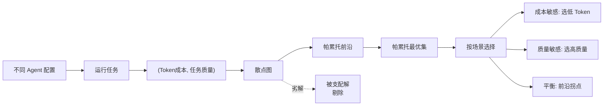
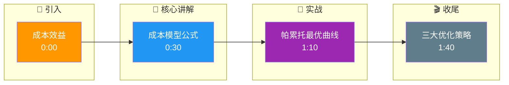

# 如何评估Agent的成本效益?Token消耗和任务质量的帕累托最优如何找

- **Agent成本模型:**

```
总成本 = (系统prompt × N轮) + (工具调用prompt × N轮) + (工具返回 × N轮) + (推理token × N轮)
```

- **成本优化策略:**

| 策略 | 节省比例 | 质量影响 |
|------|---------|---------|
| 上下文压缩 | 30-50% | 轻微下降 |
| 工具输出截断 | 20-40% | 可控 |
| 小模型做简单步骤 | 40-60% | 需要路由 |
| Prompt Caching | 50-80%(系统prompt) | 无影响 |
| 批量推理(batch API) | 50% | 延迟增加 |
| 减少Agent步数 | 20-30% | 需优化 |

- **帕累托最优分析:**
```
**X轴：** 成本(Token/美元)
**Y轴：** 任务成功率

**理想点：** 左上角(低成本+高成功率)
**策略：** 找到边际收益拐点
- 成本↑50% → 成功率↑15%:值得
- 成本↑100% → 成功率↑3%:不值得
```

- **实践建议:**
1. 用小模型(Flash/Haiku)做规划
2. 用大模型(Sonnet/Opus)做关键决策
3. 缓存系统prompt和工具定义
4. 限制最大步数

- **关于批量推理修正:** 批量API主要提升吞吐量降低单次请求成本，但会增加延迟，不适合实时交互场景。

- **实战案例:** 在一个长文档摘要Agent中，我们将模型从GPT-4o切换到Haiku做初步分段和筛选，仅将Haiku认为"高信息密度"的段落喂给GPT-4o进行最终总结。此举降低了65%的成本，而摘要质量（ROUGE分数）仅下降了2%。

- **代码示例 (Python - 模型路由逻辑):**
```python
# 根据任务复杂度路由到不同模型
MOCK_LLM_COSTS = {"gpt-4o": 5.0, "gpt-3.5-turbo": 0.2} # $ per 1M tokens

def route_task(task_description):
    complexity = estimate_complexity(task_description)
    
    # 帕累托最优策略：简单任务用便宜模型
    if complexity < 0.3:
        return "gpt-3.5-turbo"
    elif complexity < 0.7:
        return "gpt-4o-mini" # 性价比拐点
    else:
        return "gpt-4o" # 只有高复杂任务才上最贵模型

# 边际收益分析示例
def evaluate_cost_quality(cost_increase, quality_gain):
    # 简单启发式：每1%的质量提升最多允许10%的成本增加
    return (quality_gain * 10) > cost_increase
```

- **对比表格:**

| 维度 | 仅优化 Prompt | 模型路由策略 |
| :--- | :--- | :--- |
| **成本控制** | 低 (每次调用成本固定) | 高 (动态调配资源) |
| **实现复杂度** | 低 (仅修改文本) | 中 (需增加分类器/Router) |
| **质量稳定性** | 高 (模型能力一致) | 中 (小模型可能拖后腿) |
| **适用场景** | 单轮简单任务 | 多步骤、复杂Agent工作流 |

## 常见考点
1. **Prompt Caching的适用边界？** 并不是所有Prompt都适合缓存，只有System Prompt和长期不变的工具定义适合，用户输入部分通常无法命中缓存。
2. **如何计算边际收益？** 实际工程中需要建立"基准线"，通过A/B测试对比不同配置下的成功率与Token消耗，绘制Cost-Quality曲线寻找拐点。
3. **小模型做路由的准确性风险？** 如果Router（通常是极小模型）判断失误，将复杂任务路由给小模型，会导致直接失败，因此通常会加入"保底机制"（如小模型失败后自动升级到大模型重试）。

## 核心流程图



## 记忆要点

- 成本模型：总成本 = 系统Prompt + 工具调用 + 工具返回 + 推理Token（均乘以轮数）。
- 帕累托最优：寻找边际收益拐点，成本大幅增加但质量微升则不值得。
- 优化策略：Prompt Caching（省50%+）、模型路由（小模型做简单步骤）、上下文压缩。
- 路由逻辑：简单任务用便宜模型，复杂任务上大模型，需设保底重试机制。

## 结构化回答

**30 秒电梯演讲：** 评估 Agent 成本效益就是找帕累托最优——在 Token 预算内最大化任务成功率。总成本是系统 Prompt、工具调用、工具返回、推理 Token 乘以轮数。优化三板斧：Prompt Caching 省 50%+、模型路由让小模型干简单活、上下文压缩。

**展开框架：**
1. **成本模型** — 总成本 = (系统 Prompt + 工具调用 + 工具返回 + 推理 Token) × 轮数，每个环节都乘轮数。
2. **帕累托最优** — 找边际收益拐点：成本涨 50% 换 15% 质量值得，涨 100% 换 3% 就不值。
3. **优化策略** — Prompt Caching 省 50%+、模型路由（简单任务用便宜模型）、上下文压缩；路由要设保底重试防小模型翻车。

**收尾：** 成本优化的精髓是边际收益分析——我可以聊聊怎么用 Haiku 做初筛、GPT-4o 做精总结，成本降 65% 质量只掉 2%。

## 视频脚本

> 预计时长：2 分钟 | 由浅入深

| 时间 | 画面/字幕 | 口播台词 | 讲解要点 |
|------|----------|----------|----------|
| 0:00 | 标题卡：成本效益 | "像买车，在预算内买性能最好的，不追求豪车。" | 类比开场 |
| 0:30 | 成本模型公式 | "总成本是系统 Prompt、工具调用、返回、推理 Token，都乘以轮数。" | 成本模型 |
| 1:10 | 帕累托最优曲线 | "找边际收益拐点：成本大涨质量微升就不值得。" | 帕累托最优 |
| 1:40 | 三大优化策略 | "Prompt Caching、模型路由、上下文压缩，三板斧。" | 优化策略 |

### 视频流程图




