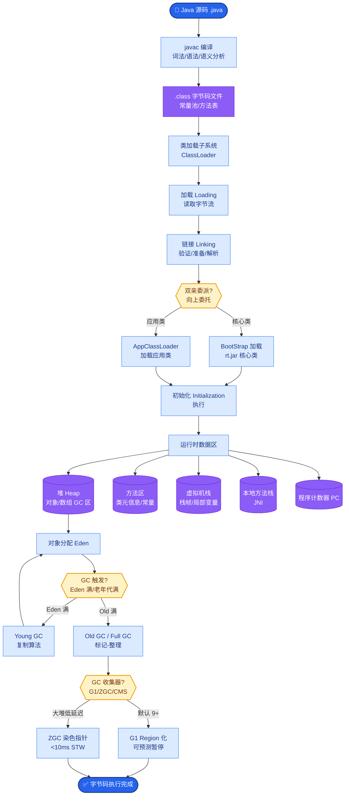

# 生产Agent如何实现可观测性?需要追踪哪些关键指标

### Agent 可观测性三层架构

**1. 追踪 - 链路级细节**
追踪 Agent 思考的每一步，记录完整的输入输出。

```text
Trace ID: abc-123
├─ Step 1: Thought (分析用户需求) 
│   └─ Action: Search(query="...") → Result: 3 docs
├─ Step 2: Thought (阅读文档) 
│   └─ Action: ReadFile(path="...") → Result: Content
└─ Step 3: Thought (总结生成)
    └─ Action: Finish(output="...")
```

**关键记录字段**：时间戳、Token 消耗、延迟、使用的模型、温度参数。

**2. 指标 - 聚合统计数据**
- **业务指标**：任务成功率、平均完成时间、用户满意度。
- **性能指标**：P50/P99 延迟、Token 吞吐量。
- **成本指标**：每任务平均 Token 数、每 1000 次调用成本。
- **稳定性指标**：工具调用失败率、LLM 报错率。

**3. 日志 - 调试与审计**
- **结构化日志**：JSON 格式记录错误堆栈、关键决策点。
- **全量记录**：保留完整的 Prompt 和 LLM Response（用于 Debug 幻觉或注入攻击）。

### 工具选型

| 工具 | 特点 | 适用场景 |
| :--- | :--- | :--- |
| **LangSmith** | LangChain 深度集成，可视化管理 | 使用 LangChain/LangGraph 开发 |
| **Arize Phoenix** | 开源，支持 Tracing 和 Evaluations | 通用框架，需要本地部署 |
| **OpenTelemetry** | 行业标准，生态丰富 | 纳入现有微服务监控体系 |
| **自研系统** | 高度定制，完全可控 | 有特殊合规或数据隔离要求 |

### 核心原则

**追踪必须贯穿“黑盒”**：不仅记录最终答案，必须记录 Agent 为什么调用这个工具、LLM 的原始思考过程，这是排查“幻觉”的唯一线索。

### 深化实战补充

**实战案例**：曾遇到 Agent 频繁调用错误的 API 参数导致账单激增。通过 Tracing 发现 LLM 忽略了 Prompt 中的负向约束。我们在 Trace 中增加了“Prompt Compression Ratio”和“Constraint Violation”指标，实时告警，快速定位到 Prompt 脆弱性。

**代码示例 (Python - 使用 OpenTelemetry 手动埋点)**：
```python
from opentelemetry import trace
from opentelemetry.trace import Status, StatusCode

tracer = trace.get_tracer(__name__)

def run_tool_step(tool_name, input_data):
    with tracer.start_as_current_span(tool_name) as span:
        # 记录输入
        span.set_attribute("llm.input", str(input_data))
        
        try:
            result = execute_tool(tool_name, input_data)
            # 记录输出成功
            span.set_attribute("llm.output.tokens", result.get("usage", {}))
            span.set_status(Status(StatusCode.OK))
            return result
        except Exception as e:
            # 记录异常事件
            span.record_exception(e)
            span.set_status(Status(StatusCode.ERROR, str(e)))
            raise
```


## 核心流程图



## 记忆要点

- 可观测三层：Tracing 记录全链路思考，Metrics 聚合统计性能成本，Logs 保留完整 Prompt。
- 追踪核心：必须贯穿黑盒，记录 LLM 思考过程和工具调用原因，用于排查幻觉。
- 关键指标：业务看成功率，性能看 P99 延迟，成本看 Token 吞吐量，稳定看错误率。
- 工具选型：LangChain 用 LangSmith，通用场景选 OpenTelemetry，合规需求可自研。

## 结构化回答

**30 秒电梯演讲：** 生产 Agent 的可观测性分三层：Tracing 记录全链路思考过程，Metrics 聚合统计性能成本，Logs 保留完整 Prompt。追踪必须贯穿黑盒——记录 LLM 为什么调这个工具、原始思考是什么，这是排查幻觉的唯一线索。

**展开框架：**
1. **可观测三层** — Tracing 记录全链路思考，Metrics 聚合统计性能成本，Logs 保留完整 Prompt 和 Response。
2. **追踪核心** — 必须贯穿黑盒，记录 LLM 思考过程和工具调用原因，用于排查幻觉和注入攻击。
3. **关键指标与工具** — 业务看成功率、性能看 P99 延迟、成本看 Token 吞吐量；LangChain 用 LangSmith，通用选 OpenTelemetry。

**收尾：** 可观测性的命门是贯穿黑盒——只看最终输出排查不了幻觉，我可以聊聊怎么用 Constraint Violation 指标做实时告警。

## 视频脚本

> 预计时长：3 分钟 | 由浅入深

| 时间 | 画面/字幕 | 口播台词 | 讲解要点 |
|------|----------|----------|----------|
| 0:00 | 标题卡：Agent 可观测性 | "像给飞机装黑匣子，不仅记录结果，还记录每一步操作。" | 类比开场 |
| 0:30 | 三层架构图 | "三层：Tracing 记思考，Metrics 统计性能，Logs 留完整 Prompt。" | 三层架构 |
| 1:15 | Trace 链路展开示意 | "追踪必须贯穿黑盒，记录 LLM 为什么调这个工具。" | 追踪核心 |
| 2:00 | 关键指标仪表盘 | "业务看成功率，性能看 P99，成本看 Token，稳定看错误率。" | 关键指标 |
| 2:40 | 工具选型对比表 | "LangChain 用 LangSmith，通用选 OpenTelemetry，合规可自研。" | 工具选型 |

