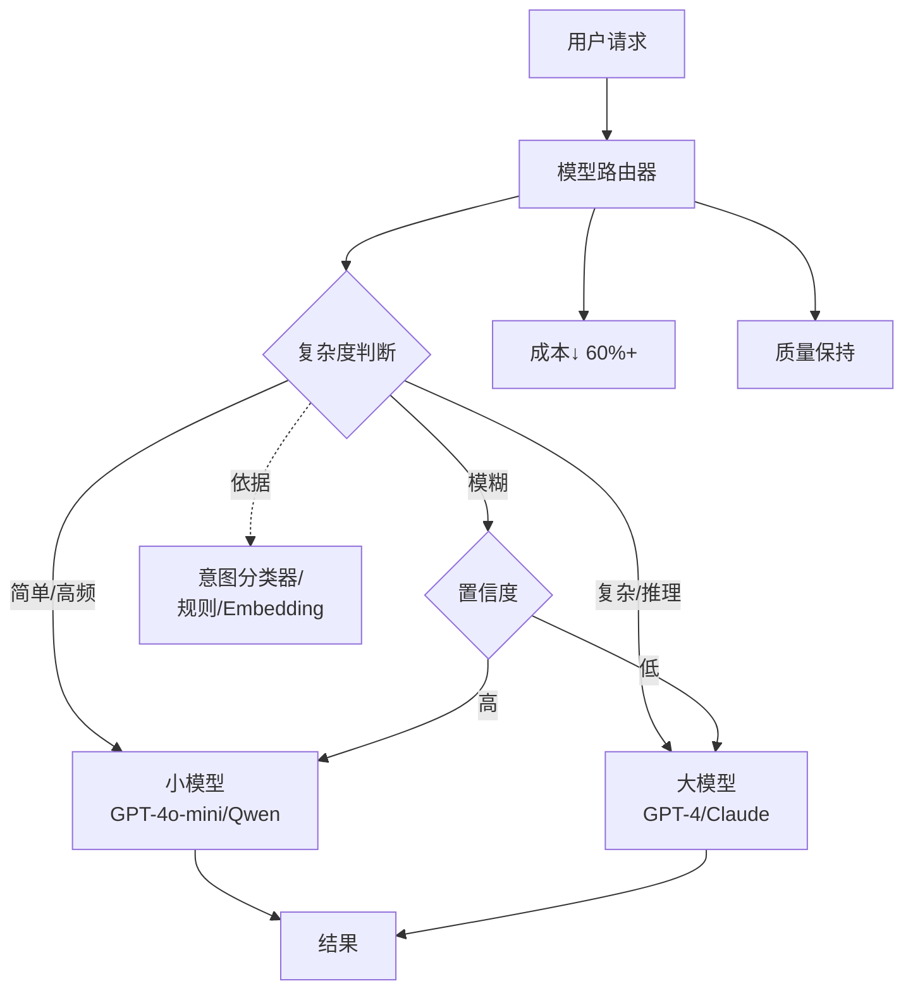

# Agent如何通过模型路由降低成本?什么场景用大模型,什么场景用小模型

### 模型路由策略

根据任务难度和类型，动态选择最经济的模型，而非全程使用最强模型。

| 任务类型 | 推荐模型 | 决策逻辑 |
| :--- | :--- | :--- |
| **复杂规划/决策** | 大模型 (GPT-4o, Claude 3.5 Sonnet) | 需要强推理和多步逻辑 |
| **简单分类/意图识别** | 小模型 (GPT-4o-mini, Haiku) | 模式简单，速度优先 |
| **代码生成/调试** | 大模型 | 准确性要求极高，错误成本高 |
| **文本摘要/改写** | 中/小模型 | 语言理解任务，小模型已足够 |
| **结构化提取 (JSON)** | 小模型 | 格式约束强，幻觉概率低 |
| **格式转换** | 小模型 | 机械式转换，几乎不需要推理 |

### 路由实现逻辑

```python
def route_agent_task(task_input: dict) -> str:
    # 1. 基于规则的硬路由
    if task_input["type"] in ["extract_json", "classify"]:
        return "low_end_model"
    
    # 2. 基于复杂度的软路由 (可由小模型预判)
    complexity_score = evaluate_complexity(task_input["content"])
    if complexity_score > 0.8:
        return "high_end_model"
    
    return "mid_range_model"
```

### 成本效益分析

- **成本对比**：全量使用大模型成本设为 100%，混合路由通常可降低至 20%-30%。
- **质量权衡**：对于简单任务，小模型与大模型的准确率差异通常 < 2%，但成本差异可达 10 倍。
- **注意事项**：定期回流评估小模型的表现，避免因模型能力退化导致任务失败。

### 深化实战补充

**实战案例**：在一个电商客服 Agent 中，我们初期所有查询都用 GPT-4。引入路由后，仅将“退货/投诉”等高敏感词路由给 GPT-4，其余 80% 的“查单/咨询”由 3.5-Turbo 处理。月度成本降低 65%，且响应 P99 延迟从 3s 降至 800ms。

**代码示例 (Python - 语义路由与回退)**：
```python
from semantic_router import Route, SemanticRouter

# 定义路由层
routes = [
    Route(name="complex_support", utterances=["退款失败", "投诉商家", "订单异常复杂"]),
    Route(name="simple_query", utterances=["查物流", "发货时间", "修改地址"])
]

router = SemanticRouter(routes)

def dispatch_request(user_query: str):
    route_choice = router(user_query)
    
    if route_choice.name == "complex_support":
        # 路由到大模型，设置高 temperature 增加灵活性
        return llm_large.generate(user_query, temperature=0.7)
    else:
        # 路由到小模型，低 temperature 保证准确
        return llm_small.generate(user_query, temperature=0.2)
```

**路由策略对比**：

| 策略 | 实现复杂度 | 准确率 | 成本优化 | 适用场景 |
| :--- | :--- | :--- | :--- | :--- |
| **规则/关键词匹配** | 低 | 中 (易漏判) | 一般 | 任务边界非常清晰的场景 |
| **语义路由** | 中 | 高 | 高 | 需理解意图的自然语言交互 |
| **LLM 代理路由** | 高 (需额外 Token 消耗) | 极高 | 中 (路由本身有成本) | 极其复杂、多分支的业务逻辑 |


## 核心流程图



## 记忆要点

- 路由策略：复杂规划用大模型，简单分类/提取用小模型，混合路由可降本 70%。
- 决策逻辑：基于规则硬路由（如 JSON 提取）或语义软路由（复杂度评分）。
- 成本效益：简单任务小模型准确率差异 <2%，但成本差异可达 10 倍。
- 兜底机制：定期回流评估小模型表现，关键任务配置多供应商故障转移。

## 结构化回答

**30 秒电梯演讲：** 模型路由就是按需分配算力——复杂规划和决策用大模型，简单分类和结构化提取用小模型。简单任务两者准确率差不到 2%，但成本差 10 倍。混合路由能降本 70%，决策逻辑可以是规则硬路由或语义软路由。

**展开框架：**
1. **路由策略** — 复杂规划用大模型，简单分类/提取用小模型，混合路由可降本 70%。
2. **决策逻辑** — 基于规则硬路由（如 JSON 提取走小模型）或语义软路由（复杂度评分决定）。
3. **成本与兜底** — 简单任务小模型准确率差异 <2% 但成本差 10 倍；定期回流评估小模型表现，关键任务配多供应商故障转移。

**收尾：** 路由的坑在小模型翻车——我可以聊聊怎么设保底重试机制防误判。

## 视频脚本

> 预计时长：3 分钟 | 由浅入深

| 时间 | 画面/字幕 | 口播台词 | 讲解要点 |
|------|----------|----------|----------|
| 0:00 | 标题卡：模型路由 | "像配送快递，大件贵重叫专车，小件文件叫骑手。" | 类比开场 |
| 0:30 | 任务类型与模型匹配表 | "复杂规划用大模型，简单分类提取用小模型。" | 路由策略 |
| 1:15 | 规则硬路由 vs 语义软路由 | "决策可以用规则硬路由，也可以用复杂度评分软路由。" | 决策逻辑 |
| 2:00 | 成本对比（差 10 倍） | "简单任务准确率差不到 2%，但成本差 10 倍。" | 成本效益 |
| 2:40 | 兜底与故障转移 | "定期回流评估小模型，关键任务配多供应商故障转移。" | 兜底机制 |

