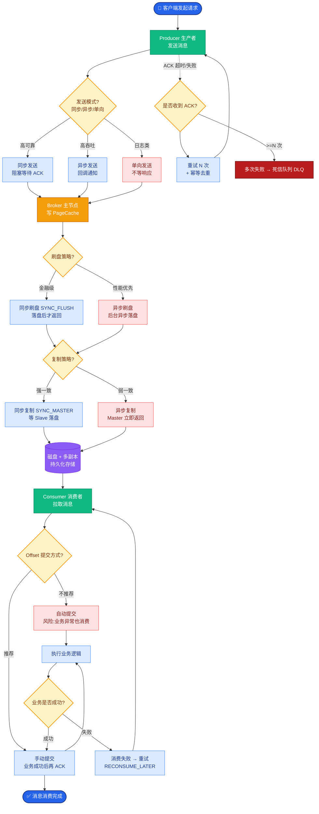

# Agent服务的限流和弹性设计怎么做?LLM API限流如何处理

### 限流层级设计

**1. 用户级限流 (保护系统公平性)**
- **请求频次**：每用户/分钟限制 N 次请求。
- **资源配额**：每用户/天限制 M 个 Token，防止滥用。
- **算法**：令牌桶 或 漏桶 算法，允许突发流量但平滑平均速率。

**2. 系统级限流 (保护后端稳定性)**
- **全局并发**：限制系统内同时运行的 Agent 实例总数。
- **上游保护**：针对 LLM Provider 的 RPM/TPM 限制做动态调整。
- **队列机制**：超过限流阈值的请求进入队列排队或直接拒绝（快失败）。

### LLM API 限流处理

**1. 客户端重试策略**
实现指数退避 重试机制，避免在网络抖动或瞬时限流时雪崩。

```python
import asyncio
import random

async def call_llm_with_retry(prompt, max_retries=5):
    for attempt in range(max_retries):
        try:
            return await llm_api.generate(prompt)
        except RateLimitError:
            if attempt == max_retries - 1:
                raise
            # 指数退避: 2s, 4s, 8s... 加上随机抖动
            wait_time = (2 ** attempt) + random.uniform(0, 1)
            await asyncio.sleep(wait_time)
```

**2. 多供应商故障转移**
维护多个 LLM Provider 列表，当一个触发限流或超时，自动切换至备用模型。

### 弹性设计模式

- **断路器**：当某个 LLM API 错误率超过阈值，暂时熔断请求，快速失败，避免耗尽系统资源。
- **服务降级**：在高峰期或高成本压力下，将非核心任务的模型降级（如从 GPT-4 切到 GPT-3.5）。
- **超时控制**：设置严格的单步超时和全局任务超时，防止 Agent 陷入死循环。

- **核心细节补充:**
  - **令牌桶算法细节**:
    - **桶容量**: 允许的最大突发流量（如瞬间容纳 100 个请求）。
    - **填充速率**: 每秒恢复的 Token 数（如 10 tokens/sec）。
    - **优势**: 适合处理突发流量，在流量低谷时积累 Token，高峰时快速消耗。
  - **自适应限流**: 动态监控 LLM Provider 返回的 `Retry-After` 头部或 429 错误频率，实时调整本地的限流阈值，比静态配置更鲁棒。
  - **优先级队列**: 在资源受限时，VIP 用户或关键任务进入高优先级队列优先处理，非核心任务进入低优先级队列甚至直接丢弃。

- **限流与弹性架构图:**

```text
[User Requests]
      │
      ▼
┌─────────────────┐
│  API Gateway    │
│  (Gateway侧限流) │ ◄─── 令牌桶算法: 用户级配额检查
└────────┬────────┘
         │
         ▼
┌─────────────────┐
│   Load Balancer │
└────────┬────────┘
         │
         ▼
┌───────────────────────────────────┐
│      Agent Service Cluster        │
│  ┌─────────────────────────────┐  │
│  │  Rate Limiter (系统级并发)   │ ◄─── Semaphore 控制: 全局 Worker 数
│  └──────────────┬──────────────┘  │
│                 │                 │
│  ┌──────────────▼──────────────┐  │
│  │     Circuit Breaker         │ ◄─── 熔断器: 错误率 > 50% 开启
│  └──────────────┬──────────────┘  │
└─────────────────┼───────────────┘
```

### 深化实战补充

**实战案例**：在大促期间，OpenAI API 出现大面积 429 错误。由于所有 Worker 同时重试，瞬间打爆了自身 Redis 连接池。改进后引入了“抖动重试 + 本地隔离舱”机制，每个 Worker 独立计算退避时间，并在 API 熔断期间自动降级至本地小模型进行兜底回复，保障了基础可用性。

**代码示例 (Python - 断路器模式实现)**：
```python
from pybreaker import CircuitBreaker

# 配置断路器：失败5次后熔断，10秒后尝试半开状态
llm_breaker = CircuitBreaker(fail_max=5, reset_timeout=10)

@llm_breaker
def call_llm_protected(prompt):
    return llm_api.generate(prompt)

# 调用示例
try:
    response = call_llm_protected(user_prompt)
except CircuitBreakerError:
    # 熔断触发，执行降级逻辑
    response = fallback_llm.generate("抱歉，服务繁忙，请稍后再试。")
except RateLimitError:
    # 业务层限流，进入队列或重试
    response = enqueue_for_retry(user_prompt)
```


## 核心流程图



## 记忆要点

- 限流分层：用户级用令牌桶控频次，系统级用 Semaphore 控并发，保护后端稳定。
- LLM 限流：客户端指数退避重试，配合抖动防止雪崩，多供应商自动切换。
- 弹性设计：断路器防级联失败，超时控制防死循环，高峰期服务降级换小模型。
- 核心原则：快失败优于阻塞，任务进消息队列持久化，确保不丢。

## 结构化回答

**30 秒电梯演讲：** Agent 服务的限流分两层：用户级用令牌桶控频次，系统级用 Semaphore 控并发。LLM API 限流靠客户端指数退避加重试抖动防雪崩，再加多供应商故障转移。弹性三板斧是断路器防级联失败、超时控制防死循环、高峰期服务降级换小模型。

**展开框架：**
1. **限流分层** — 用户级用令牌桶控频次防滥用，系统级用 Semaphore 控并发保护后端稳定。
2. **LLM 限流处理** — 客户端指数退避重试配合抖动防止雪崩，多供应商自动切换故障转移。
3. **弹性设计** — 断路器防级联失败，超时控制防死循环，高峰期服务降级换小模型；快失败优于阻塞。

**收尾：** 弹性的核心原则是快失败优于阻塞——我可以聊聊大促期间怎么用抖动重试加本地隔离舱扛住 429。

## 视频脚本

> 预计时长：3 分钟 | 由浅入深

| 时间 | 画面/字幕 | 口播台词 | 讲解要点 |
|------|----------|----------|----------|
| 0:00 | 标题卡：限流与弹性 | "像商场排队，门口限流，每人限号，某柜台坏了换别的。" | 类比开场 |
| 0:30 | 用户级 vs 系统级限流 | "用户级用令牌桶控频次，系统级用 Semaphore 控并发。" | 限流分层 |
| 1:15 | 指数退避 + 抖动动画 | "LLM 限流靠指数退避加重试抖动防雪崩，多供应商故障转移。" | LLM限流 |
| 2:00 | 断路器三状态转换 | "断路器防级联失败，错误率超阈值就熔断快失败。" | 断路器 |
| 2:40 | 服务降级 + 快失败原则 | "高峰期降级换小模型，快失败优于阻塞，任务进队列持久化。" | 弹性原则 |

