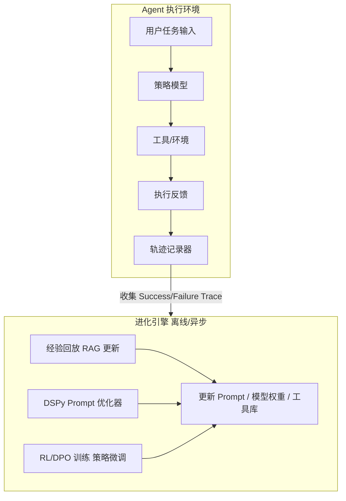
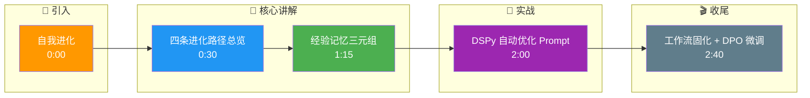

# Agent如何实现自我进化(Self-Evolution)?从错误中学习的设计思路是什么

### Agent 自我进化路径

**1. 经验记忆**
- **机制**：记录任务的全链路轨迹，特别是失败案例。构建“错误-修正”对的索引。
- **关键细节**：通常采用结构化数据存储（如向量数据库）和图数据库结合。存储不仅包含对话内容，还需包含“Thought（思维链）”、“Action（工具调用）”和“Observation（执行结果）”三元组。针对失败案例，需标记具体的 Error Type（如：工具参数错误、幻觉、逻辑死循环）。
- **应用**：遇到相似任务时，通过向量检索召回历史经验，作为 Context 注入 Prompt，避免重蹈覆辙。

**2. 自动 Prompt 优化**
- **机制**：收集成功与失败的样本，利用 DSPy 或类似框架，自动梯度搜索或进化算法优化系统 Prompt。
- **关键细节**：DSPy 通过编译过程，将 Prompt 视为程序模块，利用 Teacher Model（强模型）生成示范数据，在 Student Model（目标模型）上进行微调或 Prompt 搜索。常用算法包括 BootstrapFewShot（少样本自举）和 MIPRO（多阶段优化）。
- **目标**：提升指令遵循度和工具调用准确率。

**3. 工具使用学习**
- **机制**：分析哪些工具组合在特定场景下成功率最高。
- **关键细节**：建立工具调用的统计模型（如 Multi-Armed Bandit 算法），记录每个工具的准确率、延迟和成本。当出现新的高频失败模式时，触发工具描述的重写或新工具的注册。
- **进化**：自动更新工具描述中的推荐用法，甚至动态组合新的工具链。

**4. 工作流固化**
- **机制**：从高频成功的轨迹中，提取通用的子任务流程，固化为硬编码的 Workflow 或 LangGraph 子图。
- **关键细节**：通过挖掘频繁子图算法，识别出连续的成功动作序列。固化过程需设置阈值（如连续成功 20 次且无回退），将动态规划转化为静态 DAG（有向无环图）执行。
- **收益**：将需多步推理的任务转化为确定性执行，大幅降低成本和延迟。

**5. 强化学习 (RLHF / RLAIF)**
- **机制**：利用强模型（如 GPT-4）对 Agent 的历史轨迹打分，生成偏好数据，通过 PPO 或 DPO 微调策略模型。
- **关键细节**：奖励函数的设计至关重要，通常包括 Task Success（任务完成率）、Efficiency（步数/成本）和 Safety（安全性）。DPO（Direct Preference Optimization）相比 PPO 更适合离线轨迹数据的微调，训练更稳定。

### 自我进化系统架构



### 深化实战补充

**实战案例**：在 SQL 生成 Agent 中，初期模型经常写错 `JOIN` 语法。我们构建了一个自动反馈循环：执行错误的 SQL 会被数据库捕获，将 Error Message 和修正后的 SQL 存入向量库。通过检索增强（RAG），下次遇到相似表结构时，模型准确率从 75% 提升至 92%。

**代码示例 (Python - DSPy 简化的优化流程)**：
```python
import dspy
from dspy.teleprompt import BootstrapFewShot

# 定义签名
class GenerateSQL(dspy.Signature):
    """根据问题生成 SQL"""
    question = dspy.InputField(desc="用户查询")
    context = dspy.InputField(desc="表结构信息")
    sql_query = dspy.OutputField(desc="生成的 SQL")

# 配置模型
dspy.settings.configure(lm=dspy.OpenAI(model="gpt-4"))

# 收集训练数据 (来自历史成功/修正案例)
trainset = [
    dspy.Example(question="Find all users", context="public.users", sql_query="SELECT * FROM users")
]

# 自动优化 Prompt (FewShot 选择)
optimizer = BootstrapFewShot(metric=validate_sql_match, max_bootstrapped_demos=10)
optimized_sql_agent = optimizer.compile(GenerateSQL(), trainset=trainset)

# 保存优化后的提示词供生产使用
optimized_sql_agent.save("optimized_sql_agent.json")
```

## 记忆要点

- 经验记忆：记录失败案例三元组（Thought/Action/Observation），向量检索复用。
- Prompt 优化：用 DSPy 框架，基于成功样本自动梯度搜索或进化算法优化指令。
- 工作流固化：挖掘高频成功子图，将动态推理固化为静态 DAG，降本增效。
- 强化学习：利用强模型对轨迹打分，通过 DPO 微调策略模型，实现自我进化。

## 结构化回答

**30 秒电梯演讲：** Agent 自我进化有四条路径：经验记忆记录失败案例三元组供向量检索复用；用 DSPy 框架自动优化 Prompt；挖掘高频成功子图把动态推理固化为静态 DAG 降本；用强模型打分加 DPO 微调策略模型实现强化学习。

**展开框架：**
1. **经验记忆** — 记录失败案例的 Thought/Action/Observation 三元组，向量检索复用避免重蹈覆辙。
2. **Prompt 与工具优化** — 用 DSPy 框架基于成功样本自动搜索优化指令；分析工具组合成功率动态更新工具描述。
3. **工作流固化与强化学习** — 挖掘高频成功子图固化为静态 DAG 降本；用强模型打分加 DPO 微调策略模型。

**收尾：** 自我进化的本质是从错误中学习——我可以聊聊 SQL Agent 怎么靠错误反馈循环把准确率从 75% 提到 92%。

## 视频脚本

> 预计时长：3 分钟 | 由浅入深

| 时间 | 画面/字幕 | 口播台词 | 讲解要点 |
|------|----------|----------|----------|
| 0:00 | 标题卡：自我进化 | "像老司机开车，开得越多越知道哪条路不堵、哪个弯怎么过。" | 类比开场 |
| 0:30 | 四条进化路径总览 | "四条路：经验记忆、Prompt 优化、工作流固化、强化学习。" | 进化路径 |
| 1:15 | 经验记忆三元组 | "记录失败案例的 Thought/Action/Observation，向量检索复用。" | 经验记忆 |
| 2:00 | DSPy 自动优化 Prompt | "用 DSPy 框架，基于成功样本自动搜索优化指令。" | Prompt优化 |
| 2:40 | 工作流固化 + DPO 微调 | "高频成功子图固化为 DAG 降本，DPO 微调策略模型。" | 固化与RL |

### 视频流程图




