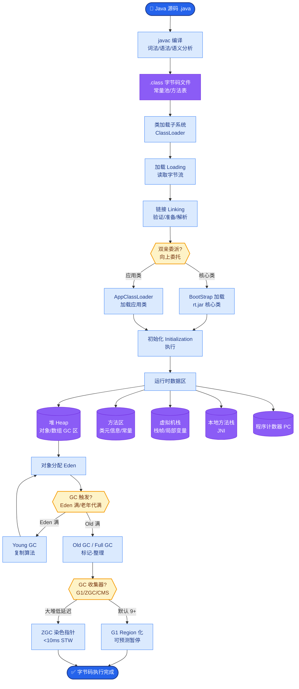
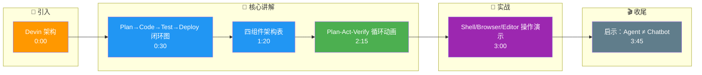

# Devin(Cognition)的架构设计有什么值得借鉴的地方?它为什么被称为「第一个AI软件工程师」

### Devin 的核心定位

Devin 被称为“第一个 AI 软件工程师”，因为它不仅仅是对话助手，而是一个具备**全栈工程能力**的自主 Agent：规划 → 编码 → 测试 → 部署 → 调试。

### 核心架构设计

| 组件 | 功能解析 | 借鉴价值 |
| :--- | :--- | :--- |
| **Planner** | 将高层需求分解为子任务，设定里程碑 | 解决复杂任务拆解难题 |
| **Sandboxed IDE** | 提供真实的代码编辑器、Terminal、Browser | 深度工具集成是执行力的基础 |
| **Context Manager** | 长期记忆管理，维护跨文件的代码库心智模型 | 解决大项目上下文理解问题 |
| **Verifier** | 每一步执行后自动验证（如运行测试） | Plan-Act-Verify 循环保证质量 |

### 系统运行流程图

```text
用户需求
    │
    ▼
┌──────────────┐
│   Planner    │◄─────┐
│ (任务拆解)    │      │
└──────┬───────┘      │ 反馈循环 (Self-Correction)
       │             │
       ▼             │
┌──────────────┐      │
│  Agent Core  │──────┘
│ (LLM 推理)    │
└──────┬───────┘
       │
       ├──────────────┬──────────────┐
       ▼              ▼              ▼
┌───────────┐  ┌───────────┐  ┌───────────┐
│   Shell   │  │  Browser  │  │  Editor   │
│(Terminal) │  │ (Headless)│  │ (VS Code) │
└─────┬─────┘  └─────┬─────┘  └─────┬─────┘
      │             │             │
      └─────────────┴─────────────┘
                    │
                    ▼
            ┌───────────────┐
            │  Verifier     │
            │ (自测/日志检查) │
            └───────┬───────┘
                    │
            Pass? ──┴── Fail? ──> (重试/修正)
                    │
                    ▼
               最终交付物
```

### 关键设计哲学与细节

1. **Code-Centric (以代码为中心)**：核心产出是代码和 PR，而非对话文本。对话是手段，不是目的。
2. **Self-Correction (自愈能力)**：测试失败后，Agent 会自动阅读报错、修改代码、重测，形成闭环。
3. **Human-in-the-Loop (人在环中)**：在关键决策点（如部署上线）寻求人工确认，平衡自主性与安全性。

**补充技术细节：**
- **状态持久化**：Sandbox 中的状态（如数据库迁移、环境变量）会跨 Task 保存，模拟真实开发者的“工作台”状态。
- **工具调用链**：Devin 不只是调用 API，而是模拟击键和鼠标操作，这意味着它能操作任何基于 GUI 的工具，而不仅是 CLI 工具。

### 对业界的启示

- **Agent ≠ Chatbot**：真正的 Agent 是工具的使用者，而非仅仅生成文本。
- **工具链深度集成是壁垒**：简单调用 API 不够，必须能像人类一样操作终端、浏览器和编辑器。
- **长上下文管理**：能否维护大型代码库的一致性是代码 Agent 的核心竞争力。

## 常见考点

1. **Devin 如何处理长代码文件的上下文限制？**
   - 考点：RAG（检索增强生成）在代码场景的应用，以及如何通过向量数据库检索相关的代码片段而非全量读取。
2. **为什么说“自愈能力”比“一次性代码生成”更重要？**
   - 考点：软件工程中的迭代思维，以及 LLM 产生幻觉时的纠错机制设计。
3. **沙箱环境的安全性如何保证？**
   - 考点：容器化隔离、网络白名单、以及执行敏感命令时的权限控制策略。

## 核心流程图



## 记忆要点

- 核心定位：首个 AI 软件工程师，具备规划、编码、测试、部署、调试全栈能力。
- 架构闭环：Planner 拆解任务，Sandbox IDE 提供真实环境，Verifier 自测纠错。
- 关键设计：Plan-Act-Verify 循环保证质量，深度集成 Shell/Browser/Editor 模拟人工。
- 核心价值：Agent 产出的代码而非对话，具备自愈能力，长上下文维护代码一致性。

## 结构化回答

**30 秒电梯演讲：** Devin 被称为首个 AI 软件工程师，因为它不只是聊天机器人——而是有完整工程闭环：Planner 拆解任务、Sandbox IDE 提供真实的终端浏览器编辑器、Verifier 跑测试自检。核心产出是代码不是对话，Plan-Act-Verify 循环保证质量。

**展开框架：**
1. **核心定位** — 全栈闭环工程能力，从规划到编码、测试、部署、调试全程自主完成。
2. **架构四件套** — Planner 拆解子任务、Sandbox IDE 提供真实环境、Context Manager 维护跨文件心智模型、Verifier 自测纠错。
3. **设计哲学** — Plan-Act-Verify 循环保证质量，以代码而非对话为核心产出，长上下文维护代码一致性。

**收尾：** Devin 的护城河在工具链深度集成——我可以聊聊 Sandbox IDE 的安全隔离是怎么做的。

## 视频脚本

> 预计时长：4 分钟 | 由浅入深

| 时间 | 画面/字幕 | 口播台词 | 讲解要点 |
|------|----------|----------|----------|
| 0:00 | 标题卡：Devin 架构 | "不只会聊天的客服，是能远程上手修电脑的技术员。" | 定位开场 |
| 0:30 | Plan→Code→Test→Deploy 闭环图 | "全栈闭环：规划、编码、测试、部署、调试一条龙。" | 核心定位 |
| 1:20 | 四组件架构表 | "Planner 拆任务，Sandbox IDE 提供环境，Verifier 自测纠错。" | 架构四件套 |
| 2:15 | Plan-Act-Verify 循环动画 | "测试失败自动读报错、改代码、重测，形成自愈闭环。" | 自愈能力 |
| 3:00 | Shell/Browser/Editor 操作演示 | "不调 API 而是模拟击键鼠标，能操作任何 GUI 工具。" | 工具集成 |
| 3:45 | 启示：Agent ≠ Chatbot | "真正的 Agent 是工具使用者，长上下文管理是核心竞争力。" | 业界启示 |

### 视频流程图




