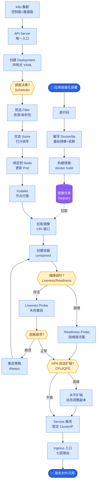
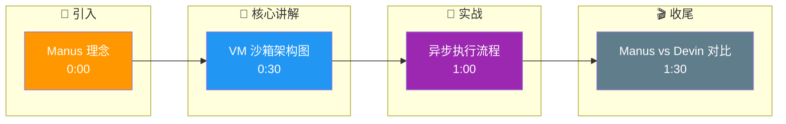

# Manus(通用Agent)的设计理念是什么?它和Devin/Claude Code有什么区别

### Manus 的核心理念

Manus 定位为**通用任务 Agent**，不局限于编程，旨在覆盖数据分析、报告撰写、资料调研、PPT 制作等广泛的办公室工作场景。

### 架构特点

**1. 虚拟机沙箱**
- 每个任务分配一个独立的云端虚拟机（VM）。
- **环境**：完整的 Linux OS，预装 Chrome、Office、Python 等全套工具。
- **优势**：提供真实的操作环境，解决依赖缺失和环境隔离问题。

**2. 多模态交互**
- Agent 不仅能读文本，还能看屏幕截图（视觉）、操作 DOM 结构、读写文件系统。

**3. 异步执行模式**
- 支持长时任务（如“跑完这组数据并生成报告”）。
- 任务在后台 VM 中运行，完成后通过通知推送给用户，无需保持连接。

### Manus 架构示意图

```text
用户
  │
  │ (任务提交)
  ▼
┌─────────────────┐
│  Control Plane  │
│ (调度/任务分发)  │
└────────┬────────┘
         │
         ▼
    ┌────┴────┐
    │  VM池   │ (动态扩缩容)
    └────┬────┘
         │
    ┌────┴─────────────────────────────┐
    │ VM #1 (Isolated)      VM #2 ...   │
    │ ┌───────────────────┐  ┌───────┐  │
    │ │   OS + Toolchain  │  │  ...  │  │
    │ │ [Chrome, Python,  │  │       │  │
    │ │  Office, Node.js] │  │       │  │
    │ └────────┬──────────┘  └───────┘  │
    │          │ Agent Process          │
    └──────────┼────────────────────────┘
               │ (日志/状态/文件上传)
               ▼
         用户通知/结果查看
```

### 对比分析：Manus vs Devin vs Claude Code

| 维度 | Devin | Claude Code | Manus |
| :--- | :--- | :--- | :--- |
| **核心领域** | 软件工程 | 编程辅助 | **通用办公任务** |
| **运行环境** | Docker 沙箱 | 用户本地终端 | **云端独立 VM** |
| **交互方式** | 对话 + IDE 视图 | CLI / TUI | **Web + 异步通知** |
| **产出物** | 代码 / PR | 代码片段 | **报告 / PPT / 数据 / 代码** |

### 启示

- **能力上限 = 工具链丰富度**：给 Agent 装什么工具，它就能干什么活。
- **VM 级沙箱是通用的“手”**：让 Agent 获得了在电脑上做任何事的能力，不再局限于 API 调用。
- **异步是处理长任务的必经之路**：复杂任务耗时不可控，必须解耦请求与响应。

**补充细节：**
- **资源清理策略**：VM 在任务结束后会被销毁或快照重置，防止状态污染，但在同一 Session 内可复用以节省冷启动时间。
- **多模态输入处理**：Manus 使用类似 ViT (Vision Transformer) 的模型解析屏幕截图，结合 DOM 树分析精确定位 Web 元素进行点击/输入，而非简单的坐标模拟。

## 常见考点

1. **Manus 这种“云端 VM”模式相比“本地 API 调用”有什么劣势？**
   - 考点：延迟（冷启动时间）、数据隐私（敏感数据上传云端）、成本（维护 VM 基础设施昂贵）。
2. **如何解决 VM 中的环境依赖安装耗时问题？**
   - 考点：使用定制化的 AMI (机器镜像) 或 Docker 镜像预装常用库，实现秒级启动。
3. **Agent 在浏览器中操作时，如何处理动态网页（如 SPA）？**
   - 考点：等待策略、智能重试、以及通过监控 DOM 变化而非固定等待时间来判断页面加载完成。

## 核心流程图



## 记忆要点

- 核心理念：通用任务 Agent，覆盖办公全场景，不局限于编程。
- 环境隔离：每个任务分配独立云端 VM，预装全套工具，支持多模态交互。
- 执行模式：支持长时任务异步运行，解耦请求与响应，完成后通知用户。
- 对比差异：Devin 专注代码，Manus 通用办公，VM 沙箱比 API 调用更通用但成本高。

## 结构化回答

**30 秒电梯演讲：** Manus 是通用任务 Agent，不只写代码还能做 PPT、分析数据、调研资料。每个任务分配独立云端 VM，预装 Chrome、Office、Python 全套工具。支持长时任务异步运行，完成后通知用户——比 Devin 通用，但 VM 成本更高。

**展开框架：**
1. **核心理念** — 通用任务 Agent，覆盖办公全场景（数据分析、报告、PPT），不局限于编程。
2. **环境隔离** — 每个任务分配独立云端 VM，预装全套工具链，支持多模态交互（看截图、操作 DOM）。
3. **执行模式与对比** — 支持长时任务异步运行解耦请求响应；Devin 专注代码，Manus 通用办公，VM 比 API 通用但成本高。

**收尾：** Manus 的取舍是通用性换成本——我可以聊聊 VM 冷启动和资源清理策略。

## 视频脚本

> 预计时长：2 分钟 | 由浅入深

| 时间 | 画面/字幕 | 口播台词 | 讲解要点 |
|------|----------|----------|----------|
| 0:00 | 标题卡：Manus 理念 | "云端雇的远程实习生，能写代码也能做 PPT。" | 类比开场 |
| 0:30 | VM 沙箱架构图 | "每个任务分独立云端 VM，预装 Chrome、Office、Python。" | 环境隔离 |
| 1:00 | 异步执行流程 | "长任务后台跑，完成后通知，解耦请求和响应。" | 异步模式 |
| 1:30 | Manus vs Devin 对比 | "Devin 专注代码，Manus 通用办公，VM 比 API 通用但贵。" | 对比差异 |

### 视频流程图




