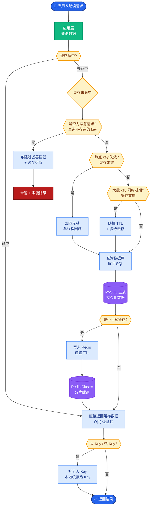

# OpenAI Codex CLI的架构有什么特点?它的前缀缓存和上下文压缩如何工作

### Codex CLI 核心架构特点

**1. 无状态请求设计**
- **原则**：每次 API 调用都携带完整的上下文信息，服务端不保存会话状态。
- **优势**：
  - 服务端可任意水平扩展，无需考虑会话亲和性。
  - 无需处理会话过期、恢复等复杂逻辑。

**2. 前缀缓存**
- **原理**：在一个请求中，System Prompt、工具定义等项目是固定的（即“前缀”）。LLM 推理引擎会对这些部分的 KV Cache 进行复用，仅对变化的部分重新计算。
- **收益**：在长上下文场景下，可节省 **50%-80%** 的计算成本和延迟。
- **支持情况**：目前 OpenAI、Anthropic、DeepSeek 等主流厂商均已在底层实现此优化。

### 前缀缓存 工作原理图

```text
请求 1: [System Prompt (10k) | User Input (1k) | ...]
         │                                   │
         ▼                                   ▼
    [计算 KV Cache 10k]                 [计算 KV Cache 1k]
              │                                   │
              └───────────> 存入缓存 <─────────────┘

请求 2 (相同的 System Prompt):
         [System Prompt (10k) | New Input (1k) | ...]
                    │                    │
                    ▼                    ▼
           (命中缓存，无需计算)      (计算 KV Cache 1k)
                    │                    │
                    └───────────> 拼接缓存 ──────> 推理
```

**3. 上下文压缩**
- **触发机制**：当对话历史或上下文长度超过模型窗口阈值时自动触发。
- **策略**：
  - 保留最近的 N 轮对话。
  - 对更早的历史进行摘要，保留关键信息，丢弃细节。

**4. 配置文件级联加载**
为了注入领域知识，Codex CLI 支持按目录层级加载配置文件（如 AGENTS.md）：

```text
/AGENTS.md           # 全局通用规则
/project/AGENTS.md   # 项目特定规则
/src/AGENTS.md       # 模块级规则（优先级最高）
```

**效果**：深层目录的配置会覆盖浅层配置，实现细粒度的行为控制。

**5. 工具沙箱**
- **权限分级**：
  - **Auto**：允许自动执行安全命令（如 `git status`）。
  - **Suggest**：仅生成命令，由用户手动复制执行。
  - **Always-Ask**：敏感操作（如 `rm -rf`）必须经用户明确确认。

### 与 Claude Code 的核心区别

- **Codex CLI**：侧重**无状态**、**高性能**和**低成本**（利用前缀缓存），适合作为通用工具接口。
- **Claude Code**：侧重**有状态**、**深度推理**和**本地交互**，适合作为沉浸式编程伙伴。

**补充技术细节：**
- **Prompt 结构优化**：Codex CLI 通常将 Prompt 结构化为 `Instructions + Context + User Query`，其中 `Instructions` 部分非常适合利用 Prefix Cache，因为其在多次请求中几乎不变。
- **Token 预算管理**：CLI 工具会严格监控剩余 Token 配额，动态决定是截断旧历史还是进行摘要，以避免 API 报错 (431 Payload Too Large)。

## 常见考点

1. **前缀缓存对业务层代码有什么特殊要求？**
   - 考点：需要确保“前缀”部分（如 System Message）在文本级别完全一致。哪怕多一个空格或换行符不同，都会导致缓存失效。
2. **无状态设计如何实现多轮对话的记忆功能？**
   - 考点：客户端侧负责维护历史记录数组，每次请求时将历史截断/摘要后拼接到新的 Prompt 中发送给服务端。
3. **上下文压缩中的“摘要”由谁完成？**
   - 考点：通常由 LLM 本身完成（调用一个 summary 模型），或者使用成本更小的模型（如 GPT-3.5）来压缩 GPT-4 的历史上下文。


## 核心流程图



## 记忆要点

- 架构特点：无状态请求设计，服务端可任意水平扩展，无需维护会话亲和性。
- 前缀缓存：复用 System Prompt 等固定部分的 KV Cache，长上下文下降本 50%-80%。
- 上下文压缩：超阈值时自动摘要历史对话，保留最近 N 轮，丢弃细节。
- 配置级联：按目录层级加载配置文件，深层目录规则覆盖浅层，实现细粒度控制。

## 结构化回答

**30 秒电梯演讲：** Codex CLI 的特点是无状态请求——服务端不存会话，可任意水平扩展。靠前缀缓存复用 System Prompt 的 KV Cache，长上下文降本 50% 到 80%。超阈值自动摘要历史，按目录层级加载配置实现细粒度控制。

**展开框架：**
1. **无状态架构** — 每次请求带完整上下文，服务端不保存会话，可任意水平扩展无需会话亲和性。
2. **前缀缓存** — 复用 System Prompt、工具定义等固定部分的 KV Cache，长上下文降本 50%-80%。
3. **上下文压缩与配置级联** — 超阈值自动摘要历史保留最近 N 轮；按目录层级加载 AGENTS.md，深层覆盖浅层。

**收尾：** 前缀缓存的坑是前缀必须完全一致——我可以聊聊一个空格差异就让缓存失效的排查故事。

## 视频脚本

> 预计时长：2 分钟 | 由浅入深

| 时间 | 画面/字幕 | 口播台词 | 讲解要点 |
|------|----------|----------|----------|
| 0:00 | 标题卡：Codex CLI 架构 | "像发邮件，每次带前缀，但背景一样只收一次邮费。" | 类比开场 |
| 0:30 | 无状态请求流程 | "无状态设计，服务端不存会话，可任意水平扩展。" | 无状态架构 |
| 1:00 | 前缀缓存命中率演示 | "复用 System Prompt 的 KV Cache，长文本降本 50%-80%。" | 前缀缓存 |
| 1:30 | 上下文压缩 + 配置级联 | "超阈值摘要历史，AGENTS.md 按目录层级覆盖。" | 压缩与配置 |

