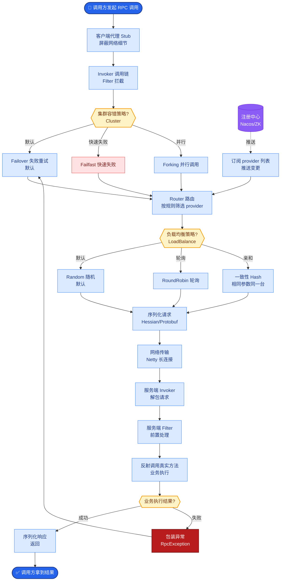
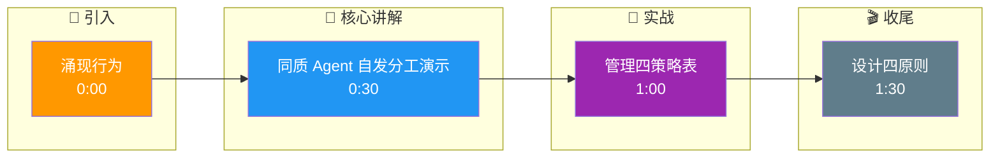

# 大规模Agent系统中的涌现行为(Emergent Behavior)有哪些?如何管理

### 涌现行为 定义

涌现行为指多 Agent 系统中，个体遵循简单规则互动，却在宏观层面表现出个体未预设的复杂行为模式。

### 常见涌现行为示例

1. **专业化分工**
- **现象**：初始同质的 Agent，在协作中自发演变成不同角色（如有的擅长搜索，有的擅长总结）。
- **机制**：基于正反馈强化，擅长某任务的 Agent 获得更多奖励，从而更倾向于接此类任务。

2. **自发协议形成**
- **现象**：Agent 间形成默契的通信格式或交互节奏。
- **机制**：为了提高协作效率，Agent 动态调整消息长度或调用频率。

3. **集体智能**
- **现象**：单个 Agent 能力有限，但群体协作解决了极复杂问题（类似蚁群筑巢）。

4. **策略涌现**
- **现象**：在 RL 训练中，Agent 自主发明出设计者未教过的策略（如 DeepSeek-R1 的自我反思行为）。

### 涌现行为管理架构

```text
      ┌─────────────────────────────────────┐
      │      监控与治理层               │
      │  (全局视角、异常检测、熔断器)        │
      └──────────────┬──────────────────────┘
                     │
      ┌──────────────┴──────────────────────┐
      │         消息总线 / 共享环境          │
      │  (黑盒信息池、状态共享、博弈空间)     │
      └────┬─────────┬─────────┬────────────┘
           │         │         │
      ┌────▼───┐ ┌───▼───┐ ┌──▼─────┐
      │Agent A │ │Agent B │ │Agent C │ ...
      │(个体)  │ │(个体)  │ │(个体)  │
      └────────┘ └───────┘ └────────┘
           │         │         │
      ┌────▼─────────▼─────────▼────┐
      │     简单本地规则            │
      │  (Reward、Memory、Policy)   │
      └─────────────────────────────┘
```

### 管理与治理策略

| 风险 | 管理策略 |
| :--- | :--- |
| **混乱与不可控** | 设定明确的角色边界和通信协议，限制交互复杂度。 |
| **回音壁效应** | 引入多样性（不同模型、不同 Prompt），防止群体陷入局部最优。 |
| **级联错误** | 设置断路器和关键检查点，阻断错误在 Agent 间的传播。 |
| **资源耗尽** | 设置全局 Token 预算和步数上限，防止无限循环或无意义调用。 |

**补充技术细节：**
- **通信拓扑限制**：不要使用全连接网络，建议使用层次化或 Ring 网络结构，限制信息传播速度，防止系统过快震荡。
- **“阿克曼函数”式陷阱**：防止 Agent 之间陷入无限互相确认的死循环（例如 A 问 B，B 问 A），需引入超时机制和层级仲裁。

### 设计原则

1. **简单规则**：个体规则越简单，系统的鲁棒性和可预测性越强。
2. **局部交互**：尽量避免全连接网络，Agent 只与必要的邻居通信。
3. **反馈机制**：建立良性的奖惩反馈，抑制有害涌现，鼓励有益涌现。
4. **全局可观测**：即使是个体交互，也必须有全局视角的监控，以便及时发现异常模式。

## 常见考点

1. **如何区分“Bug”和“涌现行为”？**
   - 考点：结果是否符合预期目标。涌现行为可能是新颖且有用的（良性），而 Bug 是系统非预期的故障。但在训练初期，区分往往取决于最终 Reward 的高低。
2. **多 Agent 系统中常见的“死锁”场景有哪些？如何解决？**
   - 考点：资源竞争死锁（都等待对方释放锁）和逻辑死锁（无限循环对话）。解决方法包括超时重置、引入中心调度器或随机退避算法。
3. **RLHF（人类反馈强化学习）在多 Agent 系统中如何应用？**
   - 考点：既可以对单个 Agent 的行为进行打分，也可以对群体的最终协作结果进行打分（Team Reward），但要注意 Team Reward 导致的“搭便车”问题（Credit Assignment Problem）。

## 核心流程图



## 记忆要点

- 涌现定义：个体遵循简单规则，宏观层面表现出未预设的复杂行为（如专业化分工）。
- 管理策略：设定明确角色边界，限制通信拓扑，引入断路器阻断级联错误。
- 风险防控：防止回音壁效应需引入多样性，防资源耗尽需设置全局 Token 预算。
- 设计原则：个体规则简单化，交互局部化，建立全局可观测监控异常模式。

## 结构化回答

**30 秒电梯演讲：** 涌现行为是多 Agent 系统里，个体遵循简单规则，宏观层面却表现出未预设的复杂行为——比如同质 Agent 自发分工。管理上要设角色边界、限制通信拓扑、引入断路器防级联错误，再用全局 Token 预算防资源耗尽。

**展开框架：**
1. **涌现定义与示例** — 个体遵循简单规则，宏观表现出专业化分工、自发协议、集体智能等未预设行为。
2. **管理策略** — 设定明确角色边界、限制通信拓扑、引入断路器阻断级联错误传播。
3. **风险防控与设计** — 防回音壁引入多样性、防资源耗尽设全局 Token 预算；个体规则简单化、交互局部化、建立全局可观测监控异常。

**收尾：** 涌现的命门是区分 Bug 和良性涌现——我可以聊聊怎么用 Reward 信号做判定。

## 视频脚本

> 预计时长：2 分钟 | 由浅入深

| 时间 | 画面/字幕 | 口播台词 | 讲解要点 |
|------|----------|----------|----------|
| 0:00 | 标题卡：涌现行为 | "像蚂蚁搬家，没人指挥，简单互动却搬完了家。" | 类比开场 |
| 0:30 | 同质 Agent 自发分工演示 | "同质 Agent 协作中自发演变成不同角色，叫专业化分工。" | 涌现示例 |
| 1:00 | 管理四策略表 | "设角色边界、限通信拓扑、断路器防级联、Token 预算防耗尽。" | 管理策略 |
| 1:30 | 设计四原则 | "规则简单、交互局部、反馈机制、全局可观测。" | 设计原则 |

### 视频流程图




