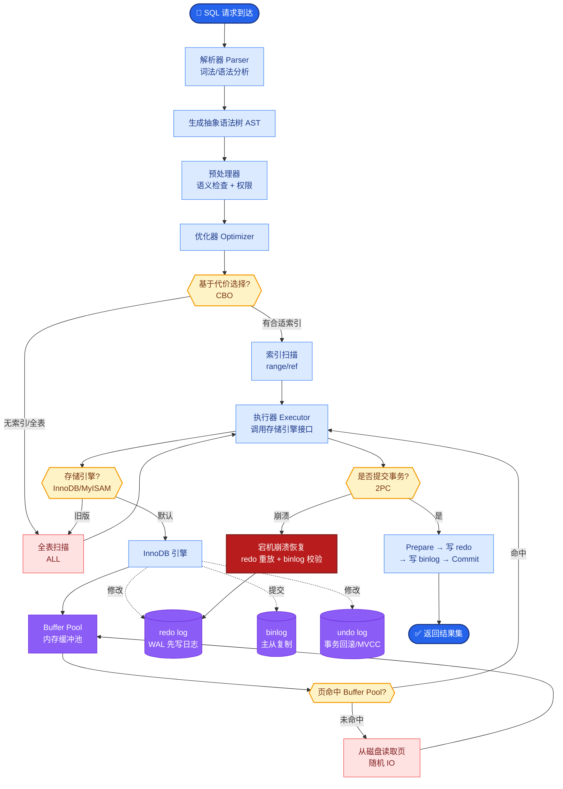

# Agent如何实现动态知识管理?RAG在Agent中的角色是什么

- **Agent知识管理三层:**

1. **参数化知识** - 模型权重中的预训练知识
   - 优点:推理时无额外延迟
   - 缺点:无法更新、可能过时

2. **激活知识** - Prompt中的上下文信息
   - 优点:精确可控
   - 缺点:受上下文窗口限制

3. **检索知识** - 向量数据库中的外部知识
   - 优点:可动态更新、不受窗口限制
   - 缺点:检索质量影响准确性

- **Agent中RAG的特殊角色:**

| 用途 | 示例 |
|------|------|
| 经验库 | 过去成功/失败的任务轨迹 |
| 代码库 | 当前项目的代码和理解 |
| 用户偏好 | 用户的编码风格/习惯 |
| 实时信息 | 文档/API变更 |
| 工具手册 | 可用工具的使用说明 |

- **动态知识流架构:**
```text
┌───────────────┐      ┌───────────────┐      ┌───────────────┐
│   User Task   │─────>│   Agent Core  │─────>│  Decision     │
└───────────────┘      └───────┬───────┘      └───────┬───────┘
                               │                      │
                               │   (Knowledge Gap)    │
                               ▼                      ▼
                        ┌───────────────┐      ┌───────────────┐
                        │    Query      │─────>│  Vector DB    │
                        │  Generation   │<─────│  (Embeddings) │
                        └───────┬───────┘      └───────┬───────┘
                                │                      │
                                │ (Context Injection)  │
                                └──────────────────────┘
```

- **动态更新策略:**
1. 每次任务后自动提取经验存入向量库
2. 用户反馈标记好/坏结果
3. 定期重训练embedding模型
4. 冲突检测:新知识与旧知识矛盾时如何处理

- **高级检索增强细节:**
   - **Hybrid Search (混合检索)**: 结合向量检索（语义相似度）与关键词检索（BM25），解决专有名词匹配问题。
   - **Re-ranking (重排序)**: 先检索Top-50粗排，再使用Cross-Encoder进行精细排序，提高相关性。
   - **Recursive Retrieval (递归检索)**: 先检索文档摘要，再根据摘要检索具体子块，处理长文本。

- **实战案例**: 在企业知识库问答中，常遇到“幻觉”问题，即Agent检索到了错误文档。引入Citations（引用溯源）机制，强制Agent在回答中标注来源ID，可显著提升可信度并便于人工纠错。

- **代码示例**: 
```python
from langchain.retrievers import MergerRetriever
from langchain_community.retrievers import BM25Retriever

# 混合检索实现 (Python)
vector_retriever = vector_db.as_retriever(search_kwargs={"k": 5})
keyword_retriever = BM25Retriever.from_documents(docs)
keyword_retriever.k = 5

# 结合语义和关键词检索
hybrid_retriever = MergerRetriever(retrievers=[vector_retriever, keyword_retriever])
```

- **边界情况**：
   - **空结果处理**：当检索返回空结果时，Agent应具备“拒答”或调用搜索引擎（如Google/Bing）的兜底策略，而非凭空捏造。
   - **上下文窗口溢出**：检索到的文档总长度超过模型上下文窗口时，需实施“滑动窗口”截取或基于重要性分数的动态截断策略。
   - **多模态知识**：面对图片、表格等多模态文档，纯文本向量检索失效，需引入多模态Embedding模型（如CLIP）或OCR+表格解析预处理。

- **易错点**：
   - **过度依赖语义相似度**：仅使用余弦相似度检索，可能导致检索到语义相近但内容错误的文档（例如检索“如何关闭防火墙”却返回“防火墙无法关闭的原因”），必须混合关键词检索。
   - **忽视索引滞后性**：知识更新后未实时刷新向量索引，导致Agent无法获取最新数据，需设计“写入-索引-生效”的实时流或准实时流管道。

- ## 面试追问
   1. 如何评估RAG系统的检索准确性？你会选择哪些指标（如Recall@K, MRR, NDCG）？
   2. 当检索到的文档之间内容相互冲突时，Agent该如何判断和取舍？
   3. 针对私密性极强的企业知识，如何防止通过Prompt注入攻击导致向量库被恶意遍历或泄露？


## 核心流程图



## 记忆要点

- 知识三层架构：参数化(预训练)、激活(Prompt)、检索(向量库)，各有利弊。
- RAG在Agent中不仅是文档库，更是经验库、代码库和用户偏好的动态来源。
- 动态更新策略：任务后自动存经验、冲突检测、混合检索(向量+BM25)。
- 核心流程：Agent识别知识缺口 -> 查询向量库 -> 注入上下文 -> 生成回答。
- 关键优化：重排序提升相关性，引用溯源解决幻觉问题。

## 结构化回答

**30 秒电梯演讲：** Agent 的知识分三层：参数化知识在模型权重里、激活知识在 Prompt 里、检索知识在向量库里。RAG 不只是文档库，更是经验库、代码库、用户偏好的动态来源。流程是识别知识缺口、查向量库、注入上下文、生成回答，再用重排序和引用溯源优化。

**展开框架：**
1. **知识三层架构** — 参数化（预训练，不可更新）、激活（Prompt，受窗口限制）、检索（向量库，可动态更新）。
2. **RAG 的多重角色与动态更新** — 不仅是文档库，还是经验库、代码库、用户偏好来源；任务后自动存经验、冲突检测、混合检索（向量+BM25）。
3. **核心流程与优化** — Agent 识别知识缺口→查向量库→注入上下文→生成回答；重排序提升相关性、引用溯源解决幻觉。

**收尾：** RAG 的坑在检索质量——我可以聊聊 Hybrid Search 怎么解决专有名词匹配问题。

## 视频脚本

> 预计时长：3 分钟 | 由浅入深

| 时间 | 画面/字幕 | 口播台词 | 讲解要点 |
|------|----------|----------|----------|
| 0:00 | 标题卡：Agent 知识管理 | "大脑记不住的查笔记，记不住的存外挂硬盘。" | 类比开场 |
| 0:30 | 三层知识架构对比表 | "参数化、激活、检索三层，各有利弊。" | 三层架构 |
| 1:15 | RAG 五重角色 | "RAG 不只是文档库，还是经验库、代码库、用户偏好来源。" | RAG 角色 |
| 2:00 | 动态更新流程 | "任务后自动存经验，冲突检测，混合检索向量加 BM25。" | 动态更新 |
| 2:40 | 重排序 + 引用溯源 | "Cross-Encoder 重排序提相关性，引用溯源解决幻觉。" | 关键优化 |

