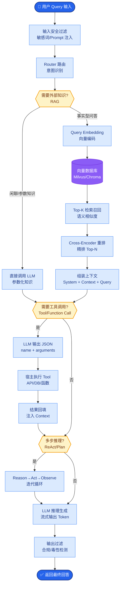

# 如何为Agent开发高质量的自定义工具?有哪些设计原则

- **自定义工具设计原则:**

1. **单一职责** - 一个工具做一件事
   - ❌ `process_data(action, data, format, target)`
   - ✅ `read_data(source)` + `format_data(data)` + `write_data(target)`

2. **清晰的错误信息**
```python
# ❌ 坏
return {"error": "failed"}
# ✅ 好
return {"error": "File not found: /path/to/file. Available files: [...]"}
```

3. **幂等性** - 相同输入相同输出
   - 方便重试
   - 避免副作用

4. **结构化输出** - 返回JSON而非文本

5. **超时保护** - 避免工具挂起

- **工具Schema最佳实践:**
```python
@tool
def search_codebase(query: str, file_pattern: str = "*", max_results: int = 20):
    """
    在代码库中搜索匹配的代码片段.

    **Args：** 
    **query：** 搜索关键词或正则表达式
    **file_pattern：** 文件类型过滤,如"*.py"
    **max_results：** 最大返回结果数

    **Returns：** 
    匹配的代码片段列表,每项包含文件路径、行号、代码内容

    当用户需要查找代码中的特定模式时使用此工具.
    不要用于读取完整文件(用read_file代替).
    """
    ...
```

- **关键:** docstring就是给LLM看的工具描述,要像写给新同事的文档一样清晰

- **Agent工具调用架构:**
```text
┌───────────────┐
│   LLM Brain   │
└───────┬───────┘
        │ 1. Generate Tool Call Arguments (JSON)
        ▼
┌───────────────────────────────────────┐
│          Tool Registry / Router        │
│  (Validates Args, Maps to Function)    │
└───────┬───────────────────────┬───────┘
        │                       │
        ▼                       ▼
┌───────────────┐       ┌───────────────┐
│  Local Tools  │       │  Remote APIs  │
│  (Python Fn)  │       │   (HTTP)      │
└───────┬───────┘       └───────┬───────┘
        │                       │
        │ 2. Execution Results  │
        └───────────┬───────────┘
                    │
                    ▼
            ┌───────────────┐
            │   LLM Brain   │
            │ (Synthesize)  │
            └───────────────┘
```

- **工具实现的高级细节:**
   - **输入校验**: 使用 Pydantic 模型进行强类型校验，防止非法参数导致工具崩溃。
   - **流式输出支持**: 对于长时间运行的工具，支持 yield 生成器返回中间状态，减少用户等待焦虑。
   - **语义版本控制**: 工具接口变更时更新版本号，避免旧版Prompt调用失效。

- **实战案例**: 开发SQL查询工具时，若仅描述为“执行SQL”，Agent极易生成DROP TABLE等危险语句。在Docstring中显式添加“DANGER: 仅支持SELECT操作”并在Pydantic层校验SQL关键词，可有效拦截高危操作。

- **代码示例**:
```python
from pydantic import BaseModel, Field, validator

class SQLQueryInput(BaseModel):
    query: str = Field(..., description="SQL查询语句，仅允许SELECT语法")
    
    @validator('query')
    def validate_safe_sql(cls, v):
        dangerous_keywords = ['DROP', 'DELETE', 'UPDATE', 'INSERT', 'ALTER']
        if any(keyword in v.upper() for keyword in dangerous_keywords):
            raise ValueError("Dangerous SQL operation detected. Only SELECT is allowed.")
        return v
```

- **边界情况**：
   - **长尾输出处理**：工具返回数据量极大（如查询全表）时，应设计分页机制或流式返回，避免撑爆上下文窗口。
   - **部分失败处理**：批量操作工具（如批量发送邮件）中，部分成功部分失败时，应返回详细的成功/失败ID列表，而非简单的True/False。
   - **网络抖动重试**：对于依赖HTTP的工具，需实现指数退避重试机制，但需配合幂等性设计，避免重复扣款等副作用。

- **易错点**：
   - **工具描述过载**：在Prompt中堆砌过多工具（超过50个），会导致LLM出现“迷失”现象，无法准确选中正确工具，需采用分层路由或动态检索工具描述。
   - **缺乏状态追踪**：工具无状态设计导致无法处理多轮对话依赖（如先“打开文件”再“写入”），应引入Session ID或上下文传递机制。

- ## 面试追问
   1. 当Agent连续调用同一个工具且总是失败时，如何设计机制让它停止盲目重试并转向其他策略？
   2. 如何给工具设计“优先级”？当多个工具都可能适用时，如何引导Agent优先尝试成本更低或速度更快的工具？
   3. 如果工具的输入参数是一个复杂的JSON对象，如何确保LLM生成的JSON格式完全符合Pydantic模型的定义？


## 核心流程图



## 记忆要点

- 设计五原则：单一职责、幂等性、结构化输出、清晰报错、超时保护。
- Docstring是关键：像给新同事写文档一样描述工具用途和参数，防止误用。
- 安全校验：使用Pydantic进行强类型校验，拦截非法参数(如危险SQL)。
- 架构流程：LLM生成参数 -> 路由校验 -> 执行工具 -> 返回结果 -> LLM综合。
- 实战注意：长尾输出需分页或流式返回，避免阻塞Agent。

## 结构化回答

**30 秒电梯演讲：** 给 Agent 开高质量工具五条铁律：单一职责、幂等性、结构化输出、清晰报错、超时保护。关键是 Docstring——像给新同事写文档一样描述用途和参数。用 Pydantic 做强类型校验拦截危险 SQL，长尾输出要分页或流式避免阻塞。

**展开框架：**
1. **设计五原则** — 单一职责、幂等性（方便重试）、结构化输出（JSON 而非文本）、清晰报错（含上下文）、超时保护（防挂起）。
2. **Docstring 与安全校验** — Docstring 是 LLM 理解工具的唯一依据，要详尽；用 Pydantic 强类型校验拦截非法参数（如 DROP TABLE）。
3. **架构流程与实战** — LLM 生成参数→路由校验→执行工具→返回结果→LLM 综合；长尾输出需分页或流式返回避免阻塞 Agent。

**收尾：** 工具设计的坑在描述过载——我可以聊聊超过 50 个工具时怎么用分层路由防 LLM 迷失。

## 视频脚本

> 预计时长：3 分钟 | 由浅入深

| 时间 | 画面/字幕 | 口播台词 | 讲解要点 |
|------|----------|----------|----------|
| 0:00 | 标题卡：工具设计原则 | "给机器人写说明书，越傻瓜式越不会瞎操作。" | 类比开场 |
| 0:30 | 五原则对比示例 | "单一职责、幂等性、结构化输出、清晰报错、超时保护。" | 设计五原则 |
| 1:15 | Docstring 好坏对比 | "Docstring 是给 LLM 看的，像给新同事写文档一样。" | Docstring |
| 2:00 | Pydantic 拦截危险 SQL | "Pydantic 强类型校验，拦 DROP TABLE 这种危险参数。" | 安全校验 |
| 2:40 | 工具调用架构流程图 | "LLM 生成参数、路由校验、执行、返回、LLM 综合。" | 架构流程 |

