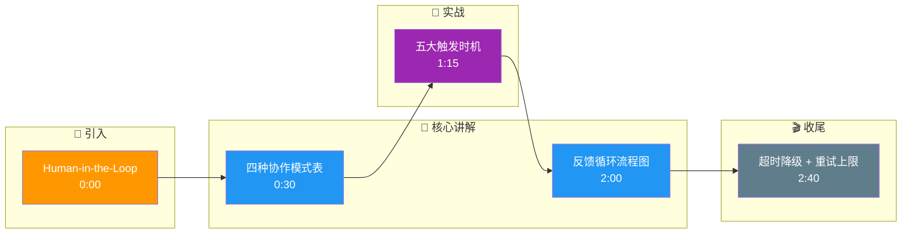

# Human-in-the-Loop在Agent中如何设计?不同的人机协作模式有哪些

- **人机协作模式:**

| 模式 | 人 | Agent | 适用 |
|------|-----|--------|------|
| **Copilot** | 主导 | 辅助 | IDE/写作 |
| **Review** | 审批 | 执行 | 代码/文档 |
| **Supervise** | 监督 | 自主 | 自动化任务 |
| **Delegate** | 委托 | 全权 | 长任务 |

- **Human-in-Loop触发时机:**

1. **低置信度时** - Agent不确定时主动求助
2. **高风险操作** - 删除/部署/支付前
3. **计划审批** - 执行前展示计划
4. **定期检查** - 每N步展示进度
5. **异常处理** - 错误恢复时

- **设计模式:**

```python
# 模式1:计划审批
plan = agent.create_plan(task)
if user.approve(plan):
    agent.execute(plan)

# 模式2:逐步确认
for step in plan.steps:
    if step.risk_level >= 3:
        if not user.confirm(step):
            step.modify_based_on(user_feedback)
    agent.execute(step)

# 模式3:低置信度求助
if agent.confidence(result) < 0.7:
    result = user.ask_for_guidance()
```

- **关键原则:**
- 最小化打断(不要每步都问)
- 提供足够的上下文(让用户能做判断)
- 记住用户决策(类似的以后自动处理)

- **人机交互反馈循环:**
```text
                ┌───────────────┐
                │  User Intent  │
                └───────┬───────┘
                        ▼
                ┌───────────────┐
                │  Agent Plan   │───────┐
                │  Generation   │       │ (Plan Review)
                └───────┬───────┘       ▼
                        │        ┌───────────────┐
                        │        │ Human Feedback│
                        │        └───────┬───────┘
                        ▼                │
                ┌───────────────┐        │
                │  Agent Action │◄───────┘
                └───────┬───────┘
                        ▼
                ┌───────────────┐
                │   Result      │───────┐
                └───────────────┘       │ (Execution Check)
                                        ▼
                                ┌───────────────┐
                                │ Human Verify  │
                                └───────────────┘
```

- **进阶设计细节:**
   - **上下文压缩**: 向用户确认时，自动隐藏中间无关的步骤，只展示关键决策点和变更摘要。
   - **偏好学习**: 系统记录用户在确认过程中的修改习惯，后续自动应用类似修改（即 AutoGPT 的微调版）。
   - **多模态交互**: 对于图形界面任务，Agent 可以截图高亮需要操作的区域，询问用户是否点击，而非仅用文本描述。

- **实战案例**: 在代码重构Agent中，引入“断点交互”：当Agent检测到潜在逻辑漏洞时，暂停并生成Diff视图，由开发者确认是否Apply。这比直接修改Commit更安全，同时也通过开发者的确认数据强化了Agent的代码审查能力。

- **边界情况**：
   - **用户离线/无响应**：在关键步骤需要确认但用户长时间未回复时，系统应具备“超时降级”策略（如安全挂起任务或执行保守的默认操作）。
   - **意图理解偏差**：Agent误判了用户的反馈（如用户说“行”是指同意概念而非同意具体参数），需在确认环节强制Agent回溯具体的执行参数。

- **易错点**：
   - **过度信任**：在Review模式下，如果用户习惯性点击“全部同意”，容易引入安全漏洞，应在操作执行后保留“撤销窗口”。
   - **反馈循环死锁**：Agent陷入反复报错并反复求助用户的死循环，需设置最大重试次数，超过后转入人工接管模式。

- ## 面试追问
   1. 如何量化用户的“认知负荷”？如果Agent频繁请求确认导致用户疲劳，系统应如何自动调整交互策略？
   2. 在多用户协作场景下（如多个开发者同时Review一个Agent的计划），如何处理冲突的反馈意见？
   3. 当用户的反馈带有情绪（如愤怒或着急），Agent是否应该感知并调整其沟通风格或执行策略？

## 核心流程图

```mermaid
flowchart TD
    Start([🚀 SpringBoot 启动<br/>main 方法]):::start
    SpringApplication[SpringApplication.run<br/>启动入口]:::process
    PrepareEnv[准备 Environment<br/>加载 application.yml]:::process
    ContextQ{{应用上下文?<br/>Servlet/Reactive}}:::decision
    ServletCtx[AnnotationConfigCtx<br/>传统 MVC]:::process
    ReactiveCtx[ReactiveWebCtx<br/>WebFlux]:::process
    Refresh[refresh 刷新容器<br/>核心入口]:::process
    BeanFactory[BeanFactory<br/>IoC 容器]:::store
    BeanDef[BeanDefinition<br/>扫描 @Component/@Bean]:::process
    ScanQ{{配置方式?<br/>注解/XML}}:::decision
    AnnoScan[ComponentScan<br/>ClassPathBeanDefinitionScanner]:::process
    XmlScan[XmlBeanDefinitionReader<br/>解析 XML]:::process
    Instantiate[实例化 Bean<br/>反射 newInstance]:::process
    Populate[属性填充<br/>依赖注入 @Autowired]:::process
    AwareQ{{实现 Aware 接口?}}:::decision
    Aware[BeanNameAware / ContextAware<br/>回调注入]:::process
    InitQ{{自定义初始化?}}:::decision
    PostConstruct[@PostConstruct<br/>初始化方法]:::process
    AOPQ{{需要 AOP 增强?<br/>切面 @Aspect}}:::decision
    Proxy[创建动态代理<br/>JDK/CGLIB]:::process
    ProxyChain[代理链<br/>MethodInvocation]:::process
    Final([✅ Bean 就绪 可用]):::start

    Start --> SpringApplication --> PrepareEnv --> ContextQ
    ContextQ -->|传统| ServletCtx --> Refresh
    ContextQ -->|响应式| ReactiveCtx --> Refresh
    Refresh --> BeanFactory --> BeanDef --> ScanQ
    ScanQ -->|注解| AnnoScan --> Instantiate
    ScanQ -->|XML| XmlScan --> Instantiate
    Instantiate --> Populate --> AwareQ
    AwareQ -->|是| Aware --> InitQ
    AwareQ -->|否| InitQ
    InitQ -->|是| PostConstruct --> AOPQ
    InitQ -->|否| AOPQ
    AOPQ -->|是| Proxy --> ProxyChain --> Final
    AOPQ -->|否| Final

    classDef start fill:#2563eb,stroke:#1e3a8a,color:#fff,stroke-width:2px;
    classDef process fill:#dbeafe,stroke:#3b82f6,color:#1e3a8a;
    classDef decision fill:#fef3c7,stroke:#f59e0b,color:#78350f,stroke-width:2px;
    classDef store fill:#8b5cf6,stroke:#6d28d9,color:#fff;

```

## 记忆要点

- 四种协作模式：Copilot(人主导)、Review(人审批)、Supervise(人监督)、Delegate(人委托)。
- 触发时机：低置信度、高风险操作、计划审批、异常恢复时主动介入。
- 设计原则：最小化打断，提供充分上下文，记住用户决策以减少重复确认。
- 反馈循环：计划生成 -> 人审 -> 执行 -> 结果验证 -> 人核验。
- 边界处理：用户离线需超时降级，避免反馈死锁设置最大重试次数。

## 结构化回答

**30 秒电梯演讲：** Human-in-the-Loop 有四种协作模式：Copilot 人主导、Review 人审批、Supervise 人监督、Delegate 人委托。触发时机是低置信度、高风险操作、计划审批、异常恢复。设计原则是最小化打断，但提供充分上下文，还要记住用户决策减少重复确认。

**展开框架：**
1. **四种协作模式** — Copilot（人主导 Agent 辅助）、Review（人审批 Agent 执行）、Supervise（人监督 Agent 自主）、Delegate（人委托 Agent 全权）。
2. **触发时机** — 低置信度、高风险操作（删除/部署/支付）、计划审批、异常恢复时主动介入。
3. **设计原则与边界** — 最小化打断、提供充分上下文、记住用户决策；用户离线需超时降级，避免反馈死锁设最大重试次数。

**收尾：** HITL 的命门是用户疲劳——我可以聊聊习惯性点"全部同意"时怎么用撤销窗口防漏洞。

## 视频脚本

> 预计时长：3 分钟 | 由浅入深

| 时间 | 画面/字幕 | 口播台词 | 讲解要点 |
|------|----------|----------|----------|
| 0:00 | 标题卡：Human-in-the-Loop | "像新员工带老员工，拿不准的问一声，危险的递过来签字。" | 类比开场 |
| 0:30 | 四种协作模式表 | "Copilot 人主导，Review 人审批，Supervise 人监督，Delegate 人委托。" | 协作模式 |
| 1:15 | 五大触发时机 | "低置信度、高风险、计划审批、定期检查、异常恢复时介入。" | 触发时机 |
| 2:00 | 反馈循环流程图 | "计划生成、人审、执行、结果验证、人核验。" | 反馈循环 |
| 2:40 | 超时降级 + 重试上限 | "用户离线超时降级，反馈死锁设最大重试次数。" | 边界处理 |

### 视频流程图




