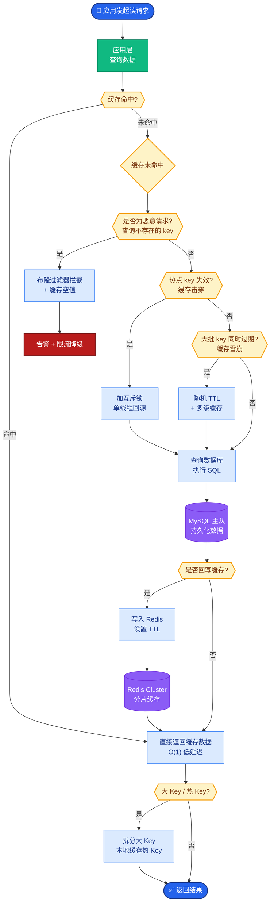

# Agent 工具调用失败后如何降级处理?设计一个容错策略.

- **Agent 工具调用失败常见原因**
1. API 超时/网络错误
2. 参数格式不匹配
3. 工具返回异常结果
4. 权限不足
5. 工具被限流

- **多级降级策略**

- **Level 1 - 重试**:
  - 指数退避重试(3次,间隔 1s/2s/4s)
  - 仅对幂等操作重试
  - 添加 Jitter (随机抖动) 避免惊群效应

- **Level 2 - 参数修正**:
  - 解析失败信息 → LLM 重新生成参数
  - Schema 校验 → 自动补全缺失字段 (如默认值)

- **Level 3 - 替代工具**:
  - 注册 fallback 工具链(如搜索引擎A → 搜索引擎B → 内置知识库)
  - 工具优先级排序 (高可用 > 低成本 > 高精度)

- **Level 4 - 优雅降级**:
  - 跳过失败步骤,用已有信息继续
  - 向用户透明地报告失败并请求手动输入

- **Level 5 - 人工兜底**:
  - 关键操作失败 → 转人工审核
  - 积累失败模式 → 离线优化

- **架构流程图**
```text
┌─────────────┐
│  Agent Task │
└──────┬──────┘
       │
       ▼
┌─────────────┐      失败      ┌──────────────────┐
│   Execute   │ ──────────────▶│  Retry + Backoff │
│    Tool     │◀────────────── │   (Max 3 times)  │
└──────┬──────┘                 └────────┬─────────┘
       │ 成功                           │
       ▼                                │ 仍失败
┌─────────────┐                        ▼
│    Return   │               ┌──────────────────┐
└─────────────┘               │  Parameter Fix  │
                              │  (LLM Re-gen)    │
                              └────────┬─────────┘
                                       │ 仍失败
                                       ▼
                              ┌──────────────────┐
                              │ Fallback Tool    │
                              │ (Chain logic)    │
                              └────────┬─────────┘
                                       │ 仍失败
                                       ▼
                              ┌──────────────────┐
                              │ Human / Report   │
                              └──────────────────┘
```

- **实现细节补充**
  - **熔断机制**: 如果某工具短时间内失败率超过阈值（如 50%），自动熔断，直接进入 Fallback 或报错，避免无效重试消耗 token 和时间。
  - **超时控制**: 每个工具调用必须设置 `timeout` 参数（如 `asyncio.wait_for`），防止因工具挂起导致整个 Agent 卡死。
  - **结果缓存**: 对于幂等的查询类工具，可以在重试前检查本地缓存是否有旧数据可用（允许一定脏读）。

- **## 常见考点**
  1. **幂等性保证**：如何判断一个工具操作是幂等的？（GET请求、唯一索引更新等）
  2. **重试风暴**：在分布式 Agent 环境下，如何避免所有 Agent 同时重试导致后端压力倍增？（客户端退避 + 服务端限流）

- **实战案例**：在电商大促场景中，库存查询工具因流量激增触发限流，由于未配置熔断，数千个 Agent 实例同时指数退避重试，导致数据库 CPU 飙升至 100%。后续引入了 Python 的 `tenacity` 库配置了 `stop_after_attempt` 和 `wait_exponential`，并配合 Sentinel 进行熔断保护。

- **代码示例** (Python) 
```python
from tenacity import retry, stop_after_attempt, wait_exponential, retry_if_exception_type
import requests

# 仅对网络错误或5xx错误进行重试，最多3次
@retry(stop=stop_after_attempt(3), 
       wait=wait_exponential(multiplier=1, min=1, max=4),
       retry=retry_if_exception_type((requests.Timeout, requests.ConnectionError)),
       reraise=True)
def call_tool_with_fallback(url, params):
    try:
        resp = requests.post(url, json=params, timeout=5)
        resp.raise_for_status()
        return resp.json()
    except Exception as e:
        # Level 3: 触发替代工具逻辑
        return fallback_search(params)
```


## 核心流程图



## 记忆要点

- 五级降级：重试(指数退避) -> 参数修正(LLM重填) -> 替代工具 -> 优雅降级 -> 人工兜底。
- 重试策略：仅对幂等操作重试，添加Jitter避免惊群效应。
- 熔断保护：失败率超阈值直接熔断，避免无效重试消耗Token。
- 超时控制：所有工具调用必须设置Timeout，防止Agent卡死。
- 实战案例：库存查询限流导致雪崩，需配合Sentinel进行熔断保护。

## 结构化回答

**30 秒电梯演讲：** Agent 工具调用失败的容错分五级降级：先指数退避重试，再让 LLM 重填参数修正，接着换替代工具，不行就优雅降级跳过非关键步骤，最后转人工兜底。重试只对幂等操作做，加 Jitter 防惊群，熔断防雪崩。

**展开框架：**
1. **五级降级链** — 重试（指数退避 3 次）→ 参数修正（LLM 重填）→ 替代工具（fallback 链）→ 优雅降级（跳过）→ 人工兜底。
2. **重试与熔断** — 仅对幂等操作重试加 Jitter 避免惊群；失败率超阈值直接熔断，避免无效重试消耗 Token。
3. **超时控制与实战** — 所有工具调用必须设 Timeout 防卡死；库存查询限流导致雪崩的案例需配合 Sentinel 熔断。

**收尾：** 容错的命门是熔断阈值——我可以聊聊大促时库存查询雪崩怎么用 tenacity + Sentinel 扛住。

## 视频脚本

> 预计时长：3 分钟 | 由浅入深

| 时间 | 画面/字幕 | 口播台词 | 讲解要点 |
|------|----------|----------|----------|
| 0:00 | 标题卡：工具调用容错 | "像导航软件，这条路堵了自动换路，实在不行问你。" | 类比开场 |
| 0:30 | 五级降级链流程图 | "重试、参数修正、替代工具、优雅降级、人工兜底。" | 五级降级 |
| 1:15 | 指数退避 + Jitter 动画 | "只对幂等操作重试，加 Jitter 防惊群效应。" | 重试策略 |
| 2:00 | 熔断器三状态转换 | "失败率超阈值直接熔断，避免无效重试消耗 Token。" | 熔断保护 |
| 2:40 | 大促雪崩案例 | "库存查询限流导致雪崩，配 Sentinel 熔断才扛住。" | 实战案例 |

