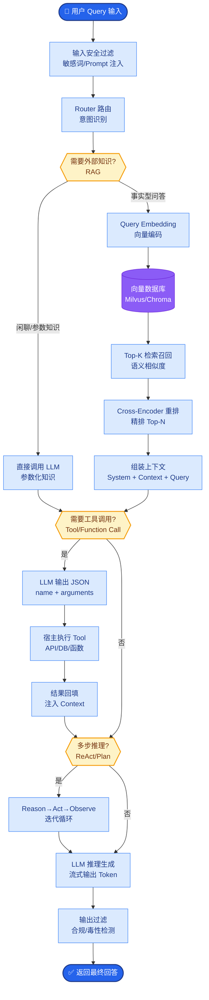

# Agent 产生幻觉式工具调用(hallucinated tool calls)的原因是什么?如何减少

- **幻觉式工具调用**指 LLM 调用不存在的工具、传递错误参数、或在不该调用工具时调用.

- **常见原因**
1. **工具描述模糊**:LLM 不理解何时使用、参数含义不清
2. **过度调用倾向**:模型训练时见过大量工具调用,倾向'用工具'而非'直接回答'
3. **上下文混淆**:对话历史中提到工具名,被误认为调用指令
4. **幻觉函数名**:编造不存在的 API 名称
5. **参数类型错误**:传字符串给期望数字的参数

- **减少策略**

1. **工具描述工程**:
   - 用 JSON Schema 严格定义参数类型和约束
   - 添加 'when to use' 和 'when NOT to use' 说明
   - 提供调用示例

2. **调用前校验**:
   - 函数名白名单检查
   - 参数 schema 校验(类型、范围、必填)
   - 调用频率限制

3. **Few-shot 引导**:
   - 在 system prompt 中展示正确和错误的调用模式
   - 包含'不需要工具'的示例

4. **置信度过滤**:
   - 检查 tool_call 的 logprob
   - 低置信度时不执行,要求重新推理

5. **微调对齐**:
   - 用真实工具调用数据做 SFT
   - 负样本训练:错误调用 + 惩罚

- **详细执行流程图**
```text
┌───────────────────────────────────────┐
│            LLM Generation             │
└───────────────────┬───────────────────┘
                    │
                    ▼
        ┌───────────────────────┐
        │  1. Syntax Validation │
        │  (Valid JSON?)        │
        └───────────┬───────────┘
                    │ No
                    ▼
            ┌───────────────┐
            │  Reject/Reask │
            └───────────────┘
                    │ Yes
                    ▼
        ┌───────────────────────┐
        │  2. Semantic Check    │
        │  - Name Whitelist      │
        │  - Arg Schema          │
        │  - Logic Constraints   │
        └───────────┬───────────┘
                    │ Fail
                    ▼
            ┌───────────────────┐
            │ Auto-fix / Error  │
            │ Feedback to LLM   │
            └───────────────────┘
                    │ Pass
                    ▼
        ┌───────────────────────┐
        │  3. Confidence Filter │
        │  (Logprobs > Thresh)  │
        └───────────┬───────────┘
                    │ Low
                    ▼
            ┌───────────────────┐
            │  Manual Review    │
            │  or Skip          │
            └───────────────────┘
                    │ High
                    ▼
            ┌───────────────┐
            │   Execute     │
            └───────────────┘
```

- **实战案例**：某数据分析 Agent 频繁调用 `get_pricing_info`，但该工具并不存在（模型幻觉源于训练数据中含相似 API）。通过在 System Prompt 中显式增加“Available Tools”严格列表，并在代码层增加 `pydantic` 的 `ValidationError` 捕获，减少了 95% 的无效调用。

- **代码示例** (Python) 
```python
from pydantic import BaseModel, ValidationError

# 定义严格的参数 Schema
class SearchParams(BaseModel):
    query: str
    limit: int = 10

# 调用前 Guardrail 校验
def validate_tool_call(tool_name, arguments):
    if tool_name not in ALLOWED_TOOLS:
        raise ValueError(f"Tool {tool_name} not allowed")
    try:
        # 校验参数类型和约束，自动类型转换
        SearchParams(**arguments)
    except ValidationError as e:
        return False, str(e)
    return True, "OK"
```


## 核心流程图



## 记忆要点

- 幻觉原因：描述模糊、过度调用倾向、上下文混淆、编造函数名。
- 防御五策：严格JSON Schema、Few-shot引导、置信度过滤、微调对齐、白名单校验。
- 校验流程：语法检查 -> 语义检查(白名单/Schema) -> 置信度过滤 -> 执行。
- 工具描述：明确'何时用'和'何时不用的示例'，减少误调。
- 实战技巧：利用Pydantic的ValidationError捕获非法参数并反馈给LLM修正。

## 结构化回答

**30 秒电梯演讲：** Agent 幻觉式工具调用的根因是描述模糊、过度调用倾向、上下文混淆、编造函数名。防御五策：严格 JSON Schema、Few-shot 引导、置信度过滤、微调对齐、白名单校验。校验流程是语法检查→语义检查→置信度过滤→执行。

**展开框架：**
1. **幻觉根因** — 工具描述模糊、模型过度调用倾向、上下文混淆误判、编造不存在的函数名。
2. **防御五策** — 严格 JSON Schema、Few-shot 引导（含"不用工具"示例）、置信度过滤（logprob）、微调对齐、白名单校验。
3. **校验流程与技巧** — 语法检查→语义检查（白名单/Schema）→置信度过滤→执行；用 Pydantic 的 ValidationError 捕获非法参数反馈 LLM 修正。

**收尾：** 防幻觉的命门是工具描述——我可以聊聊"何时不用"的示例怎么把误调率降 95%。

## 视频脚本

> 预计时长：2 分钟 | 由浅入深

| 时间 | 画面/字幕 | 口播台词 | 讲解要点 |
|------|----------|----------|----------|
| 0:00 | 标题卡：工具调用幻觉 | "给工具贴详细标签，过安检还要核对身份证。" | 类比开场 |
| 0:30 | 四大幻觉原因 | "描述模糊、过度调用、上下文混淆、编造函数名。" | 幻觉原因 |
| 1:00 | 防御五策 | "Schema、Few-shot、置信度过滤、微调、白名单。" | 防御五策 |
| 1:30 | 校验流程四步 | "语法检查、语义检查、置信度过滤、执行。" | 校验流程 |

