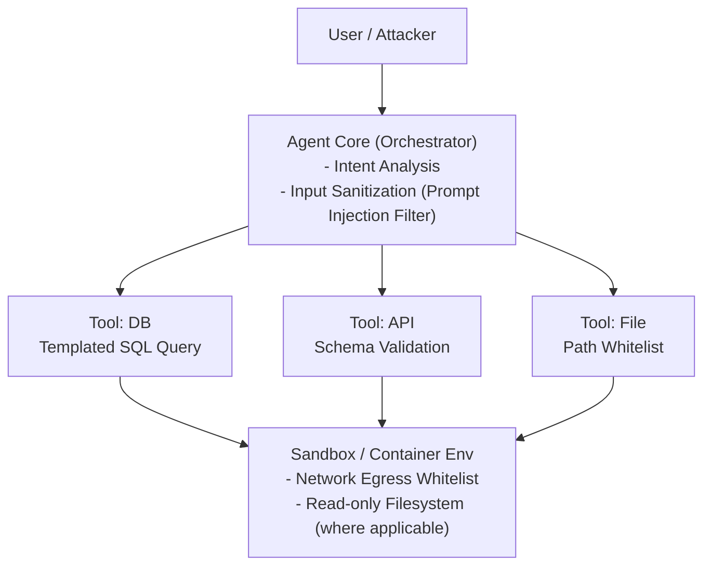

# 如果让 Agent 连接数据库或内部系统,如何做权限控制和安全隔离

- **Agent 权限控制多层方案**

1. **最小权限原则**
   - 只授予完成任务所需的最小权限
   - 读/写/执行/删除分级授权
   - 示例:只读 DB 用户、限定的 API scope

2. **工具沙箱化**
   - 每个工具运行在隔离容器/进程中
   - 限制文件系统访问范围
   - 禁止网络访问非白名单地址
   - 资源限制(CPU/Memory/Time)

3. **操作分级审批**
   - Level 0 (只读查询):自动执行
   - Level 1 (修改操作):需日志审计
   - Level 2 (删除/发送):需人工确认
   - Level 3 (系统级操作):禁止 Agent 直接执行

4. **Query 白名单与参数化**
   - 数据库:只允许预定义的 SQL 模板,参数化注入
   - API:schema 校验 + 速率限制
   - 文件:路径白名单 + 只允许指定扩展名

5. **审计与追踪**
   - 所有工具调用记录:输入、输出、时间、用户
   - 异常检测:调用频率异常、参数异常
   - 可回放:支持事后审查

6. **Prompt 注入防护**
   - 输入过滤:检测恶意指令注入
   - 输出过滤:防止数据泄露
   - 分层 prompt:系统指令 > 用户指令 > 工具返回

- **安全隔离架构图**


- **实战案例**：某企业内部 Copilot 曾因 Prompt 注入攻击，诱导 Agent 调用 `send_email` 接口发送钓鱼邮件。修复方案是在工具层增加“操作分级”，凡是涉及 `write`/`send` 权限的工具，强制必须由独立的审批微服务验证 JWT Token 后才放行。

- **代码示例** (Python) 
```python
import re
from sqlalchemy import text

def safe_db_query(template_id, params):
    # 1. 白名单校验：只允许预定义的模板ID
    allowed_templates = ['get_user_by_id', 'get_order_status']
    if template_id not in allowed_templates:
        raise PermissionError("Template not allowed")
    
    # 2. 强制参数化查询，防止 SQL Injection
    query_map = {
        'get_user_by_id': "SELECT * FROM users WHERE id = :id",
        'get_order_status': "SELECT status FROM orders WHERE order_id = :oid"
    }
    # 使用 text() 和 params 绑定，拒绝拼接字符串
    return db_session.execute(text(query_map[template_id]), params)
```


## 记忆要点

- 最小权限：只授予完成任务的最小权限，读写删分级授权。
- 沙箱隔离：工具运行在隔离容器中，限制网络出口和文件系统访问。
- 分级审批：读操作自动，写操作审计，删/发操作人工确认。
- 输入防护：SQL仅允许预定义模板，API需Schema校验，防Prompt注入。
- 审计追踪：记录所有调用的输入输出，支持异常检测和事后回放。

## 结构化回答

**30 秒电梯演讲：** Agent 连数据库和内部系统的安全三板斧：最小权限只给干活需要的最低权限读写删分级；沙箱隔离把工具关进容器限网络和文件系统；分级审批读自动、写审计、删发人工确认。SQL 只许预定义模板防注入，所有调用记录审计可回放。

**展开框架：**
1. **最小权限与沙箱** — 只授完成任务的最小权限读写删分级；工具运行在隔离容器，限制网络出口和文件系统访问。
2. **分级审批与输入防护** — 读自动、写审计、删发人工确认；SQL 仅预定义模板、API 需 Schema 校验、防 Prompt 注入。
3. **审计追踪** — 记录所有调用的输入输出，支持异常检测和事后回放，便于追责。

**收尾：** 权限控制的命门是 Prompt 注入——我可以聊聊企业 Copilot 被诱导发钓鱼邮件的修复方案。

## 视频脚本

> 预计时长：2 分钟 | 由浅入深

| 时间 | 画面/字幕 | 口播台词 | 讲解要点 |
|------|----------|----------|----------|
| 0:00 | 标题卡：Agent 权限控制 | "给访客发临时门禁卡，动核弹必须两把钥匙。" | 类比开场 |
| 0:30 | 最小权限 + 沙箱架构 | "最小权限读写删分级，工具关进容器限网络文件。" | 权限与沙箱 |
| 1:00 | 分级审批 L0-L3 | "读自动、写审计、删发人工确认、系统级禁止。" | 分级审批 |
| 1:30 | SQL 模板 + 审计追踪 | "SQL 只许预定义模板防注入，所有调用记录可回放。" | 输入防护与审计 |

