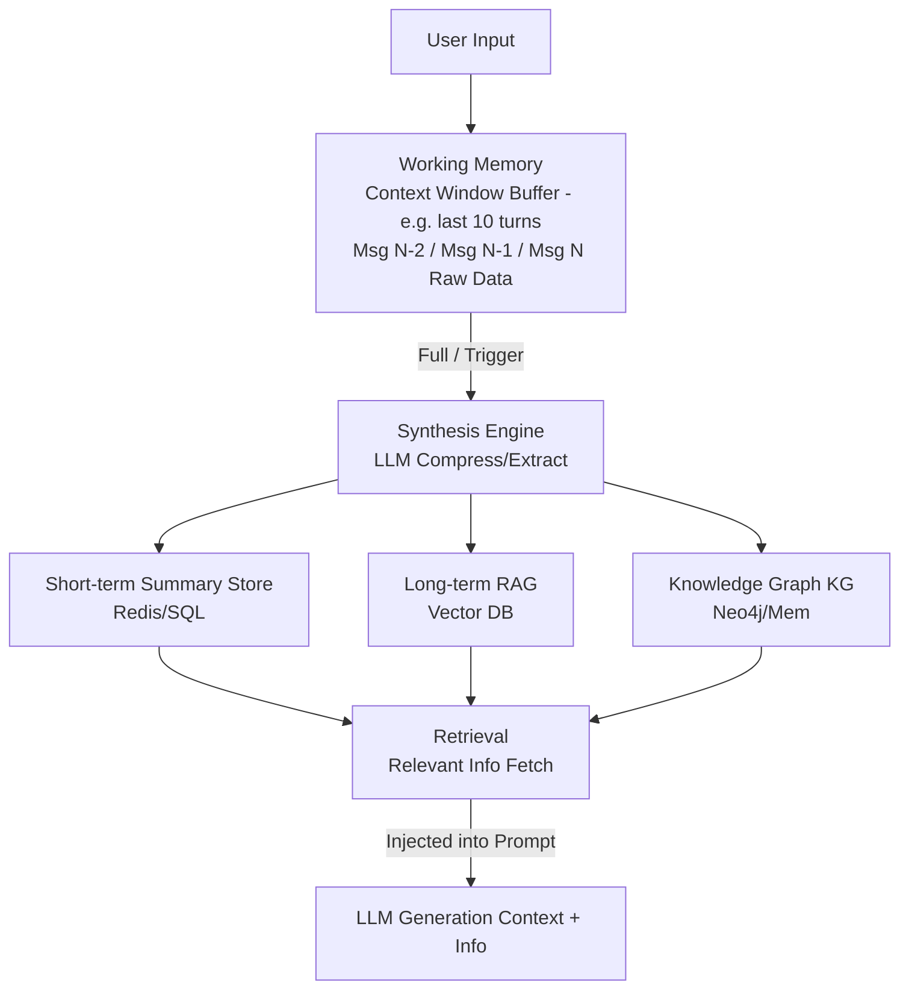
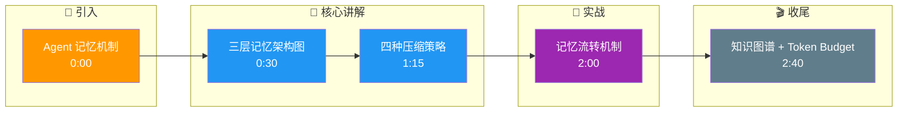

# Agent 如何设计记忆机制,避免上下文不断膨胀

- **上下文膨胀问题**:随着对话轮次增加,历史消息累积导致 token 超限、延迟增加、成本上升.

- **分层记忆架构**

1. **工作记忆**
   - 当前对话的最近 N 轮
   - 原始格式保留,精确度高
   - 容量有限(<8K tokens)

2. **短期记忆**
   - 最近几小时/几天的对话摘要
   - 用 LLM 压缩为关键信息点
   - 检索时展开细节

3. **长期记忆**
   - 向量数据库存储历史交互
   - 语义检索召回相关片段
   - 可无限扩展

- **压缩与遗忘策略**

1. **滑动窗口**:保留最近 N 轮,旧的丢弃/压缩
2. **摘要压缩**:每隔 K 轮,LLM 生成摘要替换原始消息
3. **重要性评分**:用 LLM 给消息打分,低分丢弃
4. **实体提取**:维护实体知识图谱('用户叫张三'、'项目是面试题库')
5. **时间衰减**:旧记忆权重降低,模拟人类遗忘

- **记忆流转架构图**


- **实战案例**：在 7x24 小时客服场景中，Agent 运行一周后上下文溢出。我们采用了“Token Budget”策略：当历史消息超过 4000 tokens 时，触发一个轻量级模型（如 GPT-3.5）将最早的消息块压缩为 JSON 格式的摘要 `[Summary: {user_intent, entities, outcome}]`，成功将上下文长度稳定在 6000 tokens 以内。

- **代码示例** (Python) 
```python
from collections import deque

class RollingWindowMemory:
    def __init__(self, max_tokens=4000, compress_threshold=3000):
        self.history = deque(maxlen=20) # 存储原始消息
        self.summary = ""
        self.max_tokens = max_tokens
        self.compress_threshold = compress_threshold

    def add_message(self, role, content):
        self.history.append({"role": role, "content": content})
        if self.estimate_tokens() > self.max_tokens:
            self._compress_old_messages()

    def get_context(self):
        # 返回摘要 + 最近N条消息
        return [{"role": "system", "content": f"History Summary: {self.summary}"}] + list(self.history)
```

## 记忆要点

- 三层记忆：工作记忆(最近N轮)、短期记忆(摘要压缩)、长期记忆(向量库)。
- 压缩策略：滑动窗口截断、LLM摘要生成、重要性评分过滤、时间衰减。
- 流转机制：工作记忆满后触发压缩，关键信息存入向量库，检索时注入。
- 实体提取：维护知识图谱，记录用户偏好和关键实体，避免重复询问。
- 核心目标：在保留关键信息的前提下，控制Token成本和推理延迟。

## 结构化回答

**30 秒电梯演讲：** Agent 记忆分三层避免上下文膨胀：工作记忆存最近 N 轮原始消息，短期记忆存 LLM 摘要压缩，长期记忆存向量库。压缩靠滑动窗口、摘要生成、重要性评分、时间衰减。工作记忆满了就触发压缩，关键信息进向量库检索时注入。

**展开框架：**
1. **三层记忆架构** — 工作记忆（最近 N 轮原始）、短期记忆（LLM 摘要压缩）、长期记忆（向量库无限扩展）。
2. **压缩与遗忘策略** — 滑动窗口截断、LLM 摘要生成、重要性评分过滤、时间衰减模拟人类遗忘。
3. **流转与实体提取** — 工作记忆满触发压缩，关键信息存向量库检索注入；维护知识图谱记用户偏好避免重复询问。

**收尾：** 记忆的命门是摘要丢信息——我可以聊聊 Token Budget 策略怎么把上下文稳定在 6000 以内。

## 视频脚本

> 预计时长：3 分钟 | 由浅入深

| 时间 | 画面/字幕 | 口播台词 | 讲解要点 |
|------|----------|----------|----------|
| 0:00 | 标题卡：Agent 记忆机制 | "刚发生的在脑子里，昨天的记大概，久的归档图书馆。" | 类比开场 |
| 0:30 | 三层记忆架构图 | "工作记忆存最近 N 轮，短期存摘要，长期存向量库。" | 三层架构 |
| 1:15 | 四种压缩策略 | "滑动窗口、LLM 摘要、重要性评分、时间衰减。" | 压缩策略 |
| 2:00 | 记忆流转机制 | "工作记忆满触发压缩，关键信息进向量库检索注入。" | 流转机制 |
| 2:40 | 知识图谱 + Token Budget | "维护实体图谱避免重复问，Token Budget 控成本。" | 实体与目标 |

### 视频流程图




