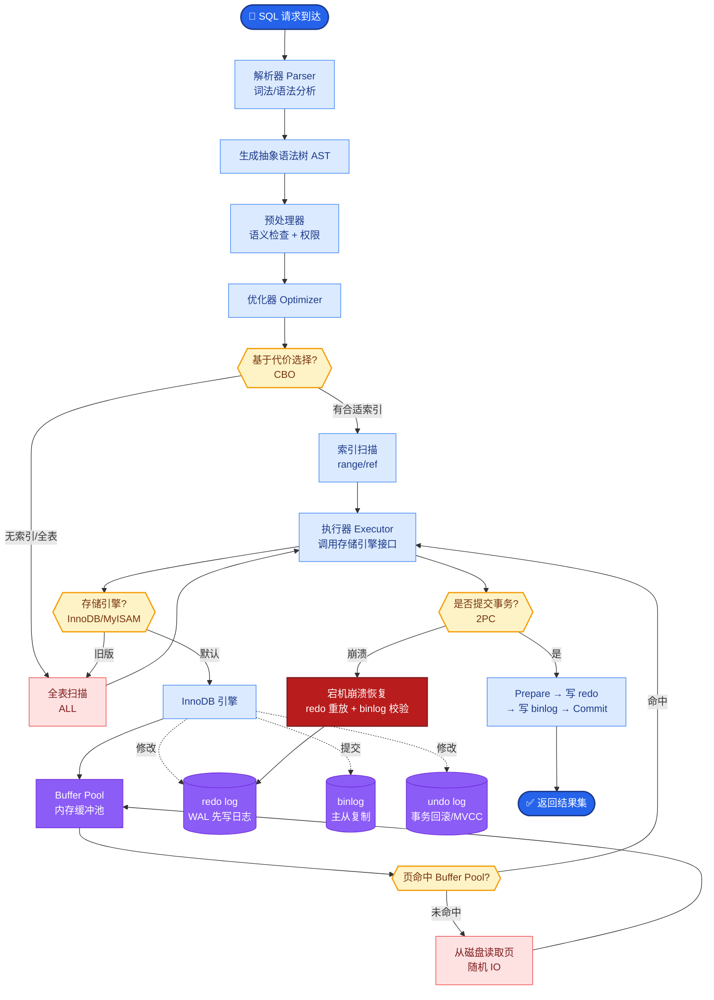
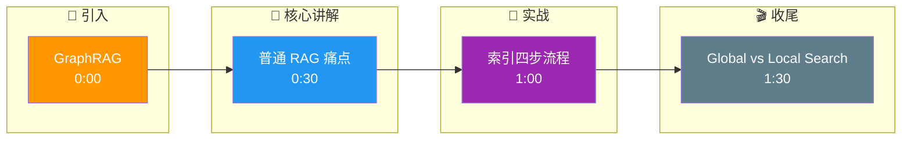

# GraphRAG 的完整架构是什么?它解决了普通向量 RAG 的什么核心痛点

- **GraphRAG (Microsoft Research)** 将知识图谱与 RAG 结合,解决普通向量 RAG 无法回答'全局性'问题的问题.

- **普通 RAG 的痛点**
- 擅长'查找具体事实'('公司的年假多少天?')
- 不擅长'全局总结/推理'('这份报告的主要论点是什么?')
- 原因:分块检索丢失了文档的全局结构和实体关系
- **核心缺陷**:向量检索基于语义相似度，无法显式建模实体间的多维关联.

- **GraphRAG 完整流程**

- **Phase 1: 索引构建(离线)**

1. **文本分块**:标准分块 (Chunk size 通常 300-500 tokens)
2. **实体抽取**:LLM 从每块提取实体和关系
- 例:(张三)-[任职于]→(字节跳动)
3. **实体聚类**:相同实体合并 (基于名称归一化)
4. **社区检测**:用图算法(如 Leiden / Louvain)将相关实体聚类为社区
- 参数:Resolution (控制社区粒度)
5. **社区摘要**:LLM 为每个社区生成摘要

- **Phase 2: 查询处理(在线)**

1. **Global Search(全局搜索)**
- 用户问'主要主题是什么?'
- 遍历所有社区摘要 → LLM 综合 → 回答
- 适合宏观/总结性问题

2. **Local Search(局部搜索)**
- 用户问'张三和谁合作过?'
- 从图中找到张三 → 扩展到关联实体(1-hop/2-hop) → 回答
- 适合具体/关系性问题

- **GraphRAG 架构流程 ASCII 图**
```text
[Source Texts]
      │
      ▼ (Chunking)
[Text Chunks]
      │
      ├─────────────────────────────────────┐
      ▼                                     ▼
[Entity Extraction (LLM)]          [Vector Indexing]
      │                                     │
      ▼ (Nodes & Edges)                     │
  ┌───┴─────┐                               │
  │  Graph  │                               │
  └───┬─────┘                               │
      │ (Graph Clustering)                  │
      ▼                                     │
[Communities]                              │
      │                                     │
      ▼ (Summarization)                    │
[Community Summaries]                      │
      │                                     │
      └───────────────┬─────────────────────┘
                      ▼
              [Knowledge Graph + Vector Store]
                      │
          ┌───────────┴───────────┐
          ▼                       ▼
   [Global Search]         [Local Search]
   (Map-Reduce over         (Walk & Retrieve)
    Community Summaries)    over Graph nodes)
```

- **实战案例**
- 在处理 500+ 份行业研报的投资分析 Agent 中，普通 RAG 无法回答“未来三年的行业趋势汇总”。引入 GraphRAG 后，通过对“技术”、“政策”、“市场”三个社区进行 Global Search，成功生成了涵盖产业链上下游的宏观分析报告。
- 代码示例：
```python
# 使用 LangChain GraphRAG 风格的查询逻辑 (Python)
from langchain_community.graphs import Neo4jGraph

def global_search(graph: Neo4jGraph, query: str):
    # 1. 提取所有社区摘要
    community_summaries = graph.query("MATCH (c:Community) RETURN c.summary AS summary")
    
    # 2. Map-Reduce 生成最终回答
    prompt = f"""Based on these community summaries:
    {community_summaries}
    
    Answer the question: {query}"""
    return llm.invoke(prompt)
```

- **成本与挑战**
- 索引成本高:需要大量 LLM 调用做实体抽取和摘要 (耗时, Token 消耗大)
- 存储成本:图数据库 + 向量数据库 + 文本存储
- 更新困难:增量更新图谱比增量更新向量复杂 (社区结构可能大变)

- **与普通 RAG 的选型对比**

| 特性 | 普通 Vector RAG | GraphRAG |
| :--- | :--- | :--- |
| **构建成本** | 低 (仅需切片 Embedding) | 高 (LLM 抽取实体 + 图聚类) |
| **查询延迟** | 低 (毫秒级向量检索) | 中 (需遍历社区或图遍历) |
| **优势领域** | 事实检索、关键词匹配 | 全局总结、复杂关系推理 |
| **数据规模** | 适合海量数据 (亿级文档) | 适合中高规模 (百万级节点) |
| **技术栈** | Vector DB (Pinecone/Milvus) | Graph DB (Neo4j/NebulaGraph) |

- **经验**:小规模文档(<100篇)用 GraphRAG 成本过高,大规模文档(>1000篇)必须用 GraphRAG 解决全局性问题.

## 核心流程图



## 记忆要点

- 核心痛点：普通RAG基于语义相似度，丢失全局结构，无法回答宏观总结性问题。
- 索引阶段：分块→实体抽取→社区检测→社区摘要，构建层级知识图谱。
- 查询阶段：Global Search遍历社区摘要做总结，Local Search遍历实体关系做推理。
- 关键算法：使用Leiden等算法进行社区聚类，Resolution参数控制粒度。
- 适用场景：适合处理海量文档的全局问答，如行业研报分析、全书总结。

## 结构化回答

**30 秒电梯演讲：** GraphRAG 解决普通 RAG 答不了宏观总结问题的痛点——普通 RAG 靠语义相似度丢全局结构。索引阶段分块、抽实体、社区检测、社区摘要构建层级图谱。查询分两种：Global Search 遍历社区摘要做总结，Local Search 遍历实体关系做推理。

**展开框架：**
1. **核心痛点** — 普通 RAG 基于语义相似度，丢失全局结构，无法回答宏观总结性问题。
2. **索引阶段四步** — 分块→实体抽取→社区检测（Leiden 算法，Resolution 控制粒度）→社区摘要，构建层级知识图谱。
3. **查询两种模式** — Global Search 遍历社区摘要做总结，Local Search 遍历实体关系做推理；适合行业研报、全书总结。

**收尾：** GraphRAG 的命门是索引成本——我可以聊聊 500 份研报怎么用三社区 Global Search 出产业链分析。

## 视频脚本

> 预计时长：2 分钟 | 由浅入深

| 时间 | 画面/字幕 | 口播台词 | 讲解要点 |
|------|----------|----------|----------|
| 0:00 | 标题卡：GraphRAG | "RAG 只给碎片，GraphRAG 先看全图再找碎片。" | 类比开场 |
| 0:30 | 普通 RAG 痛点 | "基于语义相似度，丢失全局结构，答不了宏观总结。" | 核心痛点 |
| 1:00 | 索引四步流程 | "分块、抽实体、社区检测、社区摘要，建层级图谱。" | 索引阶段 |
| 1:30 | Global vs Local Search | "Global 遍历社区摘要做总结，Local 遍历实体关系做推理。" | 查询模式 |

### 视频流程图




