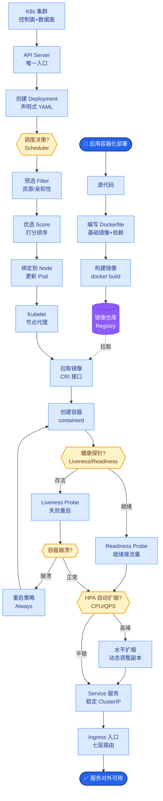
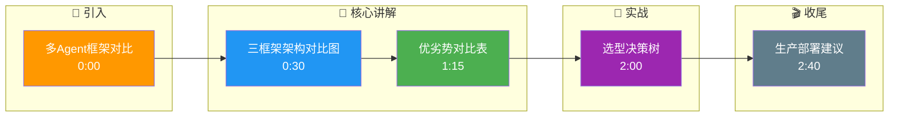

# CrewAI、MetaGPT、AutoGen 三大多智能体框架的架构有什么本质差异?如何选型

- **三大多Agent框架深度对比**

- **1. AutoGen (Microsoft)**
- 核心抽象:**Agent = 可对话实体** (ConversableAgent)
- 模式:对话驱动(Agent 之间互相对话)
- 特点:灵活的对话拓扑(一对一、群聊、嵌套)
- 优势:研究友好,支持人类参与对话,支持 Code Interpreter
- 劣势:对话容易发散,难以约束产出格式,流程控制弱

- **2. CrewAI**
- 核心抽象:**Crew = 有角色分工的团队**
- 模式:角色驱动(每个 Agent 有 role/goal/backstory/tools)
- 特点:Tasks 有明确流程(sequential 或 hierarchical)
- 优势:直觉式的'团队模拟',上手快,Process 机制保证执行顺序
- 劣势:灵活性有限,角色定义需精心设计,复杂编排能力弱

- **3. MetaGPT (DeepWisdom)**
- 核心抽象:**SOP = 标准作业流程**
- 模式:流程驱动(模拟软件公司 SOP)
- 特点:预定义角色(PM/架构师/工程师)和文档流转,引入标准化输出
- 优势:输出质量高(结构化文档/代码),适合代码生成
- 劣势:流程固化,定制成本高,Token 消耗大 (生成大量中间文档)

- **架构逻辑对比 ASCII 图**
```text
AutoGen (Chat)          CrewAI (Process)       MetaGPT (SOP)
┌─────────┐            ┌─────────────┐         ┌───────────┐
│ Agent A │<──Talk───>│ Agent B     │         │ PM        │
└────┬────┘            └──────┬──────┘         └─────┬─────┘
     │                       │                     │ Doc
     ▼                       ▼                     ▼
┌─────────┐            ┌─────────────┐         ┌───────────┐
│ Agent C │            │ Task 1 ──►  │         │Architect  │
└─────────┘            │ Task 2 ──►  │         └─────┬─────┘
  (任意拓扑)           │ Task 3      │               │
                       └─────────────┘               ▼
                      (Sequential/Hierarchical)    │Engineer│
                                                   └─────────┘
```

- **实战案例**
- 在开发“竞品分析报告生成器”时，使用 AutoGen 最初导致 Agent 陷入“互喷”循环，产出无法使用。改用 MetaGPT 的 SOP 机制，强制要求“资料收集员 -> 分析师 -> 撰稿人”按序产出文档后，交付效率提升 200%。
- 代码示例：
```python
# AutoGen 防止死循环的代码示例 (Python)
from autogen import ConversableAgent

user_proxy = ConversableAgent(
    name="User_proxy",
    system_message="A human admin.",
    code_execution_config={"last_n_messages": 3, "work_dir": "coding"},
    human_input_mode="TERMINATE", # 关键：要求人工介入终止
)

# 配置最大轮次防止死循环
assistant.register_reply(
    [ConversableAgent],
    reply_func=generate_reply,  
    trigger=lambda sender: not user_proxy.last_message()['content'].strip().endswith('TERMINATE'),
)
```

- **架构选型对比表**

| 维度 | AutoGen | CrewAI | MetaGPT |
| :--- | :--- | :--- | :--- |
| **核心抽象** | 对话 | 角色/任务 | SOP (标准作业程序) |
| **控制流** | 动态/不可预测 | 预定义流程 | 严格预定义 |
| **适用场景** | 研究、辩论、探索 | 快速原型、轻量级任务 | 复杂软件工程、代码生成 |
| **中间产物** | 对话历史 | 任务状态 | 标准 PRD/设计文档/代码 |
| **Token 消耗** | 中 (容易跑偏) | 低 | 高 (生成文档成本) |
| **上手难度** | 中 | 低 | 高 (需理解 SOP) |

- **选型决策**
```
你的场景是什么?
├─ 研究/探索(需要灵活对话) → AutoGen
├─ 快速原型/通用任务 → CrewAI
├─ 代码/文档生成(需要SOP) → MetaGPT
└─ 生产部署 → LangGraph(更可控/状态机)
```

- **生产级考量**
- 三者最初都偏研究/原型
- 生产部署推荐 LangGraph:状态机 + 人机交互 + 可观测性
- CrewAI 正在增加生产特性(memory, planning)
- AutoGen v0.4+ 正在重构以支持生产场景

- **## 常见考点**
- 如何在 AutoGen 中避免无限循环对话？
- MetaGPT 生成的中间文档是否总是必要的，能否优化 Token 消耗？
- 如果需要人类介入审批，哪个框架实现最简单？

## 核心流程图



## 记忆要点

- AutoGen：对话驱动，拓扑灵活，适合研究探索，但易发散难控制。
- CrewAI：角色驱动，流程预定义，适合快速原型，但复杂编排能力弱。
- MetaGPT：SOP驱动，模拟软件公司流程，产出高质量代码文档，但成本高。
- 选型口诀：探索研究选AutoGen，通用任务选CrewAI，代码生成选MetaGPT。
- 生产部署：建议LangGraph，结合状态机保证流程可控。

## 结构化回答

**30 秒电梯演讲：** 三大框架本质差异：AutoGen 对话驱动拓扑灵活但易发散，CrewAI 角色驱动流程预定义适合快速原型，MetaGPT 靠 SOP 模拟软件公司产出高质量但成本高。选型口诀：探索研究选 AutoGen、通用任务选 CrewAI、代码生成选 MetaGPT，生产部署还是 LangGraph。

**展开框架：**
1. **三大框架特点** — AutoGen 对话驱动拓扑灵活易发散；CrewAI 角色驱动流程预定义适合原型；MetaGPT SOP 驱动模拟软件公司产出高质量但成本高。
2. **选型口诀** — 探索研究选 AutoGen，通用任务选 CrewAI，代码生成选 MetaGPT。
3. **生产部署** — 三者都偏研究原型，生产建议 LangGraph，结合状态机保证流程可控。

**收尾：** 框架选型的命门是流程可控性——我可以聊聊竞品分析报告用 MetaGPT SOP 怎么把交付效率提升 200%。

## 视频脚本

> 预计时长：3 分钟 | 由浅入深

| 时间 | 画面/字幕 | 口播台词 | 讲解要点 |
|------|----------|----------|----------|
| 0:00 | 标题卡：多Agent框架对比 | "开会聊天、分角色演戏、流水线作业三种模式。" | 类比开场 |
| 0:30 | 三框架架构对比图 | "AutoGen 对话，CrewAI 角色，MetaGPT 的 SOP。" | 三大框架 |
| 1:15 | 优劣势对比表 | "AutoGen 易发散，CrewAI 编排弱，MetaGPT 成本高。" | 优劣势 |
| 2:00 | 选型决策树 | "探索选 AutoGen，通用选 CrewAI，代码选 MetaGPT。" | 选型口诀 |
| 2:40 | 生产部署建议 | "生产建议 LangGraph，状态机保证流程可控。" | 生产部署 |

### 视频流程图




