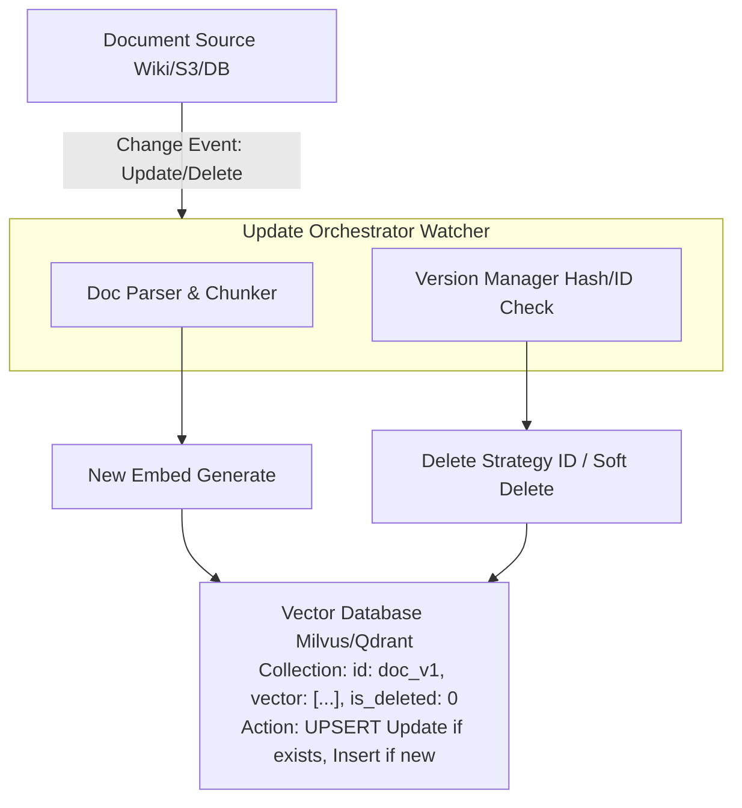

# RAG 知识库更新后如何避免旧索引污染

- **索引污染**指知识库更新后,旧版本的向量仍残留在索引中,导致检索到过期或错误信息.

- **污染来源**
1. 文档更新后旧向量未删除
2. 文档删除后向量未清理
3. 版本冲突:新旧版本同时被检索
4. 元数据未同步更新

- **解决方案**
1. **文档级 ID 管理**:每个文档/切片分配唯一 ID,更新时先删旧 ID 再插入新 ID
2. **版本号标注**:向量存储时带 version 字段,检索时过滤旧版本
3. **增量更新管道**:监听文档变更 → diff 检测 → 自动更新索引
4. **TTL 过期机制**:给向量设过期时间,定期清理
5. **软删除 + 定期重建**:标记删除,低峰期全量重建索引
6. **双索引策略**:新旧索引并存,灰度切换后删除旧索引

- **增量更新流程架构**

- **边界情况与极端场景**
- **Hash 冲突**: 基于文档内容哈希判断更新时，若两份不同文档产生相同 Hash（极低概率），会导致误判漏更。建议采用 `内容Hash + 版本号` 组合键。
- **并发写入**: 高频更新场景下（如协作文档），Delete 和 Insert 操作之间可能存在时间窗，导致短暂的“旧数据已删，新数据未就绪”的检索真空期。需利用数据库事务或 Write-Ahead Log (WAL) 保证原子性。
- **Embedding 模型迭代**: 若知识库更新伴随着 Embedding 模型的升级（如从 v1 升级到 v2），向量空间不一致会导致检索失效。需对全量数据进行重新 Embedding 或维护多向量索引并存。

- **面试追问**
1. **追问 1**: 在海量数据（亿级向量）场景下，全量重建索引成本过高，如何设计高效的“软删除 + 后台压缩”机制？
2. **追问 2**: 如果用户上传了一份文件，立即修改并再次上传，系统如何处理“更新未完成时的并发查询请求”？
3. **追问 3**: 向量数据库的 `upsert` 操作在底层是如何实现的？它一定比 delete+insert 快吗？

- **易错点**
1. **易错点**: 认为“删除向量”只需在源数据库删除文件。实际上必须显式调用 Vector DB 的删除接口，否则垃圾数据会永久占用内存和磁盘。
2. **易错点**: 忽略切片级别的版本控制。如果只对文档 ID 做版本管理，文档内容微调导致切片数量变化时，旧的多余切片依然会被检索到。必须对每个 Chunk 分配唯一 ID。

## 记忆要点

- 污染来源：文档更新旧向量未删、删除未清理、版本冲突、元数据未同步。
- 核心方案：文档级唯一ID管理，更新时先删旧ID再插入新ID(UPSERT)。
- 辅助策略：版本号标注过滤旧版本、TTL自动过期、软删除+定期重建。
- 增量更新：监听变更→Diff检测→自动更新索引，保证原子性。
- 防坑指南：并发写入用事务保证原子性，模型升级需全量重Embedding。

## 结构化回答

**30 秒电梯演讲：** RAG 索引污染就是知识库更新后旧向量还残留，导致检索到过期信息。核心方案是文档级唯一 ID 管理，更新时先删旧 ID 再插新 ID 做 UPSERT。辅助手段有版本号过滤、TTL 过期、软删除加定期重建。增量更新监听变更走 Diff 检测保证原子性。

**展开框架：**
1. **污染来源** — 文档更新旧向量未删、删除未清理、版本冲突、元数据未同步。
2. **核心方案与辅助策略** — 文档级唯一 ID 管理，UPSERT 先删后插；版本号过滤旧版本、TTL 自动过期、软删除+定期重建。
3. **增量更新与防坑** — 监听变更→Diff 检测→自动更新索引保证原子性；并发写入用事务，模型升级需全量重 Embedding。

**收尾：** 索引污染的命门是切片级版本控制——我可以聊聊只管文档 ID 会漏掉哪些多余切片。

## 视频脚本

> 预计时长：2 分钟 | 由浅入深

| 时间 | 画面/字幕 | 口播台词 | 讲解要点 |
|------|----------|----------|----------|
| 0:00 | 标题卡：RAG 索引污染 | "像整理书架，新书来了要移走旧版，否则借到过期书。" | 类比开场 |
| 0:30 | 四大污染来源 | "更新未删、删除未清理、版本冲突、元数据未同步。" | 污染来源 |
| 1:00 | UPSERT 核心方案 | "文档级唯一 ID，更新时先删旧 ID 再插新 ID。" | 核心方案 |
| 1:30 | 增量更新 + 防坑 | "监听变更 Diff 检测保证原子性，模型升级全量重 Embedding。" | 增量与防坑 |

