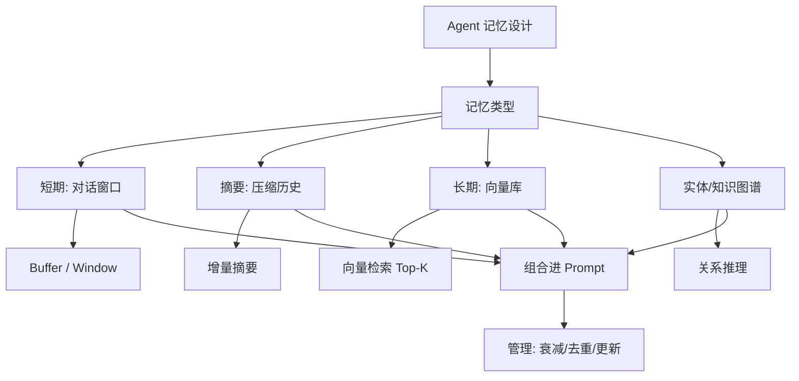
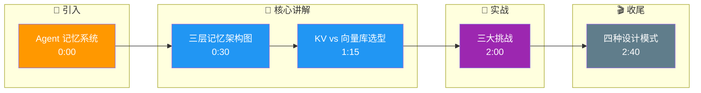

# Agent的记忆系统如何设计？

Agent记忆分为三个层级：

1. **短期记忆**：
- 当前对话的上下文窗口
- LLM context中直接包含
- 容量有限（如128K tokens）

2. **长期记忆**：
- 向量数据库存储历史经验
- 检索时用embedding相似度匹配
- 工具：ChromaDB、Pinecone、Milvus

3. **工作记忆**：
- 记录过去的完整任务执行过程
- 可以从中学习和复用
- 类似人类的经验记忆

**边界情况**：
1. **记忆冲突**：当用户长期记忆中的信息（如旧地址）与短期意图（新地址）冲突时，如何确定优先级（通常短期优先，但需更新长期）。
2. **多用户隔离**：在多租户环境下，必须通过Metadata严格隔离记忆，防止用户A查询到用户B的敏感信息。
3. **记忆过期与遗忘**：长期记忆如果不加时效性权重，Agent可能会引用过时规则（如已过期的促销政策），需要设计TTL机制。

**实战案例**：
在构建长时间运行的Agent时，曾遇到“灾难性遗忘”问题。因为只存Summary不存原始关键数据，导致Agent在第二轮对话后忘记了用户设定的具体业务约束（如“预算上限5000元”）。解决方案是引入“实体抽取”，将关键实体直接存入Redis，每次Prompt时显式注入，而不依赖模糊检索。

**代码示例**：
```python
from langchain_community.vectorstores import Chroma
from langchain_openai import OpenAIEmbeddings

# 初始化向量存储作为长期记忆
vectorstore = Chroma(
    collection_name="agent_history",
    embedding_function=OpenAIEmbeddings()
)

retriever = vectorstore.as_retriever(search_kwargs={"k": 3})
# 获取相关历史注入到当前Context
docs = retriever.invoke("用户上次提到的项目预算是多少？")
```

**记忆层级对比**：
| 特性 | 短期记忆 | 长期记忆 | 情景记忆 |
|------|----------|----------|----------|
| 存储介质 | LLM Context Window | 向量数据库 | 键值/图数据库 |
| 访问速度 | 极快 | 中等（需检索） | 快 |
| 典型内容 | 当前对话轮次 | 知识库、历史QA | 关键实体、事件链 |
| 容量 | 有限 | 海量 | 海量 |

**设计模式**：
- 总结压缩：定期总结对话历史，用摘要替换原始对话
- 分层记忆：recent → summary → archive
- 实体记忆：记住用户信息、偏好、关键事实
- 反思机制：定期从经验中提取高层规则

**挑战**：记忆检索的相关性和时效性。

## 面试追问
1. 当上下文窗口即将占满时，你会采用什么策略来决定保留哪些短期记忆，丢弃哪些？（如滑动窗口、重要性评分）
2. 面对用户的更新指令（如“我不喜欢这个了，换一个”），如何设计记忆更新机制来覆盖旧的向量存储数据？
3. 如何评估记忆系统的检索质量？是否会引入“遗忘机制”来过滤掉不再相关的噪声记忆？

## 易错点
1. **过度依赖RAG**：认为所有记忆都应该走向量检索，实际上高频访问的实体（如用户名、ID）用KV存储（Redis）效率更高且准确。
2. **回视窗口陷阱**：在实现短期记忆滑动窗口时，如果截断位置不当，可能会切断关键的逻辑依赖，导致Agent丢失上文逻辑。

## 核心流程图



## 记忆要点

- 三层记忆：短期(Context窗口)、长期(向量库)、工作记忆(任务链/经验)。
- 高频实体用KV(Redis)存，历史经验用向量库检索，避免过度依赖RAG。
- 挑战：多租户隔离需Metadata，过期信息需TTL机制，短期记忆需滑动窗口。
- 设计模式：总结压缩、分层记忆、实体抽取、定期反思。

## 结构化回答

**30 秒电梯演讲：** Agent 记忆分三层：短期记忆是 Context 窗口随对话刷新，长期记忆用向量库按需检索，工作记忆记任务链经验复用。高频实体用 Redis KV 存别过度依赖 RAG。挑战是多租户隔离要 Metadata、过期信息要 TTL、短期记忆要滑动窗口。

**展开框架：**
1. **三层记忆** — 短期（Context 窗口）、长期（向量库）、工作记忆（任务链/经验）。
2. **存储策略** — 高频实体用 KV（Redis）存，历史经验用向量库检索，避免过度依赖 RAG。
3. **挑战与设计模式** — 多租户隔离需 Metadata、过期信息需 TTL、短期记忆需滑动窗口；总结压缩、分层记忆、实体抽取、定期反思。

**收尾：** 记忆的命门是灾难性遗忘——我可以聊聊实体抽取怎么把"预算 5000"直接存 Redis 显式注入。

## 视频脚本

> 预计时长：3 分钟 | 由浅入深

| 时间 | 画面/字幕 | 口播台词 | 讲解要点 |
|------|----------|----------|----------|
| 0:00 | 标题卡：Agent 记忆系统 | "短期像大脑注意力，长期像图书馆，情景像日记本。" | 类比开场 |
| 0:30 | 三层记忆架构图 | "短期 Context，长期向量库，工作记忆任务链。" | 三层记忆 |
| 1:15 | KV vs 向量库选型 | "高频实体用 Redis，历史经验用向量库检索。" | 存储策略 |
| 2:00 | 三大挑战 | "多租户隔离 Metadata，过期 TTL，短期滑动窗口。" | 挑战 |
| 2:40 | 四种设计模式 | "总结压缩、分层记忆、实体抽取、定期反思。" | 设计模式 |

### 视频流程图




