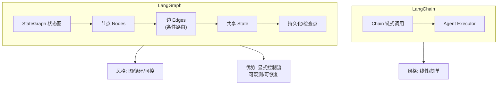

# LangGraph和LangChain有什么区别？LangGraph的核心概念是什么？

🎯 **本质**：LangGraph是LangChain的升级版，用有向图建模Agent工作流，解决了LangChain链式调用的状态管理和循环问题。

📊 **LangChain vs LangGraph**：
| 特性 | LangChain | LangGraph |
|------|-----------|-----------|
| 工作流模型 | 链式 | 有向图 |
| 状态管理 | 无(每次调用独立) | 有 (共享State) |
| 循环支持 | 不支持 | 支持(循环边) |
| 条件分支 | 困难 | 条件边原生支持 |
| 人机协作 | 无 | 原生支持(Human-in-the-loop) |
| 持久化 | 无 | Checkpointer机制 |

**边界情况**：
1. **状态冲突**：当多个节点并发修改State中的同一字段时，如何定义合并策略（如LangGraph默认使用Reducer函数处理Annotated字段）。
2. **图版本管理**：Agent工作流代码更新后，旧状态的Checkpoint可能不兼容，如何处理状态迁移。
3. **死循环检测**：在有向图中，如果条件边逻辑错误导致无限循环，是否有超时或步数限制的熔断机制。

**实战案例**：
在LangChain Chain中实现“重试机制”非常痛苦，需要写复杂的递归或循环逻辑。改用LangGraph后，只需画一个边：如果Tool节点返回Error，直接回退到Agent节点，无需修改任何业务代码，且Checkpoint自动保存了重试过程中的状态，支持断点续跑。

**代码示例**：
```python
from typing import TypedDict, Annotated, Sequence
import operator
from langgraph.graph import StateGraph, END

class AgentState(TypedDict):
    messages: Annotated[Sequence[str], operator.add]

def agent_node(state: AgentState):
    # 调用LLM处理消息
    return {"messages": ["LLM Response"]}

# 定义图和节点
workflow = StateGraph(AgentState)
workflow.add_node("agent", agent_node)
workflow.add_node("tool", tool_node)

workflow.set_entry_point("agent")
workflow.add_conditional_edges("agent", should_continue, {"continue": "tool", "end": END})
workflow.add_edge("tool", "agent")

app = workflow.compile()
```

**LangGraph核心概念**：
1. **State（状态）**
  定义一个TypedDict或Pydantic Model作为全局状态
  所有节点共享和修改这个状态
  
2. **Node（节点）**
  每个节点是一个函数：接收State -> 返回更新的State
  节点可以是LLM调用、工具调用、条件判断等

3. **Edge（边）**
  普通边：A -> B（执行完A必然到B）
  条件边：根据State决定下一步去哪个节点
  循环边：可以回到之前的节点（实现ReAct循环）

4. **编译和执行**
  graph = graph_builder.compile(checkpointer=memory)
  result = graph.invoke(initial_state, config={"configurable": {"thread_id": "123"}})

**典型模式 - ReAct Agent**：
  START -> Agent节点(决定下一步) -> 条件边
    -> 如果需要工具 -> Tool节点 -> 回到Agent节点(循环)
    -> 如果不需要工具 -> END

**人机协作**：
  在关键节点设置中断点 (`interrupt`)
  暂停执行，等待人类确认/修改
  使用Checkpoint保存和恢复状态

## 面试追问
1. LangGraph的State是全局共享的，在复杂的Agent多轮交互中，如何设计State结构以避免不同节点的字段命名冲突？
2. 在使用Checkpoint进行断点续传时，如果修改了图的代码结构（比如删除了一个节点），旧的Checkpoint还能恢复吗？如何处理兼容性问题？
3. 如何在LangGraph中实现动态分支？例如根据LLM输出的内容动态决定下一个调用的工具名称（而非预定义的枚举）。

## 易错点
1. **误解State更新**：误以为节点函数返回的整个对象会替换State，实际上LangGraph会根据返回值进行更新或合并（取决于Reducer），不注意会导致状态覆盖。
2. **忽视thread_id**：在多用户并发场景下，如果不传入唯一的thread_id，不同用户的对话状态可能会串扰。


## 核心流程图




## 记忆要点

- 本质：LangGraph用有向图建模，解决LangChain链式调用的状态管理和循环问题。
- 核心概念：State(共享状态)、Node(处理函数)、Edge(流转/条件/循环)。
- 优势：原生支持循环、条件分支、人机协作和Checkpoint断点续传。
- 避坑：节点返回值是合并非替换；多用户必须用thread_id隔离状态。

## 结构化回答

**30 秒电梯演讲：** LangGraph 是 LangChain 的升级版，用有向图建模 Agent 工作流，解决链式调用的状态管理和循环问题。核心三概念：State 共享状态、Node 处理函数、Edge 流转条件循环。原生支持循环、条件分支、人机协作和 Checkpoint 断点续传。

**展开框架：**
1. **本质与对比** — LangGraph 用有向图建模，解决 LangChain 链式调用的状态管理和循环问题。
2. **核心三概念** — State（共享状态）、Node（处理函数接收 State 返回更新）、Edge（普通边/条件边/循环边）。
3. **优势与避坑** — 原生支持循环、条件分支、人机协作、Checkpoint 断点续传；节点返回值是合并非替换，多用户必须用 thread_id 隔离。

**收尾：** LangGraph 的精髓是循环边——我可以聊聊 Tool 节点返回 Error 时怎么靠边回退到 Agent 重试。

## 视频脚本

> 预计时长：2 分钟 | 由浅入深

| 时间 | 画面/字幕 | 口播台词 | 讲解要点 |
|------|----------|----------|----------|
| 0:00 | 标题卡：LangGraph | "像画流程图编程，节点是办事员，箭头指路。" | 类比开场 |
| 0:30 | LangChain vs LangGraph 对比 | "链式变有向图，无状态变共享 State，支持循环。" | 本质对比 |
| 1:00 | State/Node/Edge 三概念 | "State 共享状态，Node 处理函数，Edge 流转条件循环。" | 核心概念 |
| 1:30 | 优势 + 避坑 | "原生循环分支人机协作，返回值合并非替换用 thread_id 隔离。" | 优势与避坑 |

