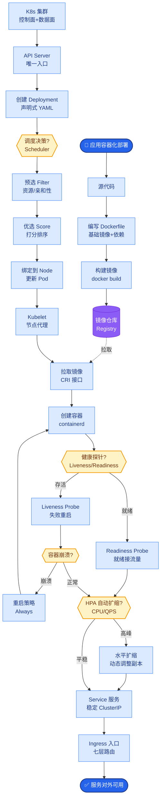

# OpenAI Swarm是什么？它和传统Agent框架有什么不同？

🎯 本质：OpenAI Swarm是一个极简的实验性多Agent编排框架，核心概念是"Handoff"（交接），通过Agent之间的简单交接实现复杂工作流。

📊 Swarm核心概念：

1. Agent（极简定义）
  只需要定义：
  - name：名称
  - instructions：系统指令
  - functions：可用工具
  
2. Handoff（交接）
  Agent A处理不了 -> 通过工具调用"交接"给Agent B
  Swarm自动将上下文传递给Agent B
  这是Swarm最核心的创新——极其简单的多Agent编排

3. Context Variables（上下文变量）
  在Agent间共享的变量
  类似全局状态

Swarm的设计哲学：
  极简——只有两个核心概念(Agent + Handoff)
  轻量——纯Python，无外部依赖
  教育——展示多Agent编排的最简形式
  非生产——官方明确说这是实验性项目

**实战案例**：在搭建电商客服系统原型时，使用Swarm的Handoff机制，一线客服Agent检测到“退换货”关键词立即交接给“售后Agent”，相比传统的if-else路由，这种方式让交接逻辑完全由Prompt控制，极大地降低了硬编码维护成本。

**代码示例（Python）**：
```python
from swarm import Agent

# 定义交接函数，返回目标Agent
def transfer_to_billing():
    return billing_agent

# 定义售后Agent
billing_agent = Agent(
    name="Billing Agent",
    instructions="你只能处理账单相关问题。"
)

# 定义前台客服Agent，配置交接工具
triage_agent = Agent(
    name="Triage Agent",
    instructions="判断用户意图，如果是账单问题请移交。",
    functions=[transfer_to_billing]
)
```

示例：
  triage_agent = Agent(name="分诊", instructions="根据用户问题决定交给谁")
  billing_agent = Agent(name="账单", instructions="处理账单问题")
  support_agent = Agent(name="技术支持", instructions="处理技术问题")
  
  分诊 -> 交给账单或技术支持 -> 处理完毕

Swarm vs 其他框架：
| 特性 | Swarm | AutoGen | CrewAI | LangGraph |
|------|-------|---------|--------|----------|
| 复杂度 | 极简 | 复杂 | 简单 | 中等 |
| 生产就绪 | 否 | 是 | 是 | 是 |
| 代码行数 | ~500行 | 大型 | 中型 | 大型 |
| 适用 | 学习概念 | 生产 | 生产 | 生产 |

面试要点：Swarm的价值在于教育——用最少的代码展示了多Agent交接的本质。生产环境推荐LangGraph或AutoGen。

```text
                  Swarm 交接流程架构

┌──────────────┐     functions      ┌──────────────┐
│   Agent A    │ ─────────────────> │   Agent B    │
│ (Triage)     │   update_agent()   │ (Billing)    │
└──────┬───────┘                     └──────┬───────┘
       │                                    │
       │ 1. 接收用户输入                      │ 3. 继续对话
       │ 2. 判断需移交                       │
       ▼                                    ▼
┌──────────────────────────────────────────────┐
│         Swarm Runtime (Context)              │
│  - 维护对话历史                              │
│  - 处理 Handoff 指令                         │
│  - 传递 Variables (user_id, context...)      │
└──────────────────────────────────────────────┘
```

## 常见考点
1. **Swarm 的状态管理**：Swarm 是无状态的吗？不，它依赖 Client 端维护状态，Session 上下文是如何在 Agent 切换中保持的？
2. **函数返回值规范**：实现 Handoff 的函数返回值必须是什么格式？（通常是包含 `agent` 字段的字典，指向目标 Agent 实例）。
3. **与 LangGraph 的区别**：Swarm 是基于简单的函数调用链，LangGraph 是基于显式的图结构状态机，Swarm 不支持循环和复杂的条件边。
4. **Context Variables 的作用域**：Variables 是在所有 Agent 间全局共享的，如何避免不同 Agent 修改同一变量导致的冲突


## 核心流程图



## 记忆要点

- 本质：OpenAI极简实验性框架，核心是Handoff(交接)机制，轻量级多Agent编排。
- 核心概念：Agent(指令+工具)、Handoff(函数返回目标Agent实现切换)。
- 特点：无外部依赖，纯Python，仅500行代码，适合学习概念。
- 定位：非生产就绪，生产环境推荐LangGraph或AutoGen。

## 结构化回答

**30 秒电梯演讲：** OpenAI Swarm 是极简实验性框架，核心是 Handoff 交接机制——像客服转接电话，A 解决不了就把上下文转给 B。Agent 只需 name、instructions、functions。Handoff 靠函数返回目标 Agent 实现切换。纯 Python 仅 500 行无外部依赖，适合学习概念，非生产就绪。

**展开框架：**
1. **本质与核心概念** — OpenAI 极简实验性框架；Agent（指令+工具）、Handoff（函数返回目标 Agent 实现切换）。
2. **特点** — 无外部依赖，纯 Python，仅 500 行代码，上下文变量自动传递。
3. **定位** — 非生产就绪，展示多 Agent 交接最简形式；生产环境推荐 LangGraph 或 AutoGen。

**收尾：** Swarm 的价值在教育——我可以聊聊电商客服怎么用 Handoff 替代 if-else 路由降维护成本。

## 视频脚本

> 预计时长：2 分钟 | 由浅入深

| 时间 | 画面/字幕 | 口播台词 | 讲解要点 |
|------|----------|----------|----------|
| 0:00 | 标题卡：OpenAI Swarm | "像客服转接电话，A 解决不了把上下文转给 B。" | 类比开场 |
| 0:30 | Agent + Handoff 两概念 | "Agent 指令加工具，Handoff 函数返回目标 Agent 切换。" | 核心概念 |
| 1:00 | 极简特点 | "纯 Python 仅 500 行，无外部依赖，上下文自动传递。" | 特点 |
| 1:30 | 非生产定位 | "非生产就绪，生产推荐 LangGraph 或 AutoGen。" | 定位 |

