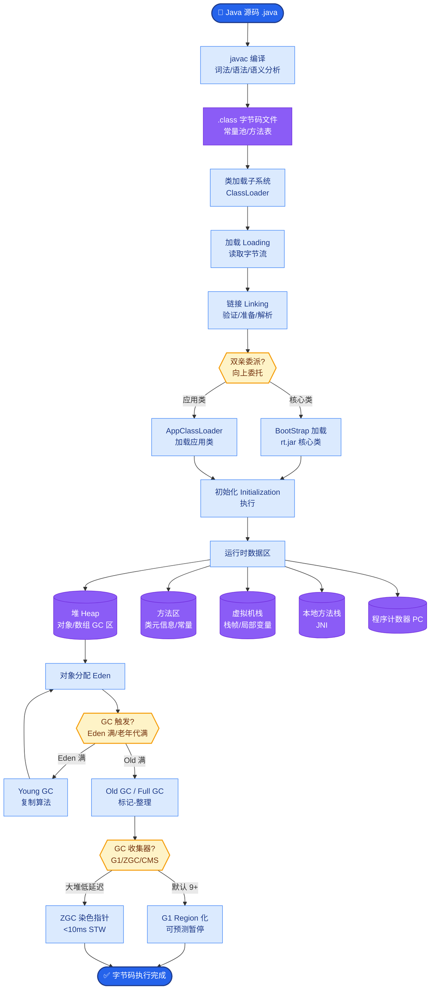
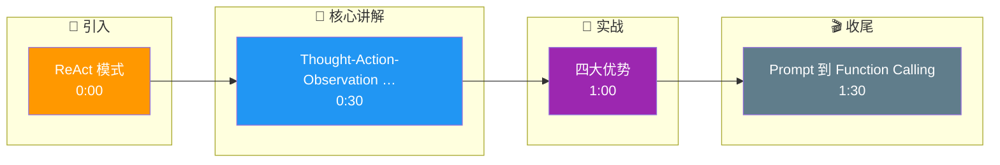

# ReAct(Reasoning + Acting)模式是什么？它如何工作？

🎯 本质：ReAct让LLM交替进行推理和行动，先思考该做什么，执行工具调用，再基于结果继续推理，直到解决问题。

📊 ReAct循环：
Thought -> Action -> Observation -> Thought -> Action -> ... -> Final Answer

示例：
问题：2024年诺贝尔物理学奖获得者是谁？
Thought: 我需要搜索2024年诺贝尔物理学奖
Action: search("2024 Nobel Prize Physics winner")
Observation: Hopfield和Hinton因神经网络基础发现获奖
Thought: 我找到了答案
Final Answer: 2024年诺贝尔物理学奖由John Hopfield和Geoffrey Hinton获得

**实战案例**：在开发运维排障Agent时，遇到服务器报警，Agent的ReAct过程为：Thought1(“检查CPU”) -> Action1(top指令) -> Observation1(“CPU正常”) -> Thought2(“检查磁盘IO”) -> Action2(iostat) -> Observation2(“IO爆满”)，成功定位到是某个日志写入过多导致的问题，避免了盲目重启服务器。

**代码示例（Python/LangChain）**：
```pythonnfrom langchain.agents import initialize_agent, Tool, AgentType
from langchain.llms import OpenAI

# 定义工具函数
def search_engine(query: str) -> str:
    return "Hopfield and Hinton"

tools = [
    Tool(name="Search", func=search_engine, description="用于搜索最新信息")
]

# 初始化ReAct Agent
agent = initialize_agent(
    tools, 
    OpenAI(temperature=0), 
    agent=AgentType.ZERO_SHOT_REACT_DESCRIPTION, # 零样本ReAct模式
    verbose=True # 打印Thought/Action过程，便于调试
)
agent.run("谁是2024诺贝尔物理学奖得主？")
```

ReAct vs 其他模式：
| 模式 | 推理 | 行动 | 观察利用 |
|------|------|------|---------|
| CoT | 有 | 无 | 无 |
| Act-only | 无 | 有 | 部分 |
| ReAct | 有 | 有 | 完整 |

ReAct的优势：
1. 推理指导行动——思考后选择最合适的工具
2. 观察反馈推理——根据工具返回结果调整策略
3. 可解释——推理过程清晰可见
4. 自我纠错——发现错误可以改变策略

实现方式：
1. Prompt工程实现
  在system prompt中教LLM使用Thought/Action/Observation格式
  解析LLM输出提取Action并执行
  将Observation拼回context
  
2. Function Calling实现（现代方式）
  LLM通过function calling决定调用哪个工具
  应用层执行工具并返回结果
  更可靠，因为不需要文本解析

ReAct是几乎所有现代Agent框架的基础模式：
- LangChain Agent: ReAct默认
- LangGraph: 显式建模ReAct循环
- AutoGen: UserProxy+Assistant本质是ReAct

ReAct的局限：
1. 串行执行（一步一步来，速度慢）
2. 错误传播（前一步错误影响后续）
3. token消耗大（推理+行动+观察都计入context）

```text
           ReAct 循环执行流

┌───────────────────────────────────────────┐
│             User Question                  │
└──────────────────┬────────────────────────┘
                   ▼
┌───────────────────────────────────────────┐
│  1. Thought (LLM Reasoning)               │
│     "我需要知道X，应该调用工具Y"           │
└──────────────────┬────────────────────────┘
                   ▼
┌───────────────────────────────────────────┐
│  2. Action (Tool Call)                    │
│     Tool: Search, Query, Calculate...     │
└──────────────────┬────────────────────────┘
                   ▼
          ┌────────────────┐
          │   External     │
          │   System/API   │
          └────────┬───────┘
                   │ (Result)
                   ▼
┌───────────────────────────────────────────┐
│  3. Observation (Feedback)                │
│     "工具返回了数据Z"                      │
└──────────────────┬────────────────────────┘
                   ▼
              ┌─────────┐

## 核心流程图



## 记忆要点

- 本质：Reasoning(推理) + Acting(行动)交替循环，直到解决问题。
- 循环流程：Thought(思考) -> Action(调用工具) -> Observation(观察结果) -> Thought。
- 优势：推理指导行动，观察反馈推理，过程可解释，支持自我纠错。
- 实现：早期靠Prompt解析，现代靠Function Calling，是所有Agent框架的基础。

## 结构化回答

**30 秒电梯演讲：** ReAct 是 Reasoning 加 Acting 交替循环——像人类做事先想一下、动手做、看结果、再继续。循环流程是 Thought 思考、Action 调工具、Observation 看结果，循环到解决。推理指导行动、观察反馈推理、过程可解释能自我纠错。早期靠 Prompt 解析，现代靠 Function Calling，是所有 Agent 框架的基础。

**展开框架：**
1. **本质与循环** — Reasoning+Acting 交替循环；Thought→Action→Observation→Thought 直到 Final Answer。
2. **四大优势** — 推理指导行动、观察反馈推理、过程可解释、支持自我纠错。
3. **实现演进** — 早期靠 Prompt 解析文本，现代靠 Function Calling 更可靠；是 LangChain、LangGraph、AutoGen 等所有框架的基础。

**收尾：** ReAct 的命门是串行成本——我可以聊聊运维排障 Agent 怎么靠它定位日志写入过多的问题。

## 视频脚本

> 预计时长：2 分钟 | 由浅入深

| 时间 | 画面/字幕 | 口播台词 | 讲解要点 |
|------|----------|----------|----------|
| 0:00 | 标题卡：ReAct 模式 | "像人类做事：先想、动手做、看结果、再继续。" | 类比开场 |
| 0:30 | Thought-Action-Observation 循环 | "Thought 思考、Action 调工具、Observation 看结果。" | 循环流程 |
| 1:00 | 四大优势 | "推理指导行动，观察反馈推理，可解释能纠错。" | 优势 |
| 1:30 | Prompt 到 Function Calling | "早期 Prompt 解析，现代 Function Calling，是所有框架基础。" | 实现演进 |

### 视频流程图




