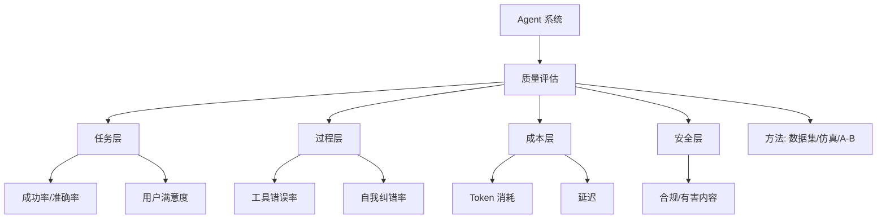

# 如何评估Agent系统的质量？有哪些关键指标？

🎯 本质：Agent评估比传统LLM评估复杂得多，需要同时评估推理质量、工具使用准确性和端到端任务完成率。

📊 Agent评估维度：

1. 任务完成率（Task Success Rate）
  最核心指标——任务是否真正完成
  评估方式：
  - 人工评估（金标准但昂贵）
  - LLM-as-Judge（用GPT-4评分）
  - 自动化测试（如SWE-bench）

2. 推理质量（Reasoning Quality）
  评估Agent的思考过程
  - 规划合理性：步骤是否有逻辑
  - 错误恢复：出错后能否自我纠正
  - 效率：是否用了最少步骤

3. 工具使用准确性（Tool Use Accuracy）
  - 工具选择：选对了工具吗
  - 参数提取：参数正确吗
  - 结果理解：正确理解了返回值吗

4. 效率指标
  - 平均步骤数：完成任务用了几步
  - 平均token消耗：总token开销
  - 平均延迟：从开始到完成的墙钟时间
  - 成本：每次任务的花费

**实战案例**：在构建数据库查询Agent时，我们发现单纯的“准确率”掩盖了严重问题。引入评估后发现，Agent虽然能查出结果，但平均每次查询调用3次工具，且经常构建出 `SELECT *` 导致超时。优化Prompt增加“思考效率”约束后，平均Token消耗下降了40%，查询时间从5秒降至1.5秒。

**代码示例（Python/伪代码）**：
```pythonnfrom langchain.evaluation import EvaluatorType
from langchain.smith import RunEvalConfig

# 配置评估器：关注“正确性”和“思考过程”
eval_config = RunEvalConfig(
    evaluators=[
        "qa", # 使用LLM判断最终答案是否正确
        "trajectory", # 评估ReAct链路是否合理
        "token_usage" # 评估成本效率
    ]
)

# 运行评估集
results = client.run_on_dataset(
    dataset_name="Agent-Test-Set",
    evaluation_config=eval_config,
)
print(f"平均通过率: {results['results']['feedback_score'].mean()}")
```

主流评估基准：
| Benchmark | 评估内容 | 特点 |
|-----------|---------|------|
| AgentBench | 多场景Agent能力 | 8个场景(购物/游戏/DB等) |
| SWE-bench | 软件工程Agent | 真实GitHub PR |
| WebArena | Web交互Agent | 真实网站操作 |
| GAIA | 通用AI助手 | 多步骤真实世界问题 |
| ToolBench | 工具使用 | 16000+ API |
| τ-bench | 工具调用+对话 | 多轮工具调用 |

评估工具：
- LangSmith: LangChain的追踪+评估
- Phoenix(Arize): 开源LLM可观测性
- Opik(Comet): Agent评估平台
- Braintrust: 端到端评估

最佳实践：
1. 分层评估：先评估单工具，再评估工具选择，最后评估端到端
2. 黄金轨迹：记录人类专家的操作路径作为参照
3. 回归测试：每次修改后跑全套测试
4. 线上监控：记录Agent的实际运行轨迹并分析


## 核心流程图



## 核心知识点图


## 记忆要点

- 评估维度：任务完成率(核心)、推理质量、工具准确性、效率(步骤/Token/成本)。
- 评估方法：人工评估(金标准)、LLM-as-Judge(快速)、自动化测试(如SWE-bench)。
- 关键指标：Tool Call Accuracy、Trajectory Match、End-to-End Success Rate。
- 避坑：不只看结果，要监控中间过程；大规模评估需控制成本用小模型。

## 结构化回答

**30 秒电梯演讲：** Agent 评估比传统 LLM 复杂得多，看四个维度：任务完成率是核心，加推理质量、工具准确性、效率（步骤 Token 成本）。方法上人工评估是金标准但贵、LLM-as-Judge 快、自动化测试如 SWE-bench。关键指标是 Tool Call Accuracy、Trajectory Match、端到端成功率。避坑是不能只看结果要监控中间过程。

**展开框架：**
1. **评估四维度** — 任务完成率（核心）、推理质量（规划合理性和错误恢复）、工具准确性（选对工具传对参）、效率（步骤/Token/成本）。
2. **评估方法** — 人工评估（金标准但昂贵）、LLM-as-Judge（快速）、自动化测试（如 SWE-bench 真实 PR）。
3. **关键指标与避坑** — Tool Call Accuracy、Trajectory Match、端到端成功率；不只看结果要监控中间过程，大规模评估用小模型控成本。

**收尾：** 评估的命门是 SELECT * 超时——我可以聊聊加"思考效率"约束怎么把 Token 降 40%、查询时间从 5 秒降到 1.5 秒。

## 视频脚本

> 预计时长：2 分钟 | 由浅入深

| 时间 | 画面/字幕 | 口播台词 | 讲解要点 |
|------|----------|----------|----------|
| 0:00 | 标题卡：Agent 评估 | "考核员工不仅看业绩，还要看工作方法和资源消耗。" | 类比开场 |
| 0:30 | 四维评估框架 | "任务完成率核心，加推理质量、工具准确性、效率。" | 评估维度 |
| 1:00 | 三种评估方法 | "人工金标准，LLM-as-Judge 快，SWE-bench 自动化。" | 评估方法 |
| 1:30 | 关键指标 + 避坑 | "Tool Call Accuracy、Trajectory Match，监控中间过程。" | 指标与避坑 |

---

## 延伸：Agent如何评估和评测？

> 合并自 `saa-006`（相似度 67%）

Agent评估比传统ML更复杂，需要多维评估：

1. **任务成功率**：最终是否完成任务
2. **步骤效率**：完成任务用了多少步
3. **工具调用准确率**：工具选择和参数是否正确
4. **成本效率**：token消耗、API调用次数
5. **鲁棒性**：面对错误输入、工具失败的表现

**边界情况**：
1. **非确定性输出**：同一个测试用例多次运行Agent，轨迹可能不同，需要评估分布情况而非单次结果。
2. **工具副作用**：某些工具调用是不可逆的（如“发送邮件”、“下单”），在评估环境（沙箱）中如何模拟这些状态变更。
3. **恶意攻击输入**：评估Agent在面对Prompt注入或越狱尝试时的安全性，不应仅关注功能正确性。

**实战案例**：
在开发数据查询Agent时，人工评估发现“语法正确但逻辑错误”的查询（如查销售额却过滤了未付款订单）很难通过LLM-as-Judge发现。我们引入了“Golden SQL”作为中间检查点，不仅评估最终答案，还对比生成的SQL语句与标准SQL的执行结果集是否一致，大幅提升了评估准确性。

**代码示例**：
```python
from langchain.evaluation import EvaluatorType
from langchain.smith import RunEvalConfig

eval_config = RunEvalConfig(
    evaluators=[
        "trajectory",  # 评估执行路径准确性
        EvaluatorType.QA  # 评估最终答案正确性
    ],
    # 自定义评估工具调用是否正确
    custom_evaluators=["tool_call_accuracy_evaluator"]
)

# 运行评估并生成报告
results = evaluate(
    agent_chain, 
    data=dataset_name, 
    eval_config=eval_config
)
```

**评估方法对比**：
| 方法 | 优点 | 缺点 | 适用场景 |
|------|------|------|----------|
| 人工评估 | 准确率最高，能发现细微错误 | 慢、贵、难扩展 | 核心业务上线前验收 |
| LLM-as-Judge | 快速、成本低、可扩展 | 复杂逻辑可能误判 | 日常迭代、大量测试集 |
| 基于单元测试 | 确定性极强，适合逻辑判断 | 无法评估生成内容的自然度 | 代码生成、SQL生成 |

**关键指标**：
- Tool Call Accuracy：工具调用正确率
- Trajectory Match：执行路径匹配度
- End-to-End Success Rate：端到端成功率
- Hallucination Rate：幻觉率

## 面试追问
1. 在构建Golden Dataset（黄金数据集）时，如何保证覆盖率和多样性，避免Agent只是“过拟合”到测试集？
2. 对于Tool Calling的评估，如果工具执行失败（如网络超时），如何区分是Agent的参数错误还是环境问题，并计算相应指标？
3. 你是如何实现LLM-as-Judge的？如果Judge模型本身产生幻觉导致评估错误，有什么校验机制？

## 易错点
1. **过度依赖最终答案**：只看结果是否正确，忽略了中间过程可能存在的死循环、错误工具调用或安全风险。
2. **忽视评估成本**：使用GPT-4作为Judge进行大规模评估可能会导致极高的成本和延迟，未考虑使用蒸馏后的的小模型进行分级评估。

## 记忆要点

- 评估五维：任务成功率、步骤效率、工具准确率、成本效率、鲁棒性。
- 方法对比：人工评估准但慢，LLM-as-Judge快但可能误判，单元测试适合逻辑。
- 关键指标：Tool Call Accuracy、Trajectory Match、End-to-End Success Rate。
- 避坑：不只看最终结果，要监控中间过程死循环；评估成本需用小模型分级。

## 结构化回答

**30 秒电梯演讲：** Agent 评估看五个维度：任务成功率、步骤效率、工具准确率、成本效率、鲁棒性。方法上人工评估准但慢、LLM-as-Judge 快但可能误判、单元测试适合逻辑判断。关键指标是 Tool Call Accuracy、Trajectory Match、端到端成功率。避坑是不能只看最终结果，要监控中间过程死循环。

**展开框架：**
1. **评估五维** — 任务成功率、步骤效率（用了多少步）、工具准确率、成本效率（Token）、鲁棒性（面对错误的表现）。
2. **方法对比** — 人工评估准但慢、LLM-as-Judge 快但可能误判、单元测试确定性适合逻辑判断。
3. **关键指标与避坑** — Tool Call Accuracy、Trajectory Match、端到端成功率；不只看结果要监控中间死循环，评估成本用小模型分级。

**收尾：** 评估的命门是语法正确但逻辑错误——我可以聊聊 Golden SQL 中间检查点怎么提升准确性。

## 视频脚本

> 预计时长：2 分钟 | 由浅入深

| 时间 | 画面/字幕 | 口播台词 | 讲解要点 |
|------|----------|----------|----------|
| 0:00 | 标题卡：Agent 评估 | "不仅看做对没，还要看解题步骤简不简洁。" | 类比开场 |
| 0:30 | 评估五维框架 | "成功率、步骤效率、工具准确率、成本、鲁棒性。" | 评估五维 |
| 1:00 | 三种方法对比 | "人工准但慢，LLM-as-Judge 快但可能误判，单元测试适合逻辑。" | 方法对比 |
| 1:30 | 关键指标 + 避坑 | "Tool Call Accuracy、Trajectory Match，监控中间死循环。" | 指标与避坑 |
