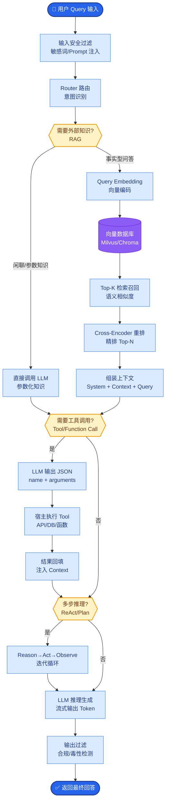

# Self-RAG是什么？它如何通过自我反思提升RAG质量？

🎯 本质：Self-RAG(Self-Reflective RAG)通过训练模型生成"反思token"来动态决定是否需要检索、检索结果是否相关、生成的答案是否被支持。

📊 Self-RAG工作流程：
1. 模型首先判断：是否需要检索？
  - 生成Retrieve token (Yes/No)
  - 简单问题可能不需要检索
  
2. 如果需要检索：
  - 检索Top-K文档
  - 对每个文档生成IsRel token（是否相关）
  - 过滤掉不相关的文档

3. 生成答案：
  - 基于相关文档生成
  - 为每段生成IsSup token（是否被证据支持）
  
4. 质量评估：
  - 生成IsUse token（有用性评分）
  - 选择最有用的答案

与传统RAG的区别：
| 特性 | 传统RAG | Self-RAG |
|------|---------|----------|
| 检索策略 | 总是检索 | 按需检索 |
| 文档过滤 | 无/简单 | 模型自我判断相关性 |
| 答案验证 | 无 | 自我验证有无证据支持 |
| 训练 | 无需训练 | 需要训练反思token |

反思token类型：
- [Retrieve] - 是否需要检索
- [IsRel] - 检索文档是否相关  
- [IsSup] - 答案是否被支持
- [IsUse] - 答案是否有用

优势：按需检索减少噪音、自我验证提升准确性、能拒绝回答无依据的问题
劣势：需要专门的训练数据、推理速度较慢（多轮判断）

💡 **实战案例**：在金融研报生成场景中，模型曾因盲目检索产生"断章取义"。引入Self-RAG后，模型能自主判断"某公司股价走势"这类需实时数据的问题需要检索（触发Web搜索），而对"估值公式原理"这类通用知识直接回答，避免了检索噪音导致的幻觉。

```python
# 伪代码：Self-RAG 推理时的 Token 约束与评分逻辑
# 语言：Python

def generate_with_reflection(model, query, docs):
    # 1. 决策是否检索
    retrieve_token = model.generate(query, forced_tokens=["[Retrieve]"])
    if retrieve_token == "[Retrieve: Yes]":
        context = search_docs(query)
        # 2. 评估文档相关性 (IsRel)
        for doc in context:
            is_rel = model.generate(f"{doc} [IsRel]", forced_tokens=["[IsRel]", "[Irrel]"])
            if is_rel == "[Irrel]":
                context.remove(doc) # 过滤不相关文档
    
    # 3. 生成答案并验证支撑性
    answer = model.generate(query, context=context)
    is_sup = model.check_support(answer, context) # [IsSup] 检查
    
    return answer, is_sup # 返回答案及置信度
```

```text
          Self-RAG 推理与 Token 流程

┌─────────────┐
│   Query     │
└──────┬──────┘
       │ 1. Generate [Retrieve] token
       ▼
   [Retrieve: Yes] ────No───▶ 2. Direct Answer Generation
       │                              (无需检索)
       │ Yes
       ▼
┌──────────────────┐
│  Retrieve Docs   │ (Top-K)
└──────┬───────────┘
       │ 3. Generate [IsRel] token per doc
       ▼
   Filter Docs ─────▶ Keep Relevant Docs Only
       │
       ▼
┌──────────────────┐
│ Answer Segment   │ 4. Generate [IsSup] token
└──────┬───────────┘    (Evidence Check)
       │
       ▼
┌──────────────────┐
│  [IsUse] Token   │ 5. Quality Score
└──────────────────┘
```

## 常见考点
1. **训练数据的构建**：Self-RAG 的训练数据从哪来？通常需要对现有的 QA 数据集进行“反推”或“标注”，标注出某段回答是否应该检索、检索到的文档是否相关。
2. **推理时机的控制**：在推理阶段，如何强制模型输出这些 Reflection Token？（通常通过约束解码 Constrained Decoding 或在 Prompt 中明确格式）。
3. **与 CRAG 的区别**：Self-RAG 是“训练时”内化了反思能力（模型本身变了），CRAG 是“推理时”增加外部评估模块（模型不变，流程变）。
4. **开销分析**：虽然减少了无效检索，但模型每一步都要预测多个 Token，推理延迟是否会反而增加？（通常依赖的是小型 Token 分类头，开销可控，但 TPS 会受影响）。


## 核心流程图



## 记忆要点

- 核心机制：训练模型生成反思Token（Retrieve/IsRel/IsSup/IsUse）来动态决策
- 流程对比：传统RAG总是检索，Self-RAG按需检索并自我验证证据支持
- 关键Token：[Retrieve]决策是否检索，[IsRel]过滤文档，[IsSup]验证幻觉
- 本质区别：Self-RAG是训练时内化反思（模型变），CRAG是推理时外挂评估（模型不变）

## 结构化回答

**30 秒电梯演讲：** Self-RAG 通过训练模型生成反思 Token 来动态决策——像带质检员的生产线每步先自检。四种 Token：Retrieve 决定是否检索、IsRel 过滤文档、IsSup 验证答案有无证据支持、IsUse 评有用性。传统 RAG 总是检索，Self-RAG 按需检索并自我验证。本质是训练时内化反思，模型本身变了。

**展开框架：**
1. **核心机制** — 训练模型生成反思 Token（Retrieve/IsRel/IsSup/IsUse）动态决策检索与生成。
2. **流程对比** — 传统 RAG 总是检索，Self-RAG 按需检索并自我验证证据支持，能拒绝无依据问题。
3. **关键 Token 与本质区别** — [Retrieve] 决策检索、[IsRel] 过滤文档、[IsSup] 验证幻觉；Self-RAG 训练时内化反思（模型变），CRAG 推理时外挂评估（模型不变）。

**收尾：** Self-RAG 的精髓是按需检索——我可以聊聊金融研报怎么判断"股价走势"要检索而"估值公式"直接答。

## 视频脚本

> 预计时长：2 分钟 | 由浅入深

| 时间 | 画面/字幕 | 口播台词 | 讲解要点 |
|------|----------|----------|----------|
| 0:00 | 标题卡：Self-RAG | "像带质检员的生产线，每步先自检再操作。" | 类比开场 |
| 0:30 | 四种反思 Token | "Retrieve 决策检索，IsRel 过滤，IsSup 验证，IsUse 评分。" | 核心机制 |
| 1:00 | vs 传统 RAG | "传统总是检索，Self-RAG 按需检索自我验证。" | 流程对比 |
| 1:30 | Self-RAG vs CRAG | "Self-RAG 训练时内化反思模型变，CRAG 推理时外挂模型不变。" | 本质区别 |

