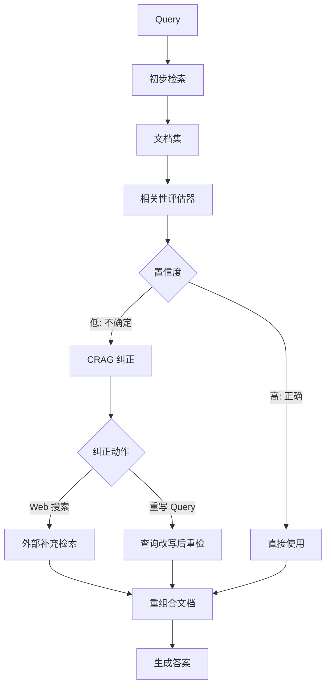

# Corrective RAG (CRAG)是什么？它如何纠正检索结果？

🎯 本质：CRAG在检索后增加一个"检索评估器"，评估检索文档的质量，并据此选择不同的生成策略：直接使用、修正、或转向网络搜索。

📊 CRAG工作流程：
1. 检索文档（标准RAG流程）
2. 检索评估器评估文档质量
  - 使用轻量级模型或规则评估
  - 输出分值：Correct（相关）、Incorrect（不相关）、Ambiguous（不确定）
3. 根据评估结果选择策略：
  - Correct -> 知识精炼（提取最相关片段）-> 生成
  - Incorrect -> 触发Web搜索 -> 用网络结果生成
  - Ambiguous -> 同时用检索结果和Web搜索 -> 合并生成

知识精炼:
  将检索文档分解为知识条目
  过滤掉不相关的条目
  只保留最相关的片段送入生成器

CRAG vs Self-RAG vs 传统RAG：
| 特性 | 传统RAG | Self-RAG | CRAG |
|------|---------|----------|------|
| 训练需求 | 无 | 需训练 | 无(即插即用) |
| 检索评估 | 无 | 模型自评 | 独立评估器 |
| 纠正方式 | 无 | 重新生成 | Web搜索补充 |
| 复杂度 | 低 | 高 | 中 |

优势：不需要重新训练模型，可直接接入现有RAG系统；通过Web搜索有效弥补检索知识库的不足。

💡 **实战案例**：在构建企业内部知识问答时，常遇到新规发布导致本地文档滞后的问题。部署CRAG后，当评估器判定检索到的旧版文档与"新政策"查询不匹配时，自动触发Web搜索抓取官网最新公告，成功解决了传统RAG只能回答过时信息的痛点。

```python
# 伪代码：CRAG 核心决策逻辑
# 语言：Python

def crag_retrieve_and_generate(query, retriever, web_search, llm):
    docs = retriever.retrieve(query)
    # 1. 检索评估
    relevance_score = evaluator.evaluate(query, docs)
    
    if relevance_score > threshold_correct:
        # 2. 知识精炼
        refined_knowledge = knowledge_refinement(docs, query)
        return llm.generate(query, refined_knowledge)
        
    elif relevance_score < threshold_incorrect:
        # 3. Web 搜索纠正
        web_docs = web_search.search(query)
        return llm.generate(query, web_docs)
        
    else:
        # 4. 模糊/不确定：混合上下文
        combined_context = docs + web_search.search(query)
        return llm.generate(query, combined_context)
```


## 核心流程图



## 记忆要点

- 核心机制：检索后增加评估器，根据质量分（Correct/Ambiguous/Incorrect）选择策略
- 纠正策略：高质量则精炼，低质量触发Web搜索，不确定则混合生成
- 优势对比：无需重新训练模型，即插即用，通过Web搜索弥补知识库不足
- 适用场景：解决文档滞后问题，如企业新规发布时自动联网补充

## 结构化回答

**30 秒电梯演讲：** CRAG 就是给 RAG 加了一道"质检"环节——检索回来的文档先让评估器打个分，质量高就精炼用，质量差就自动转去 Web 搜索补救。它最大的卖点是即插即用，不用重新训练模型就能解决知识库滞后、检索不到点子上的问题。

**展开框架：**
1. **评估器打分** — 检索回来先用独立评估器判三档：Correct 相关、Ambiguous 模糊、Incorrect 不相关。
2. **分级策略** — Correct 走知识精炼（只留最相关片段），Incorrect 触发 Web 搜索抓外部信息，Ambiguous 则两路合并。
3. **即插即用** — 跟 Self-RAG 最大区别是不用训练模型，直接接在现有 RAG 后面，用 Web 搜索弥补本地库不足。

**收尾：** 我在接企业知识问答时，就是用 CRAG 解决了新规发布后本地文档过期的痛点——评估器判定不匹配就自动抓官网公告。您想深入聊评估器怎么实现，还是 Web 搜索那一段？

## 视频脚本

> 预计时长：2 分钟 | 由浅入深

| 时间 | 画面/字幕 | 口播台词 | 讲解要点 |
|------|----------|----------|----------|
| 0:00 | 标题卡：CRAG 纠正检索 | "RAG 检索到错的文档怎么办？CRAG 让它先质检，再决定怎么回答。" | 开场钩子 |
| 0:15 | CRAG 三档决策流程图 | "检索完先过评估器，分三档：Correct 精炼用，Incorrect 转去搜 Web，Ambiguous 两路合。" | 核心机制 |
| 0:45 | 评估器三档打分示意图 | "关键就是这个独立评估器，输出 Correct、Ambiguous、Incorrect 三档分数，决定下一步走向。" | 评估器原理 |
| 1:15 | CRAG vs Self-RAG 对比表 | "和 Self-RAG 比，CRAG 最大的优势是不用训练模型，即插即用，靠 Web 搜索兜底。" | 横向对比 |
| 1:40 | 企业新规联网抓取案例 | "实战：企业知识问答遇到新规发布，评估器判定旧文档不匹配，自动抓官网最新公告。" | 实战案例 |
| 1:55 | 总结卡 | "记住三个词：质检、分级、补救。下期讲 Agentic RAG 怎么进一步自主决策。" | 收尾 |

