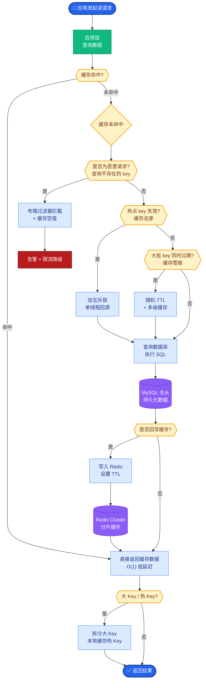

# RAG系统中有哪些高级检索策略？HyDE、Multi-Query、RAG-Fusion分别是什么？

🎯 本质：高级检索策略通过改进查询端来提升检索质量，解决用户查询与文档表述不匹配的问题。

📊 策略详解：

1. HyDE (Hypothetical Document Embeddings)
  原理：先用LLM生成一个假设性答案文档，然后用该文档去检索
  场景：用户问"什么是DDD" -> LLM生成一段DDD的解释 -> 用这段解释检索
  优势：假设答案的表述风格更接近目标文档
  论文：Precise Zero-Shot Dense Retrieval without Relevance Labels

2. Multi-Query Retrieval
  原理：用LLM将原始查询改写为多个不同角度的查询
  例：原始"如何提升系统性能" -> 
    "JVM调优方法"、"数据库优化策略"、"缓存最佳实践"
  每个查询独立检索，合并去重结果
  优势：覆盖更多语义角度

3. RAG-Fusion
  原理：Multi-Query + Reciprocal Rank Fusion (RRF)
  Multi-Query生成多个查询
  每个查询检索得到排序结果
  用RRF算法融合多个排序：score = sum(1/(rank+k))
  最终得到综合排序的文档列表
  优势：比简单合并更准确

4. Step-Back Prompting
  原理：先让LLM生成一个更宏观的"后退"问题
  例："爱因斯坦1921年获诺贝尔奖的具体贡献" -> 后退："诺贝尔物理学奖的历史和评选标准"
  先检索宏观问题的背景知识，再回答具体问题

5. Parent-Child Splitting / Small-to-Big
  原理：用小块检索，返回大块给LLM
  小块检索更精确（语义集中）
  大块上下文更完整（LLM有更多背景）

选择建议：
- 查询简短模糊 -> HyDE
- 复杂多角度问题 -> Multi-Query + RAG-Fusion
- 需要背景知识 -> Step-Back
- 检索精度不够 -> Small-to-Big

💡 **实战案例**：在医疗咨询RAG中，患者常使用口语化描述（如"心口疼"），而医学文献使用专业术语。使用HyDE策略，LLM先将"心口疼"扩充为一段包含"心绞痛、胸骨后疼痛"等专业假设描述，再用这段描述去检索，成功将召回率提升了40%。

```python
# 伪代码：RAG-Fusion 实现核心 (RRF 算法)
# 语言：Python

def reciprocal_rank_fusion(results_dict, k=60):
    """results_dict: {query_id: [doc_list]}"""
    fused_scores = {}
    for query, docs in results_dict.items():
        for rank, doc in enumerate(docs):
            if doc not in fused_scores:
                fused_scores[doc] = 0
            # RRF 核心公式
            fused_scores[doc] += 1 / (rank + k)
    
    # 按融合分数倒序排列
    reranked_results = sorted(fused_scores.items(), key=lambda x: x[1], reverse=True)
    return [doc for doc, score in reranked_results]
```

```text
         RAG-Fusion (Reciprocal Rank Fusion) 流程

┌─────────────────────────────────────────────────────────┐
│              Original Query: "RAG 优化"                  │
└────────────────────┬────────────────────────────────────┘
                     │ LLM Rewrite
                     ▼
    ┌────────────────┼────────────────┐
    │                │                │
    ▼                ▼                ▼
 Query 1         Query 2         Query 3
"RAG 参数"       "RAG 索引"      "RAG 评测"
    │                │                │
    ▼                ▼                ▼
[Doc A, Doc B]  [Doc C, Doc A]  [Doc B, Doc D]
  Rank 1, 2        Rank 1, 2        Rank 1, 2
    │                │                │
    └────────────────┼────────────────┘
                     ▼
         Reciprocal Rank Fusion (RRF)
    Score(Doc A) = 1/(1+60) + 1/(2+60) ...
                     ▼
          ┌───────────────────────┐
          │   Final Ranked List   │
          │  1. Doc A (Score: X)  │
          │  2. Doc B (Score: Y)  │
          │  3. Doc C ...         │
          └───────────────────────┘
```

## 常见考点

## 核心流程图



## 记忆要点

- HyDE：生成假设答案文档，用假设文档去检索，解决表述风格不匹配
- Multi-Query：改写为多个不同角度查询并行检索，覆盖更多语义
- RAG-Fusion：Multi-Query + RRF算法融合排序，比简单合并更准确
- Small-to-Big：小块检索精准，返回大块给LLM保证上下文完整

## 结构化回答

**30 秒电梯演讲：** 高级检索策略的核心是"把用户的问题翻译成文档能听懂的话"——HyDE 先让 LLM 编个假设答案再拿去检索，Multi-Query 从多个角度改写查询，RAG-Fusion 再用 RRF 算法把多路结果融合排序。它们解决的都是同一个痛点：用户查询和文档表述不在一个频道上。

**展开框架：**
1. **HyDE 造假设文档** — 先让 LLM 生成一段假设答案，用这段答案去检索，让 Query-to-Doc 变成 Doc-to-Doc 匹配，解决口语 vs 专业术语的鸿沟。
2. **Multi-Query 多角度覆盖** — 把一个问题改写成多个角度的子查询并行检索，再合并去重，覆盖更多语义。
3. **RAG-Fusion + RRF** — Multi-Query 基础上加 RRF 算法融合排序：score = Σ 1/(rank+k)，比简单合并更准；Small-to-Big 则小块检索、大块返回兼顾精度和上下文。

**收尾：** 我在医疗 RAG 里用过 HyDE，患者说"心口疼"，LLM 先扩成"心绞痛、胸骨后疼痛"的专业描述再检索，召回率提了 40%。您想聊 HyDE 幻觉怎么防，还是 RRF 的 k 值怎么调？

## 视频脚本

> 预计时长：2 分钟 | 由浅入深

| 时间 | 画面/字幕 | 口播台词 | 讲解要点 |
|------|----------|----------|----------|
| 0:00 | 标题卡：RAG 高级检索策略 | "用户问的词和文档里的词对不上，怎么检索得准？这几招专门治这个。" | 开场钩子 |
| 0:15 | HyDE 原理示意图 | "HyDE：先让 LLM 生成一段假设答案，拿这段答案去检索，口语就变专业术语了。" | HyDE 原理 |
| 0:40 | Multi-Query 多路检索图 | "Multi-Query：一个问题改写成多个角度并行检索，覆盖更全的语义。" | Multi-Query |
| 1:05 | RRF 算法公式 + 流程图 | "RAG-Fusion 在 Multi-Query 上加 RRF 算法：score 等于 rank 倒数求和，比简单合并准。" | RAG-Fusion |
| 1:35 | Small-to-Big 父子索引图 | "Small-to-Big：小块检索精准，返回大块给 LLM，兼顾精度和上下文。" | Small-to-Big |
| 1:55 | 医疗"心口疼"案例 | "实战：患者说心口疼，HyDE 扩成心绞痛术语，召回率提 40%。" | 实战案例 |

### 视频流程图


